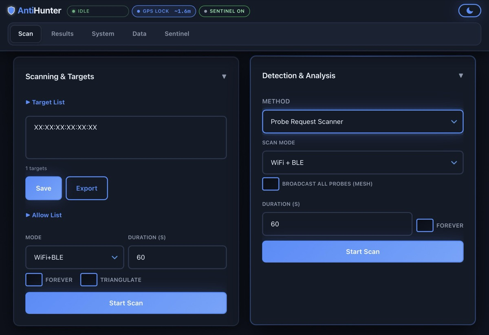
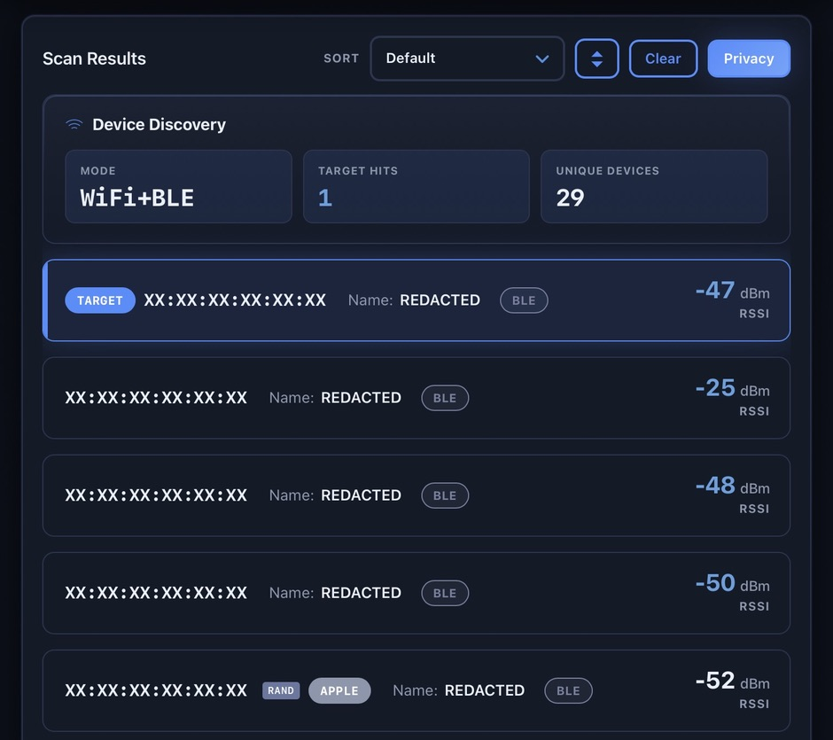
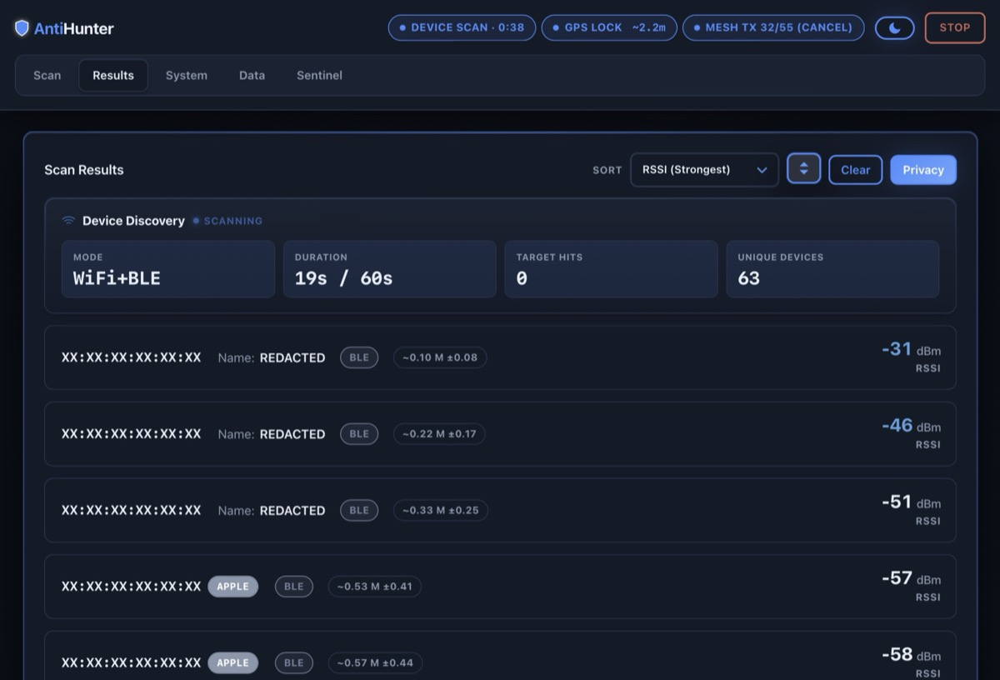
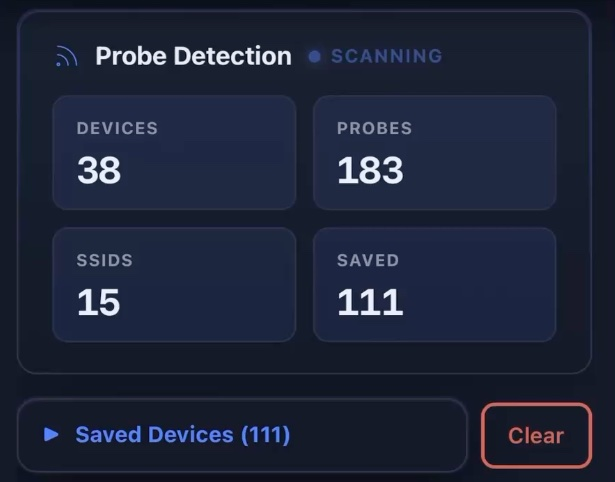
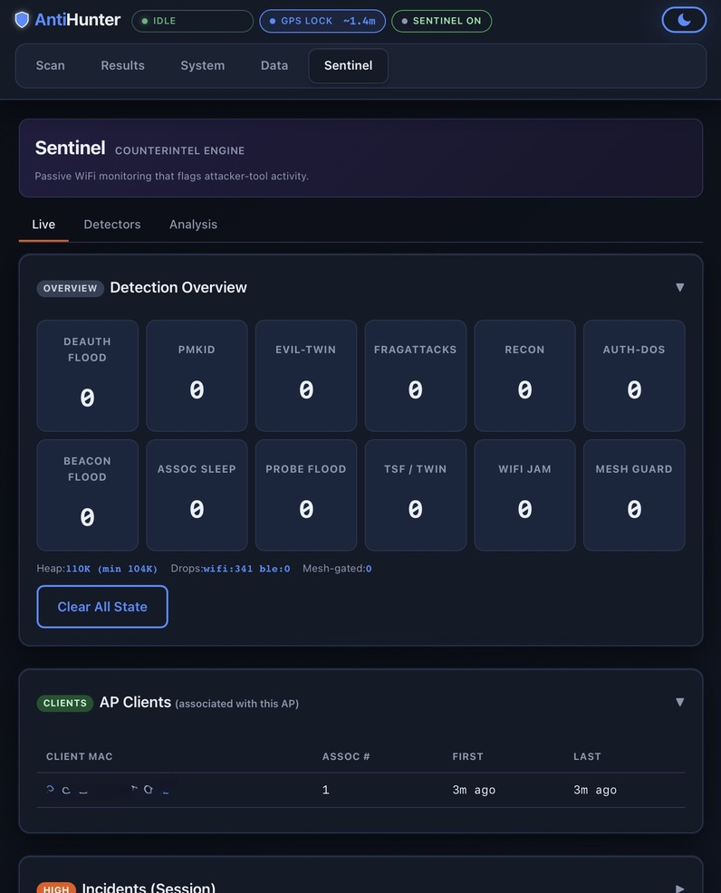
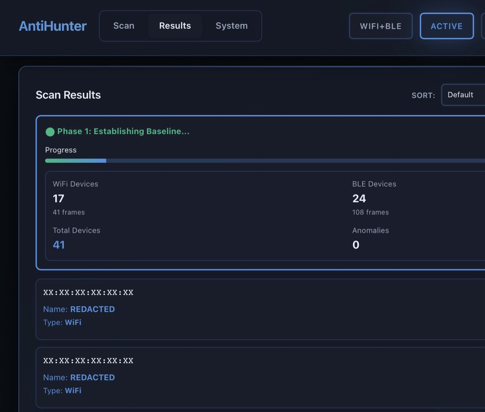
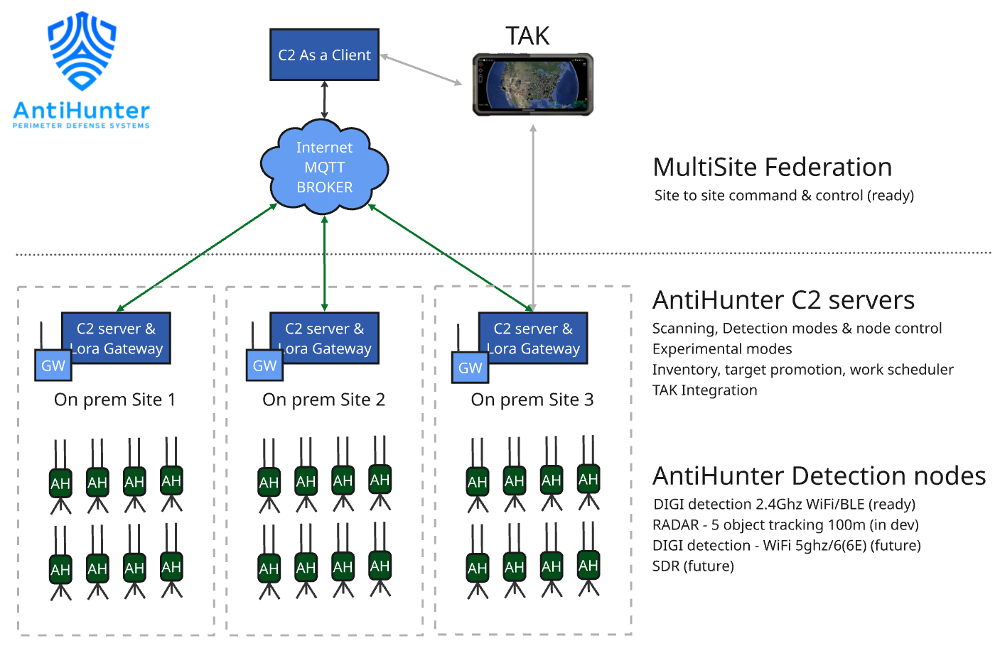

<div align="center">

[](https://discord.gg/AYFzUurfmh)</br>
[](https://github.com/lukeswitz/AntiHunter/actions/workflows/lint.yml)
[](https://github.com/lukeswitz/AntiHunter/actions/workflows/platformio.yml)
[](https://github.com/lukeswitz/AntiHunter/actions/workflows/github-code-scanning/codeql)
[](https://github.com/lukeswitz/AntiHunter/releases/latest)
[](https://github.com/lukeswitz/AntiHunter/releases)
[](https://github.com/lukeswitz/AntiHunter/tree/main/Antihunter/src)

</div>


<p align="center">
  

<div align="center">
  <h3 align="center">DIGI Detection Node Firmware</h3>
  <h3><a href="#quick-start">Quick Start</a> • <a href="#what-it-detects">What It Detects</a> • <a href="#hardware">DIY Build</a></h3>
  
  <p><strong>Companion C2: <a href="https://github.com/TheRealSirHaXalot/AntiHunter-Command-Control-PRO"> AntiHunter Command Center</p></strong>

  <a href="https://lectronz.com/stores/antihunter" alt="I sell on Lectronz"></a>
  
  [Website](https://rootdowndigital.com/antihunter)  • [Privacy Policy](https://rootdowndigital.com/privacy)


`Beta branch with new features in development. Potential stability issues and unexpected behavior may occur.`

</div>

---

## What is AntiHunter?

**A self-contained wireless detection node. Runs standalone — no server, no cloud, no subscription.**

*Featured in Seeed Studio [Best 20 XIAO Projects in 2025](https://www.seeedstudio.com/blog/2026/01/29/best-xiao-projects/).*

Most WiFi and BLE detection tools need a laptop and a backend. AntiHunter runs on the device, and you drive one node two ways with no extra infrastructure:
  - **Web UI** — the node hosts its own WiFi access point. Connect a phone or laptop, run scans and read results in the browser. Nothing to install.
  - **Meshtastic radio** — send commands and receive detections over LoRa from a paired Meshtastic radio, with no WiFi AP. The Headless firmware runs this way with no web UI at all.
  - To cover a larger area, add nodes. They share detections over the same mesh and can report to the optional [Command Center](https://github.com/TheRealSirHaXalot/AntiHunter-Command-Control-PRO).


**At a glance**

- ESP32-S3 · WiFi + BLE scanning · GPS · SD logging · vibration sensing · LoRa mesh
- Drop-in [ESP32-C5](docs/ESP32-C5.md) build adds 5 GHz alongside 2.4 GHz (testing)
- **Full** firmware: standalone web UI over the node's own AP · **Headless** firmware: serial + mesh only, for silent deployments
- One node standalone, or a distributed network that coordinates over mesh
- Vibration & attack triggered actions for set and forget operation

---

## Table of Contents

1. [Quick Start](#quick-start)
2. [What It Detects](#what-it-detects)
3. [Use Cases](#use-cases)
4. [Hardware](#hardware)
5. [Build & Flash](#build--flash) — [deployment steps by tier](#deployment-steps-by-tier)
6. [Configuration & Operations](#configuration--operations)
7. [System Architecture](#system-architecture) — [full vs headless](#full-vs-headless)
8. [Mesh Networking](#mesh-networking)
9. [Mesh Commands](#mesh-commands)
10. [API Reference](#api-reference)
11. [ESP32-C5](docs/ESP32-C5.md)
12. [RadarNode](docs/RADARNODE.md)
12. [Acknowledgments](#acknowledgments)
13. [Legal](#legal-disclaimer)

---

## Quick Start

One node, no server. Flash it from your browser — nothing to install.

1. **[Open the Web Flasher](https://lukeswitz.github.io/AntiHunter/)** in Chrome or Edge, on desktop.
   - Pick **Full** (web UI) or **Headless** (serial + mesh)
   - Choose a **Release Channel** (Stable or Beta)
   - Plug in your ESP32-S3, and click Connect & Flash.
3. First boot:
   - **Full firmware** — connect to the `Antihunter` WiFi AP (password `antihunt3r123`), open **http://192.168.4.1**. Change the AP credentials under RF Settings first.
   - **Headless firmware** — drive it over serial or [mesh commands](#mesh-commands).
4. **Configure the Meshtastic radio.** Plug the radio in on its own USB and run:

   ```bash
   pip3 install 'meshtastic[cli]' pyserial
   python3 scripts/meshtastic_config.py
   ```

   With no arguments it prints the current settings and opens a menu. It sets the serial module to TEXTMSG at 115200 on the right pins for your board, and covers screen, LED heartbeat, BLE pairing and LoRa region. Non-interactive equivalent:

   ```bash
   python3 scripts/meshtastic_config.py --serial on --board heltec-v3 \
       --screen off --led off --ble off --region US
   ```

   `--board` accepts `heltec-v3` or `t114`. Leaving the region `UNSET` makes the radio receive-only.
5. Add a watchlist entry or start a scan.

*To flash from a terminal or build from source, see [Build & Flash](#build--flash).*

### Before you deploy

**Change the defaults.** The AP ships as `Antihunter` / `antihunt3r123` — published, so treat an unchanged node as open. Set your own SSID and password in RF Settings on first boot. Set the erase PSK too if you plan to use [Secure Data Destruction](#secure-data-destruction).

**Reduce what the node emits.** The AP is a beacon that identifies the device. For covert work run **Headless** — no AP at all, serial and mesh only. On the radio, `--screen off --led off --ble off` removes the visual and Bluetooth signature.

**Redact before sharing.** Privacy Mode blanks MACs, SSIDs and GPS in the web UI for screenshots and demos. Exported logs and SD data are **not** redacted — scrub those separately.

**Location data is identifying.** SD logs, results exports and mesh alerts can carry GPS coordinates. Review any file before posting it publicly or attaching it to a report.

**Know the legal line.** Passive scanning of what is already broadcast is not the same as interception, and the rules vary by country. Scan only where you have authority. See the [Legal Disclaimer](#legal-disclaimer).

---

## What It Detects

Every capability runs on the node and reports to the web UI, mesh, and Command Center.

<p align="center">

</p>

| Feature | What it does | Scan modes |
|---------|-------------|------------|
| **Target Scan** | MAC/OUI/SSID watchlist with instant mesh alerts | WiFi, BLE, or both |
| **Device Scanner** | Captures all nearby WiFi and BLE devices with RSSI, channels, names | WiFi, BLE, or both |
| **Probe Request Scanner** | Passive sniffer -- reveals SSIDs devices are searching for | WiFi, BLE, or both |
| **Ghost SSID Detection** | Flags probed SSIDs with no responding AP nearby | Probe / Device scan |
| **Baseline Anomaly Detection** | Learn-then-alert: spots new, missing, and changed devices | WiFi + BLE |
| **MAC Randomization Correlation** | Links randomized MACs to persistent identities via behavioral signatures | WiFi + BLE |
| **Deauth Attack Detection** | Real-time deauth/disassoc frame detection with source tracking | WiFi promiscuous |
| **Sentinel Counterintel** | Passive detection of attacker-tool activity (deauth/beacon/auth/assoc floods, SAE DoS, karma, evil-twin, probe floods, handshake capture); per-detector toggles, mesh broadcast, and optional persistent start-on-boot | WiFi promiscuous |
| **Drone RID Detection** | Identifies drones broadcasting Remote ID (ODID/ASTM F3411, French ID); Serial + CAA | WiFi beacon/NAN + BLE (BT4/BT5) |
| **Triangulation** | Multi-node RSSI-based location estimation via mesh (experimental) | WiFi, BLE |
| **Mesh Networking** | LoRa mesh via Meshtastic -- alerts, remote commands, coordination | UART serial |
| **Secure Data Destruction** | Tamper-triggered or remote wipe with post-wipe obfuscation | Vibration / mesh |
 **Vibration Trigger** | Choose a scan to run when vibration detected | Vibration / mesh |
| **Privacy Mode** | One-click MAC/GPS/SSID redaction for screenshots | Web UI button |
| **Battery Saver** | 80MHz CPU, light sleep, reduced GPS, mesh heartbeat only | Mesh command |
| **Allowlist** | Global device allowlist -- ignored across all scan modes | Web UI / API |
| **Data Explorer** | Review findings, device logs and scan data | Web UI / API |

### Targets & watchlists

**Target Scan**


<!-- <p align="center">
  
</p> -->

Maintain a watchlist of MAC addresses (full or OUI prefix), SSIDs, or identity IDs (`T-XXXX`). Scans WiFi channels and BLE frequencies, alerting on detection via web UI, mesh, and command center.

- WiFi-only, BLE-only, or combined scanning
- Global allowlist filters out known devices
- Logs RSSI, channel, GPS, and device names to SD
- Real-time alerts over mesh network

### Discovery & sniffing


**Device Scanner**  

- Captures all WiFi and BLE devices in range: MACs, SSIDs, signal strength, names, and channels.
- WiFi AP discovery runs a periodic all-channel scan (gated by WiFi Scan Interval); target frames are captured passively in promiscuous mode while hopping channels between scans.
- Check **Capture Probes** to piggyback probe-request collection onto the scan, feeding the probe database (MAC, vendor, RSSI, SSIDs, randomization status).



**Probe Request Scanner**

<p align="center">
  
</p>

Correlates all three 802.11 address fields to detect ghost SSIDs (networks that exist only in a device's history), identify which APs responded, and catch silent devices via destination-address matching.

- **Three-field correlation**: probe requests (addr2=source), probe responses (addr1=client, addr2=AP, addr3=BSSID), and destination-address matching all feed one per-device record
- **Destination address (addr1) matching**: detects probe requests addressed TO a target MAC -- catches silent or sleeping devices that never transmit their own identity
- **Ghost SSID detection**: cross-references probes against responses to flag SSIDs with no responding AP. Ghost SSIDs appear prefixed with `~` (e.g. `~"HomeNetwork"` vs `"CoffeeShop"`) and reveal networks the device connected to elsewhere -- location history, home/work networks, travel patterns
- SSID watchlist: add SSIDs to the target list alongside MACs and OUIs
- OUI vendor identification (68-vendor table)
- MAC randomization detection (locally-administered bit check)
- Mesh alerting for watchlist hits (60s dedup cooldown)
- RSSI min/max/current tracking, up to 4 probed SSIDs per device

### Attack detection & counter-intel

**Sentinel — Counterintel Engine**

<p align="center">
  
</p>

Enable and it runs in the background whenever you aren't scanning. Passive WiFi monitoring that flags attacker-tool activity by frame signatures plus behavioral fallbacks. Tuned and tested against both popular consumer ESP32 attack firmware and professional Linux tooling, so detection isn't tied to one tool's byte templates.

- **Verified against:** airgeddon, aireplay-ng, bettercap, wifite, mdk4, angryoxide, eaphammer, hostapd-mana, wifipumpkin3, hcxdumptool, purpose-built test scripts, and common consumer ESP32 attack firmware.
- Detectors are organized into toggleable groups. Each detection logs to serial + SD and broadcasts to mesh peers.

| Group | Detectors | How they're caught |
|---|---|---|
| **DoS** | Deauth flood, deauth forge, broadcast deauth, AP-targeted deauth, beacon flood, auth flood, assoc-sleep, SAE DoS | Fixed/rotated deauth seqCtrl + duration (reason codes are used for tool *attribution*, never on their own as an attack trigger — reasons 1/2/6/7 are all legitimate deauth causes), impersonation bursts, beacon-spam rate + static templates, open-system auth flood, assoc-req PM-bit floods, SAE commit floods (algo 3 / txn 1) |
| **Rogue AP** | Evil-twin, OWE abuse, Karma / MANA | Clone of our own AP (SSID/BSSID collision); OWE-transition downgrade; bait-probe answered by an AP that never beacons that SSID |
| **Recon** | PMKID harvest, probe flood, handshake capture | Orphaned-M1 / KDE PMKID solicitation; fixed-seq + behavioral probe spam (≥15 MACs/SSID/5s); forced & passive EAPOL M1–M4 capture |
| **Physical** | FragAttacks, TSF / multi-channel twin, WiFi interference | A-MSDU PN reuse / mixed-key frags; same BSSID on ≥2 channels within 5s; per-channel PDR-vs-RSSI collapse (CRC-fail flood) |
| **Mesh disruption** | Self-spoof, channel flood, command audit | Own node-id seen inbound; inbound rate DoS; every privileged mesh command logged with the radio id that issued it — a provenance **audit trail**, not an alert (injection is indistinguishable from legit ops on a shared channel, so we record the source instead of guessing) |

- **Field-verified on hardware** (confirmed firing against the live tools above): deauth (flood/forge/AP-targeted), beacon flood, auth flood, assoc-sleep, SAE DoS, karma, evil-twin, probe flood, handshake capture.
- **Experimental**: OWE abuse, PMKID harvest, FragAttacks, TSF multi-channel twin, WiFi interference, mesh disruption.
- **Behavioral fallbacks** (survive template changes): SSID-rotate forge, behavioral probe-flood, EAPOL-capture bait, broadcast-deauth-while-beaconing.
- **Hotspot false-positive suppression**: the crypto/handshake detectors (PMKID, KRACK, handshake capture, SAE-DoS) and all beacon-based detectors (evil-twin, OWE, SSID-confusion, TSF, beacon-flood) skip **locally-administered / randomized BSSIDs**. Phone hotspots and MAC-randomizing devices produce normal handshakes, SAE retries and M3 retransmits that would otherwise trip these detectors as attacks. Volume-based DoS detectors (deauth/auth/assoc floods, probe-flood) intentionally do **not** skip them, since real floods commonly spoof randomized sources.
- **Outputs:** `[DETECT]` serial lines + per-detector SD `.jsonl` + mesh broadcast to peer nodes for quorum confirmation.
- **Mesh command audit:** every privileged command received on the mesh is logged with the radio id that issued it. It shows up in the **Sentinel UI** (the *Mesh Commands* panel, below AP Clients — full build) and via the **API** (`GET /api/mesh_cmd.jsonl`), and is persisted to SD (`/mesh_cmd.jsonl`). This is a provenance audit trail, not an alert — so it never false-positives.
- **Control & boot:** Start/stop from the Sentinel tab. Off at boot by default; opt into a persistent **Start-on-Boot** setting via the Web Flasher / Configurator / `SENTINEL_BOOT` mesh command — when enabled it auto-starts at power-on and survives reboot.

The mesh labels Sentinel emits, for log parsers and C2, are listed under [Mesh Commands](#mesh-commands) → *Sentinel label reference*.

**Deauth Attack Detection** — standalone WiFi deauth/disassoc frame sniffer with real-time detection. Integrates with randomization tracking for source identification.

### Drone detection

**Drone RID Detection** — detects drones broadcasting Remote ID per FAA/EASA standards over **WiFi and Bluetooth**. Supports ODID/ASTM F3411 over WiFi (NAN action frames, beacon frames) and **BLE (BT4 legacy + BT5 long-range advertising, service UUID 0xFFFA)**, plus French drone ID (OUI 0x6a5c35). Decodes all ODID message types (Basic ID, Location, System, Operator ID, Auth, Self-ID), preferring Serial Number over CAA Registration ID. Extracts UAV ID, pilot location, and flight telemetry. Mesh alerts and SD logging.

### Anomaly & identity

**Baseline Anomaly Detection**

<p align="center">

</p>

Two-phase scan: establish a baseline of known devices, then monitor for anomalies -- new devices, disappearances, reappearances, and significant RSSI changes. Persistent storage survives reboots.

- RAM cache: 200-500 devices, SD overflow: 1K-100K device db
- Automatic tiering between RAM and SD with quick lookups

> [!IMPORTANT]
> A longer initial scan produces a more reliable baseline.

**MAC Randomization Correlation** (beta) — links randomized MAC addresses to persistent device identities using behavioral signatures: IE fingerprinting, channel sequencing, timing, RSSI patterns, and sequence-number correlation. Assigns identity IDs (`T-XXXX`) with SD persistence.

- Up to 256 simultaneous identities, 128 linked MACs each (LRU eviction of oldest identity at cap; stale tracks pruned every 60s)
- Dual signature support (full and minimal IE patterns)
- Confidence-based linking with adaptive thresholds
- Detects global MAC leaks and WiFi-BLE correlation

> [!TIP]
> Use the Privacy button to redact MACs, GPS, and SSIDs before sharing screenshots.

### Locating

**Triangulation** (experimental) — multiple nodes scan for a target simultaneously. Each records RSSI and GPS coordinates. Data is aggregated over mesh for weighted trilateration with Kalman filtering.

- Outputs: GPS coordinates, confidence, estimated uncertainty (m), average HDOP
- Google Maps link sent over mesh
- Per-target distance tuning multipliers (0.1x - 5.0x)

> [!NOTE]
> Target RSSI greater than -80 produces better results for BLE devices.

<details>
<summary>RF Environment Calibration</summary>

Path loss model: `distance = 10^((RSSI0 - RSSI) / (10 * n))`

| Environment | WiFi n | BLE n | WiFi RSSI0 | BLE RSSI0 | Use Case |
|-------------|--------|-------|------------|-----------|----------|
| Open Sky | 2.0 | 2.0 | -23 dBm | -60 dBm | Clear LOS, minimal obstruction |
| Suburban | 2.7 | 2.5 | -24 dBm | -62 dBm | Light foliage, scattered buildings |
| Indoor | 3.2 | 2.9 | -25 dBm | -65 dBm | Typical indoor, some walls |
| Indoor Dense | 4.0 | 3.5 | -27 dBm | -69 dBm | Office spaces, many partitions |
| Industrial | 4.8 | 4.0 | -30 dBm | -73 dBm | Heavy obstruction, machinery |

</details>

---

## Use Cases

- Perimeter security and intrusion detection
- Penetration testing and wireless security auditing
- Counter-UAV operations and airspace monitoring
- Surveillance detection and OPSEC audits
- Device fingerprinting across MAC randomization
- Probe analysis and rogue device detection
- Event security and monitoring

---

## Hardware

Buy an assembled node or a bare PCB from the [store](https://lectronz.com/stores/antihunter), or build your own from the parts below.

> [!IMPORTANT]
> Requires regulated 5V power supply. Unregulated battery sources cause voltage instability.

### Core Components

- **Seeed XIAO ESP32-S3** (minimum 8MB flash), or **XIAO ESP32-C5** for 2.4 + 5 GHz — drop-in on the same board, [see the C5 page](docs/ESP32-C5.md) (testing)
- **Meshtastic board**: Heltec v3.2 (recommended) or T114. Alternatives in [discussions](https://github.com/lukeswitz/AntiHunter/discussions).
- **GPS, SDHC, vibration, and RTC modules**

### Assembling the PCB

- Illustrated [assembly manual](https://github.com/lukeswitz/AntiHunter/blob/main/hw/Prototype_STL_Files/Antihunter-DIGINODE-AssemblyManual.pdf)
- PCB [welcome letter](https://github.com/lukeswitz/AntiHunter/blob/beta/hw/Prototype_STL_Files/ahwelcome.txt)
- BOM parts [links & images](https://github.com/lukeswitz/AntiHunter/blob/beta/hw/Prototype_STL_Files/BOM-Links.md)

<details>
<summary>Bill of Materials</summary>

- [Links & Images](https://github.com/lukeswitz/AntiHunter/blob/beta/hw/Prototype_STL_Files/BOM-Links.md)

CORE COMPONENTS
- 1x Seeed Studio XIAO ESP32-S3
- 1x Heltec WiFi LoRa 32 V3.2 (T114 also compatible, V3.2 preferred)
- 1x ATGM336H GPS Module
- 1x Micro SD SDHC TF Card Adapter Reader Module
- 1x SD Card (FAT32, 16GB recommended)
- 1x SW-420 Vibration Sensor
- 1x DS3231 Real Time Clock Module
- 1x KSD9700 Normally Open Thermal Wire Sensor (30-40C)

CONNECTORS & FASTENERS
- 6x JST 2.54 2-Pin Terminals (2.0mm JST also fits)
- 10x M3 Mounting Inserts
- 2x M3x15mm Brass Standoffs
- 1x 1/4" Tripod Insert
- 1x JST Power Male Cable (for switch to board connection)
- 8x M3 Flat Top Screws (for enclosure)
- 6x M3 Screws (for PCB and power board)

ANTENNA & CABLING
- 3x U.FL to SMA Pigtail Cable (SMA bulkhead, 10-20cm)
- 1x 6dBi Antenna 2.4GHz (WiFi/BLE)
- 1x 6dBi Antenna LoRa (region-dependent: 868MHz EU / 915MHz US / 923MHz Asia)
- 1x Active GPS Antenna (L1, SMA)

POWER & THERMAL
- 1x 30mm 5V Fan - JST (2.0mm JST also fits)
- 1x 3-Pin Mini On/Off Switch
- 1x Type-C 15W 3A 5V Fast Charge UPS Power Supply
  (2S 18650 Charger Module DC-DC Step Up Booster Converter, 88x41x22mm)

ENCLOSURE
- 1x Weatherproof Enclosure (3D printable)
  - STL files: [hw folder](https://github.com/lukeswitz/AntiHunter/tree/main/hw/Prototype_STL_Files)

</details>

<details>
<summary>Pinout Reference</summary>

XIAO ESP32S3 [Pin Diagram](https://camo.githubusercontent.com/29816f5888cbba2564bd0e0add96cd723a730cb65c81e48aa891f0f9c20471cd/68747470733a2f2f66696c65732e736565656473747564696f2e636f6d2f77696b692f536565656453747564696f2d5849414f2d455350333253332f696d672f322e6a7067)

> Pin assignments may evolve. Verify compatibility with your board revision.

| Function | GPIO | Description |
|----------|------|-------------|
| Vibration Sensor | 2 | SW-420 tamper detection (interrupt) |
| RTC SDA | 3 | DS3231 I2C data |
| RTC SCL | 6 | DS3231 I2C clock |
| GPS RX | 44 | NMEA data receive |
| GPS TX | 43 | GPS transmit (unused) |
| SD CS | 1 | SD card chip select |
| SD SCK | 7 | SPI clock |
| SD MISO | 8 | SPI MISO |
| SD MOSI | 9 | SPI MOSI |
| Mesh RX | 4 | Meshtastic UART receive |
| Mesh TX | 5 | Meshtastic UART transmit |

</details>

---

## Build & Flash

The [Web Flasher](#quick-start) is the simplest path. Use the options below to flash from a terminal or build from source.

### Deployment Steps by Tier

The Heltec V3 arrives on the latest stable Meshtastic. The ESP32 ships empty — you flash AntiHunter, so you know what is on it.

| Tier | Included | Setup required |
|---|---|---|
| **Bare PCB** | One 82mm board, unpopulated | Source the [BOM](https://github.com/lukeswitz/AntiHunter/blob/beta/hw/Prototype_STL_Files/BOM-Links.md), solder per the [assembly manual](https://github.com/lukeswitz/AntiHunter/blob/main/hw/Prototype_STL_Files/Antihunter-DIGINODE-AssemblyManual.pdf), flash Meshtastic on the radio, fit an SD card, then the steps below |
| **Soldered Core PCB** | Board with S3, Heltec LoRa, GPS, RTC, vibration, U.FL antennas. SD card fitted, Meshtastic on the radio | Attach the antennas, then the steps below |
| **Parts Kit** | Core PCB plus enclosure, seals, SMA antennas and pigtails, fan, switch, UPS board. Meshtastic on the radio | Assemble per the manual, fit an SD card (8 or 16GB FAT32), then the steps below |
| **Assembled** | Built, sealed and bench-tested. SD card fitted, GPS helix antenna, Meshtastic on the radio | Add 2x 18650, then the steps below |

Then, on every tier:

1. **Flash AntiHunter** — [web flasher](https://lukeswitz.github.io/AntiHunter/) (Chrome or Edge), the CLI installer, or PlatformIO. See below.
2. **Set up the radio** — serial link, region, pairing pin, your own channel: [Radio Setup](#radio-setup).
3. **Set your node ID and AP password** — web UI at `http://192.168.4.1`, or over mesh.

### CLI Flash

```bash
curl -fsSL -o flashAntihunter.sh https://raw.githubusercontent.com/lukeswitz/AntiHunter/beta/Dist/flashAntihunter.sh
chmod +x flashAntihunter.sh
./flashAntihunter.sh
```

The script first asks for a **release channel** (Stable or Beta), then Full or Headless. Stable pulls from `main`, Beta from `beta`.

Use `-c` to configure device parameters during flash, `-e` to erase flash first, `-l` to list available firmware.

**Post-flash:**

- **Full firmware**: Connect to `Antihunter` WiFi AP (password: `antihunt3r123`), open `http://192.168.4.1`. Configure RF settings, detection modes, and change the AP credentials in RF Settings.
- **Headless firmware**: Serial monitor or mesh commands only.

### Build from Source

**Prerequisites:** PlatformIO, Git, USB cable. Optional: VS Code with PlatformIO extension.

```bash
git clone https://github.com/lukeswitz/AntiHunter.git
cd AntiHunter
```

```bash
pio device list                                    # List connected devices
pio run -e AntiHunter-full -t upload               # Flash full firmware (web UI)
pio run -e AntiHunter-headless -t upload           # Flash headless firmware
pio device monitor -e AntiHunter-full              # Serial monitor
pio run -e AntiHunter-full -t erase -t upload      # Clean flash (erase + upload)
```

**Build environments** (same firmware sources; differ only in features/board):
- `AntiHunter-full` -- Web UI/SoftAP dashboard (ESPAsyncWebServer + AsyncTCP); `AntiHunter-headless` -- serial + mesh only, no web deps.
- ESP32-C5 (2.4 + 5 GHz, testing): envs `AntiHunter-c5-full` / `-c5-headless` on the `feat/c5` branch -- see the [ESP32-C5 page](docs/ESP32-C5.md).
- RadarNode (24GHz radar, experimental): env `RadarNode-c5` -- see the [RadarNode page](docs/RADARNODE.md).

> [!NOTE]
> During the Web Flash process, choose "Erase Device" if upgrading from pre v0.9.2 firmware or to clear saved settings. Preferences are also saved and synced to/from SD storage; if corrupted, settings self-heal. The Web Flasher's **Sentinel & Detectors** section configures the full detection engine (Start-on-Boot, radio mode, every detector toggle, mesh flags, thresholds) — full parity with the web UI's Detectors tab. Anything left on *Default* keeps the firmware setting.

---

## Configuration & Operations

Configure via the web interface at `http://192.168.4.1` or the [API](#api-reference). All settings persist to NVS and SD.

### RF Scan Presets

| Preset | WiFi Chan Time | WiFi Scan Int | BLE Scan Int | BLE Scan Dur | RSSI Threshold | Use Case |
|--------|----------------|---------------|--------------|--------------|----------------|----------|
| Relaxed | 300ms | 5000ms | 6000ms | 3000ms | -80 dBm | Low power |
| Balanced | 160ms | 3000ms | 4000ms | 2000ms | -95 dBm | General use (default) |
| Aggressive | 110ms | 1500ms | 2000ms | 1000ms | -100 dBm | Fast detection, high coverage |
| Custom | User-defined | User-defined | User-defined | User-defined | User-defined | Fine-tuned |

<details>
<summary>Parameter Tuning</summary>

- **WiFi Channel Time**: Dwell per channel (50-300ms), used for both the passive hop and per-channel time in the all-channel scan. It must clear the ~100ms beacon interval to catch every AP on a channel; shorter = faster channel coverage but risks missing beacons.
- **WiFi Scan Interval**: Cadence of the all-channel AP discovery scan (1000-10000ms). Between scans, target frames are captured passively while hopping channels.
- **BLE Scan Interval**: Time between BLE cycles (1000-10000ms).
- **BLE Scan Duration**: Active scanning per cycle (1000-5000ms). Longer improves BLE discovery but keeps the shared radio on BLE longer, pausing WiFi channel-hopping.

> WiFi and BLE share one 2.4 GHz radio and the scan loop is single-threaded: a BLE scan holds the radio for its full duration, during which WiFi promiscuous capture is off-air. So BLE Scan Duration is the fraction of each cycle WiFi is dark. The presets set BLE Scan Duration to half the BLE Scan Interval — an even 50/50 radio split.

- **RSSI Threshold**: Global signal filter (-100 to -10 dBm). Triangulation is exempt.
- **WiFi Channels**: Comma-separated (e.g. 1,6,11) or range (1..14). Default: 1,2,3,4,5,6,7,8,9,10,11 (US 2.4 GHz channels).

> [!TIP]
> Lower intervals = faster detection, higher power. Higher intervals = reduced power, may miss brief transmissions.

</details>

### Secure Data Destruction

Tamper detection and emergency data wiping.

- **Auto-erase on tampering**: Vibration-triggered destruction (disabled by default)
- **Setup delay**: Grace period after enabling for deployment
- **Manual secure wipe**: Via web interface
- **Remote force erase**: Mesh-commanded with token auth (5-min expiry, device-specific)
- **Obfuscation**: Plants a dummy IoT weather config after wipe

> **Warning**: Data destruction is permanent and irreversible.

<details>
<summary>Auto-Erase Configuration</summary>

| Parameter | Range | Description |
|-----------|-------|-------------|
| Setup delay | 30s - 10min | Grace period before auto-erase activates |
| Vibrations required | 2-5 | Movement count to trigger |
| Detection window | 10-60s | Time frame for vibration detection |
| Erase delay | 10-300s | Countdown before destruction |
| Cooldown period | 5-60min | Minimum time between tamper attempts |

**Usage:**
1. Enable auto-erase via web interface with setup delay
2. Configure thresholds for your environment
3. Deploy and walk away during setup period
4. Monitor mesh alerts for tamper events
5. Remote erase: `@NODE ERASE_REQUEST` to generate token, then `@NODE ERASE_FORCE:<token>`

</details>

### Field controls

- **Privacy Mode** — one-click redaction of MACs, GPS, and SSIDs for screenshots (web UI button).
- **Battery Saver** — stops WiFi/BLE scanning, drops CPU to 80MHz, enables light sleep, polls GPS once per minute; mesh UART stays active. Started via [mesh command](#mesh-commands).
- **Allowlist** — global device allowlist, ignored across all scan modes (web UI / API).

---

## System Architecture

<p align="center">
  
</p>

Nodes function independently and coordinate via Meshtastic mesh networking.

**Workflow:** Detection -> Data collection (RSSI, GPS, timestamp) -> Mesh broadcast -> Command center aggregation

**Node types.** All of these share this PCB and mesh:

| | Board | Sensor | Firmware | Status |
|---|---|---|---|---|
| **DIGI** | ESP32-S3 | WiFi + BLE, 2.4 GHz | `AntiHunter-full` / `-headless` | stable |
| **[DIGI C5](docs/ESP32-C5.md)** | ESP32-C5 | WiFi + BLE, 2.4 **and** 5 GHz | `AntiHunter-c5-full` / `-c5-headless` | testing |
| **[RadarNode](docs/RADARNODE.md)** | ESP32-C5 | 24GHz radar, WiFi/BLE on trigger | `RadarNode-c5` | experimental |

A RadarNode detects a moving target on radar, then sweeps WiFi and BLE to record which devices were present at that moment. Both types answer `@ALL STATUS` — a RadarNode tags its reply with `TYPE:RADAR`, which the RadarNode UI and the Command Center use to type peers. See the [RadarNode page](docs/RADARNODE.md) for wiring, configuration and its mesh formats.

The C5 is a drop-in replacement for the S3 on the same board — same pads, same peripherals, and it adds 5 GHz scanning. See the [ESP32-C5 page](docs/ESP32-C5.md).

Both C5 builds are flashed from the [web flasher](https://lukeswitz.github.io/AntiHunter/) under the **Experimental** channel, which asks you to acknowledge that these are test builds before it will flash.

**[AntiHunter Command Center](https://github.com/TheRealSirHaXalot/AntiHunter-Command-Control-PRO):** Aggregates data from all nodes with real-time mapping and visualization.

### Full vs Headless

Same firmware, same detectors, same [mesh commands](#mesh-commands), same scan engine. Full adds a WiFi AP hosting the web UI and [API](#api-reference).

| | Full | Headless |
|---|---|---|
| Control | Web UI and API over its own AP, plus serial and mesh | Serial and mesh |
| WiFi discovery | Active all-channel sweep plus promiscuous capture on Device Scan, Target Scan, Baseline and Triangulation | Identical |
| Results | `/results`, rendered as cards in the browser | Same text at `/last_results.txt` on SD |
| Device database | `/devicedb.jsonl` | Not written |
| RF footprint | AP beacons continuously | Never beacons |

Karma bait is the only detector that transmits, a probe request every 8s. Off by default, enable with `GROUP:rogue:on`. Sentinel `defend` has no AP to pin to on Headless, so use `scan`.

---

## Mesh Networking

Meshtastic LoRa mesh via UART for long-range distributed sensing. Optional — a single node runs fully standalone without it.

- **Connection**: TEXTMSG mode, 115200 baud. Pins: `10 RX / 9 TX` (T114), `19 RX / 20 TX` (Heltec V3)
- **Protocol**: Standard Meshtastic serial, public and encrypted channels
- **Rate limiting**: 3s intervals (configurable)
- **Addressing**: `@ALL COMMAND` for broadcast, `@AH01 COMMAND` for a specific node. Node IDs: 2-5 alphanumeric chars.

### Radio Setup

Flash the radio with stable Meshtastic, connect it on its own, then run `scripts/meshtastic_config.py`. One config group per call, each value read back afterwards.

```
options:
  --port PORT           serial port (auto-detected if omitted)
  --board {heltec-v3,t114}
                        board type, sets the serial-module pins (default heltec-v3)
  --screen on|off|SECS  'off' blanks after 1s, 'on' stays lit, or give seconds
  --led {on,off}        status LED heartbeat
  --ble {on,off}        Bluetooth on or off
  --pin NNNNNN|none|random
                        BLE pairing: 6-digit fixed pin, 'none', or 'random'
  --serial {on,off}     AntiHunter serial module (TEXTMSG, 115200, board pins)
  --region REGION       LoRa region, e.g. US. UNSET means receive only
```

```bash
python3 scripts/meshtastic_config.py                     # print current settings
python3 scripts/meshtastic_config.py --serial on         # node link, pins per --board
python3 scripts/meshtastic_config.py --region US         # UNSET = RX only, no TX
python3 scripts/meshtastic_config.py --pin 481920 --screen off --led off
python3 scripts/meshtastic_config.py --board t114 --serial on --ble off
```

No flags on a terminal gives an interactive menu.

The same settings can be applied from the Meshtastic app or web client — Serial: enabled, TEXTMSG, 115200, pins per board.

Before deployment: set the region, change the BLE pairing pin, make your own encrypted channel primary and turn the public channel off in the Meshtastic app.

### Control from your phone, TAK, and MQTT

Node commands and detections travel as standard Meshtastic text messages on public or encrypted channels. Any Meshtastic client or integration that reaches the radio reaches the node:

- **Phone** — pair the Meshtastic radio to the [Meshtastic app](https://meshtastic.org/) (Android, iOS, or web) over Bluetooth or WiFi. Send `@node COMMAND` messages to run scans and read detections from anywhere in mesh range — no WiFi AP, no Command Center.
- **TAK / ATAK** — Meshtastic's [ATAK plugin](https://meshtastic.org/docs/software/integrations/integrations-atak-plugin/) and [TAK server integration](https://meshtastic.org/docs/software/integrations/) bridge the mesh to the Team Awareness Kit, so node traffic reaches a TAK server with the rest of the mesh.
- **MQTT** — a Meshtastic [MQTT gateway node](https://meshtastic.org/docs/software/integrations/mqtt/) forwards mesh traffic to a broker for logging, Home Assistant, or Node-RED.

These are Meshtastic features. AntiHunter speaks the standard protocol, so they work without any AntiHunter-specific setup on the receiving end.

<details>
<summary>Mesh TX Architecture</summary>

Scan tasks (sniffer/baseline/drone/randdet/blueteam) are **pure producers**. They enqueue device-broadcast messages into a 256-entry PSRAM-backed FreeRTOS queue (`meshTxQueue`) and exit immediately when the scan ends. A dedicated background consumer task (`meshTxTask`) drains the queue at the LoRa airtime cap via the existing token-bucket rate limiter (`SerialRateLimiter`, ~167 B/s sustained). Device rows are packed into frames up to 230 B (under Meshtastic's 237 B text-payload cap) so a scan's devices fit in the fewest LoRa packets.

**Consequences**:
- Starting a new scan never waits on prior scan's mesh TX. Drain happens in background.
- `/stop` (web UI or mesh STOP command) flushes the queue immediately (cancels pending TX).
- Header badge `Mesh TX K/N` shows live drain progress; auto-hides when queue empty.

</details>

<details>
<summary>Cross-Scan Dedup</summary>

To save airtime on repeated scans of the same RF environment, broadcast `DEVICE:` messages are deduplicated by MAC address with a configurable TTL.

| Setting | Effect |
|---------|--------|
| `meshDedupTtl = 0` (disabled) | Every scan broadcasts every observed device. No skip. |
| `meshDedupTtl = 300` (5 min, default) | If a MAC was broadcast in the last 5 min, skip it on subsequent scans within that window. |
| `meshDedupTtl = 3600` (1 hr max) | Hourly per-MAC airtime cap. Tightest savings. |

**Applies only to**: sniffer + baseline `DEVICE:` broadcasts. Never applied to triangulation (`T_F:/T_C:/T_D:` need multi-RSSI), anomaly alerts (`ANOMALY:`, `DEVICE_DISAPPEARED:`, etc.), drone alerts (`DRONE:`, `DRONE_LOST:`), attack alerts (`DEAUTH_FLOOD:`, `ATTACK:`), summaries (`SCAN_DONE:`, `BLUE_DONE:`, etc.), or randomization identities (`IDENTITY:`).

**SCAN_DONE reporting**: with dedup enabled, `TX=N DUP=M` reflects N MACs broadcast this scan window and M MACs skipped due to dedup. Total unique devices observed = `U=N+M` (approximately).

**Configure via**:
- Web UI: Network Settings → Mesh Dedup TTL
- HTTP: `POST /mesh-dedup-ttl?ttl=N` where N is seconds (0=disable)
- Mesh: `@ALL CONFIG_DEDUP_TTL:N` (sec)
- Clear cache: `POST /mesh-dedup-clear` (forces all MACs to re-broadcast on next scan)

</details>

---

## Mesh Commands

All timestamps UTC. Node IDs: 2-5 alphanumeric characters (A-Z, 0-9), no spaces.

> [!TIP]
> `@ALL` broadcasts to all nodes. Replace with a node ID for targeted commands.

### Core

| Command | Description | Example |
|---------|-------------|---------|
| `STATUS` | System status (mode, scan state, hits, temp, uptime, GPS) | `@ALL STATUS` |
| `STOP` | Stop all operations | `@ALL STOP` |

### Configuration

| Command | Parameters | Example |
|---------|------------|---------|
| `CONFIG_TARGETS` | Pipe-delimited MACs, OUI prefixes, or SSIDs | `@ALL CONFIG_TARGETS:AA:BB:CC:DD:EE:FF\|11:22:33\|MyNetwork` |
| `CONFIG_NODEID` | 2-5 alphanumeric ID | `@AH01 CONFIG_NODEID:AH02` |
| `CONFIG_RSSI` | Threshold (-128 to -10) | `@ALL CONFIG_RSSI:-80` |
| `CONFIG_CHANNELS` | Comma-separated channels | `@ALL CONFIG_CHANNELS:1..11` |
| `CONFIG_BAND` | **C5 only.** `0` 2.4GHz, `1` 5GHz, `2` both. ACK: `CONFIG_ACK:BAND:<0\|1\|2>`, or `CONFIG_ACK:BAND:INVALID` above 2 | `@ALL CONFIG_BAND:2` |
| `CONFIG_DEDUP_TTL` | Seconds 0-3600 (0=disable cross-scan MAC dedup) | `@ALL CONFIG_DEDUP_TTL:300` |
| `CONFIG_SESSION_DEDUP` | `0`/`1` — toggle per-session dedup. ACK: `CONFIG_ACK:SESSION_DEDUP:<0\|1>` | `@ALL CONFIG_SESSION_DEDUP:1` |
| `MESH_DEDUP_CLEAR` | None — clear mesh dedup cache. ACK: `DEDUP_CLEAR_ACK:OK` | `@ALL MESH_DEDUP_CLEAR` |

### Scanning

| Command | Parameters | Example |
|---------|------------|---------|
| `SCAN_START` (Target scan)| `mode:secs:channels[:FOREVER]` (0=WiFi, 1=BLE, 2=Both) | `@ALL SCAN_START:2:300:1..11` 
| `DEVICE_SCAN_START` | `mode:secs[:FOREVER[:+PROBE]]` | `@ALL DEVICE_SCAN_START:2:300:+PROBE` |
| `BASELINE_START` | `duration[:FOREVER]` (min 60s) | `@ALL BASELINE_START:300` |
| `BASELINE_STATUS` | None | `@ALL BASELINE_STATUS` |
| `DRONE_START` | `secs[:FOREVER]` | `@ALL DRONE_START:300` |
| `DEAUTH_START` | `secs[:FOREVER]` | `@ALL DEAUTH_START:300` |
| `RANDOMIZATION_START` | `mode:secs[:FOREVER]` | `@ALL RANDOMIZATION_START:2:300` |
| `PROBE_START` | `mode:secs[:FOREVER][:+ALL]` (0=WiFi, 1=BLE, 2=Both). `+ALL` broadcasts every probe over mesh, not just target matches. | `@ALL PROBE_START:2:300:+ALL` |
| `PROBE_STOP` | None | `@ALL PROBE_STOP` |

The `+PROBE` flag on `DEVICE_SCAN_START` enables probe request capture during device scans, populating the probe database alongside normal device discovery.

### Sentinel

| Command | Parameters | Example |
|---------|------------|---------|
| `SENTINEL_ON` / `SENTINEL_OFF` | None | `@ALL SENTINEL_ON` |
| `SENTINEL_STATUS` | None | `@AH01 SENTINEL_STATUS` |
| `SENTINEL_MODE` | `defend` (pin one channel) or `scan` (hop the channels set by `CONFIG_CHANNELS`). Persisted to NVS `sclScan` and restored on boot. ACK: `SENTINEL_MODE_ACK:scan`/`:defend`/`:FAIL` | `@ALL SENTINEL_MODE:scan` |
| `SENTINEL_BOOT` | `1`/`0` — persist auto-start on boot (NVS `sentBoot`) | `@ALL SENTINEL_BOOT:1` |
| `GROUP` | `<name>:<on\|off>` — toggle a detector group (name: dos, rogue, recon, physical, mesh, all). ACK: `GROUP_ACK:OK:<name>:<on\|off>` or `GROUP_ACK:FAIL:<reason>` | `@ALL GROUP:dos:on` |
| `DETECT_CFG` | `<json>` — apply detector tunables (JSON, ≤180 chars). ACK: `DETECT_CFG_ACK:OK` or `:FAIL` | `@AH01 DETECT_CFG:{"pmkid":true}` |
| `DETECT_CFG_GET` | None — dumps current detector config to serial. ACK: `DETECT_CFG_LEN:<n>` (see serial) | `@AH01 DETECT_CFG_GET` |
| `INCIDENTS` | `[:<1-200>]` — dumps sentinel incident log to serial. ACK: `INCIDENTS_LEN:<n>` (see serial) | `@AH01 INCIDENTS:50` |
| `INCIDENTS_CLEAR` | None — clear incident log. ACK: `INCIDENTS_CLEAR_ACK:OK` | `@ALL INCIDENTS_CLEAR` |
| `ATTACKER_TRILAT` | `1`/`0`/`on`/`off` — auto-triangulate the source MAC of a confirmed attack (deauth flood, SAE DoS, PMKID, evil-twin, etc.), per-MAC cooldown. Off by default. ACK: `ATTACKER_TRILAT_ACK:ON`/`:OFF` | `@ALL ATTACKER_TRILAT:1` |
| `ATTACKER_TRILAT_STATUS` | None. Reply: `ATTACKER_TRILAT_STATUS: ON`/`OFF` | `@AH01 ATTACKER_TRILAT_STATUS` |

`GROUP` members: `dos` = eviltwin, sae, assoc_sleep · `rogue` = eviltwin, owe, karma · `recon` = pmkid, probe_flood, hshk · `physical` = frag, tsf, jam · `mesh` = mesh_guard · `all` = every member listed here.

`DETECT_CFG` sets the rest: `ssid_confusion`, `pwna`, `csa_quiet`, `rid_spoof`, `bloom_gossip`, `ble_malformed`, the 15 `mesh_*` emit toggles and the numeric thresholds. `DETECT_CFG_GET` prints every key to serial. `GROUP` and `DETECT_CFG` write to NVS. Deauth, beacon and auth detection have no toggle.

Headless has no SoftAP. `defend` pins to whatever channel the radio last used, so use `scan`.

<details>
<summary>Triangulation Commands</summary>

| Command | Parameters | Example |
|---------|------------|---------|
| `TRIANGULATE_START` | `target:duration[:rfEnv[:wifiPwr:blePwr]]` rfEnv: 0=OpenSky, 1=Suburban, 2=Indoor, 3=IndoorDense, 4=Industrial. wifiPwr/blePwr: 0.1-5.0 | `@AH01 TRIANGULATE_START:AA:BB:CC:DD:EE:FF:60:2:1.0:1.0` |
| `TRIANGULATE_STOP` | None | `@ALL TRIANGULATE_STOP` |
| `TRIANGULATE_RESULTS` | None | `@AH01 TRIANGULATE_RESULTS` |

</details>

<details>
<summary>Security Commands</summary>

| Command | Parameters | Example |
|---------|------------|---------|
| `ERASE_REQUEST` | None | `@AH01 ERASE_REQUEST` |
| `ERASE_FORCE` | Auth token | `@AH02 ERASE_FORCE:AH_12345678_87654321_00001234` |
| `ERASE_CANCEL` | None | `@AH01 ERASE_CANCEL` |
| `AUTOERASE_ENABLE` | `setup:erase:vibs:window:cooldown` (seconds, except vibs count) | `@AH01 AUTOERASE_ENABLE:60:30:3:30:300` |
| `AUTOERASE_DISABLE` | None | `@AH01 AUTOERASE_DISABLE` |
| `AUTOERASE_STATUS` | None | `@AH01 AUTOERASE_STATUS` |
| `VIBRATION_STATUS` | None | `@AH01 VIBRATION_STATUS` |
| `VIBRATION_ON` | None | `@AH01 VIBRATION_ON` |
| `VIBRATION_OFF` | None | `@AH01 VIBRATION_OFF` |
| `VIBSCAN_SET` | `en:mode:dur[:cooldownSecs]` — auto-start a scan when the vibration sensor fires. en 0/1; mode 0=off, 1=all-device, 2=probe-req, 3=rand-MAC, 4=list, 5=drone, 6=deauth, 7=baseline; dur seconds (0=forever). Skipped if a scan is already running or during battery-saver. ACK: `VIBSCAN_ACK:OK En:.. Mode:.. Dur:..s Cd:..s` | `@AH01 VIBSCAN_SET:1:2:60:60` |
| `VIBSCAN_STATUS` | None. Reply: `VIBSCAN_STATUS: En:.. Mode:.. Dur:..s Cd:..s` | `@AH01 VIBSCAN_STATUS` |
| `CONFIG_ERASE_PSK` | `<key>` (1-64 chars) — set/clear the pre-shared key authorizing erase/factory-reset. ACK: `CONFIG_ACK:ERASE_PSK:SET` or `:CLEARED` | `@AH01 CONFIG_ERASE_PSK:myS3cretKey` |
| `FACTORY_RESET` | `<FULL\|CONFIG\|DATA>:<credential>` — factory reset (single node only, requires erase PSK credential). ACK: `FACTORY_RESET_ACK:<tier> - rebooting` or `:DENIED`/`:BAD_TIER`/`:BAD_FORMAT`/`:BUSY` | `@AH01 FACTORY_RESET:FULL:myS3cretKey` |

</details>

<details>
<summary>Battery Saver Commands</summary>

| Command | Parameters | Example |
|---------|------------|---------|
| `BATTERY_SAVER_START` | `interval_minutes` (1-30, default 5) | `@AH01 BATTERY_SAVER_START:10` |
| `BATTERY_SAVER_STOP` | None | `@AH01 BATTERY_SAVER_STOP` |
| `BATTERY_SAVER_STATUS` | None | `@AH01 BATTERY_SAVER_STATUS` |

Stops WiFi/BLE scanning, reduces CPU to 80MHz, enables light sleep, GPS polled once per minute. Mesh UART stays active. Heartbeat format:

```
NODE_ID: HEARTBEAT: Temp:XXC GPS:lat,lon Battery:SAVER
```

</details>

<details>
<summary>Heartbeat Commands</summary>

Periodic status broadcast over mesh. **Disabled by default.**

| Command | Parameters | Example |
|---------|------------|---------|
| `HB_ON` | None | `@AH01 HB_ON` |
| `HB_OFF` | None | `@AH01 HB_OFF` |
| `HB_INTERVAL` | `minutes` (1-60) | `@AH01 HB_INTERVAL:10` |

Format: `NODE_ID: Time:YYYY-MM-DD_HH:MM:SS Temp:XX.XC [GPS:lat,lon]`

</details>

<details>
<summary>Alert Message Formats</summary>

| Alert Type | Format |
|------------|--------|
| Target Detected | `NODE_ID: Target: TYPE MAC RSSI:dBm [Name:name] [GPS=lat,lon]` |
| Baseline Anomaly | `NODE_ID: ANOMALY-NEW/RETURN/RSSI: TYPE MAC RSSI:dBm [details]` |
| Deauth Attack | `NODE_ID: ATTACK: DEAUTH\|DISASSOC [BROADCAST\|TARGETED] SRC:MAC DST:MAC RSSI:dBm CH:N R:reason [GPS:lat,lon]` |
| Drone Detected | `NODE_ID: DRONE: MAC ID:uavId R-dBm [GPS:lat,lon] [ALT:m] [SPD:m/s] [OP:lat,lon]` — sent once per appearance, WiFi and BLE alike. Telemetry fields are dropped if the line would exceed the mesh MTU. A drone that stays in range is never re-announced; one that returns after going stale is re-announced at most once per 120s |
| Drone Lost | `NODE_ID: DRONE_LOST: MAC [ID:uavId] AGE:secs` — sent once, 120s after the last Remote ID beacon. Not repeated while the aircraft stays away, and the Web UI keeps the detection, marked stale |
| Triangulation Data | `NODE_ID: T_D: MAC Hits=N RSSI:dBm Type:WiFi/BLE GPS=lat,lon HDOP=X.XX` — one per participating node per reporting cycle, coordinator included. Slots are assigned by node-ID order, so every node derives the same rotation |
| Triangulation Final | `NODE_ID: T_F: MAC=addr GPS=lat,lon CONF=85.5 UNC=12.3` |
| Triangulation Complete | `NODE_ID: T_C: MAC=addr Nodes=N [Google Maps link]` |
| Probe Watchlist Hit | `NODE_ID: PROBE_HIT MAC [Randomized\|Vendor] RSSI=dBm CH=N [SSID="network" [GHOST]] [DST]` — vendor token omitted entirely when unknown |
| Tamper Detected | `NODE_ID: TAMPER_DETECTED: Auto-erase in Xs [GPS:lat,lon]` |
| Status Response | `NODE_ID: STATUS: Mode:TYPE Scan:STATE Hits:N Temp:XXC Up:HH:MM:SS GPS=lat,lon` |

</details>

<details>
<summary>Sentinel label reference (mesh labels and their values)</summary>

Log parsers and C2 must handle all of these. Values are taken from `detect.cpp`; anything not listed here is not emitted.

| Mesh prefix | Payload | Enumerated values |
|---|---|---|
| `DEAUTH_FORGE:<src>:<tool>:<rssi>` | tool tag | **static:** `MARAUDER` (reason=2 + seq=0xFFF0 + dur=0x013A — the template shared by ESP32Marauder, Bruce and Evil-M5Project), `MICHAEL_TKIP` (reason=14). **behavioral:** `MDK4`, `ESP_DEAUTHER`, `AIREPLAY`, `BETTERCAP` |
| `DEAUTH_FLOOD:<src>:<count>:<rssi>` | frame count | — |
| `DEAUTH_AP_TARGETED:<client>:<reason>:<count>` | client + reason code | reason is context only, see the table above |
| `BEACON_FORGE:<bssid>:<reason>:<rssi>` | forgery reason | `FORGE_TSF_STATIC`, `FORGE_BI_1000`, `FORGE_SRC_MCAST`, `FORGE_CSA_FF`, `FORGE_QUIET_ELEM`, `FORGE_SSID_ROTATE`, `FORGE_EVIL_PORTAL`, `FORGE_EVIL_PORTAL_ESP`, `FORGE_KARMA_BRUCE` |
| `BEACON_FLOOD:<rssi>` | — | serial line also carries `tool=<reason>` or `tool=-` |
| `EVILTWIN:<bssid>:<reason>:<rssi>` | twin reason | `SELF_CLONE`, `SELF_CLONE_OPEN`, `SSID_COLLISION`, `TWIN_MULTICH`, `TSF_RESTART` |
| `PROBE_FLOOD:<kind>:<what>:<rssi>` | flood kind | `RANDOMIZED`, `SINGLE_MAC`, `MARAUDER` (probe-request template seq=0x0001, fires on one frame) |
| `PROBE_FLOOD_BEHAVE:<ssid>:src=<n>:<rssi>` / `PROBE_FLOOD_AP:...` | — | — |
| `FRAG:<src>:<reason>` | CVE shape | `PN_GAP` (CVE-2020-26146), `MIXED_PLAIN` (CVE-2020-26147) |
| `HSHK:<bssid>:<sta>:<msg>:<replay>:<rssi>` | usable pair | `M1M2` (challenge), `M1M4`, `M2M3`, `M3M4` (authorized) |
| `PMKID_HARVEST:<src>:<bssid>:<rssi>` | tool | serial adds `tool=HCXDUMPTOOL` when the M1 replay counter is in `[0xF000,0xFFFE]` |
| `PMKID_FORGE:<src>:<bssid>:<rssi>` / `PMKID_FORGE:<src>:FAKE_M1:<rssi>` | forge kind | `FORGE_PMKID` (Marauder `BAD_MSG`, fixed PMKID `11 22 … ff 11`), `FAKE_M1` (zero ANonce; serial tag `ROGUE_M1`) |
| `EAPOL_BAIT:<src>:<sta>:<count>:<rssi>:<confidence>` | confidence | `high` (deauth carried a `DEAUTH_FORGE` tool fingerprint **and** EAPOL followed ≤2 s), `medium` (fingerprinted deauth >2 s, or unfingerprinted deauth with EAPOL ≤1 s). An unfingerprinted deauth followed by EAPOL after >1 s is a normal reassociation and does **not** alert |
| `CSA_SPOOF:<bssid>:<switch_count>` | count | fires at `switch_count ≥ 50`; Marauder hardcodes 255 |
| `QUIET_ABUSE:<bssid>:<duration_tu>` | duration | fires at `≥ 1000` TU; Marauder uses 0xFFFF |
| `KARMA_CAND:<bssid>:<distinct_ssids>` / `KARMA_CONFIRMED:<bssid>:<rssi>` | — | candidate at ≥2 distinct SSIDs on one BSSID / 60 s |
| `AUTH_FLOOD:<bssid>:<distinct_src>:<frames>` | — | open-system (algo 0) only; SAE is `SAE_DOS` |
| `SAE_DOS:<bssid>:<unmatched_commits>` | — | — |
| `ASSOC_SLEEP`, `SSID_CONFUSION`, `OWE_ABUSE`, `JAMMING`, `PWNAGOTCHI`, `RECON`, `ATTACKER_HUNT` | — | single-reason detectors |

**`R:` deauth/disassoc reason codes** (IEEE 802.11-2020 Table 9-49). The value is reported
as context only — since `c0d710d` the reason code is **not** used to decide whether a frame
is an attack, because 1/2/6/7 are all normal causes. Codes seen in practice:

| Code | Meaning | Typical source |
|---|---|---|
| 1 | Unspecified reason | esp8266_deauther template; generic tools |
| 2 | Previous authentication no longer valid | **Marauder / Bruce / Evil-M5 template** (with `seq=0xFFF0`, `dur=0x013A`) |
| 3 | Deauthenticated, STA leaving | normal client roam/disconnect |
| 4 | Disassociated due to inactivity | normal AP housekeeping |
| 5 | Disassociated, AP out of resources | normal AP under load |
| 6 | Class 2 frame from non-authenticated STA | bettercap; also normal |
| 7 | Class 3 frame from non-associated STA | aireplay-ng (with `dur=0x013A`), GhostESP; also normal AP behaviour |
| 8 | STA leaving BSS | normal |
| 14 | Michael MIC failure (TKIP) | `MICHAEL_TKIP` forge tag |

Any other value is passed through verbatim as `Reason code N`.

</details>

---

## API Reference

> [!NOTE]
> All timestamps use UTC

### Core

| Endpoint | Method | Description |
|----------|--------|-------------|
| `/` | GET | Web interface |
| `/diag` | GET | System diagnostics |
| `/stop` | GET | Fast-abort every scan/task: aborts in-flight WiFi/BLE scans, stops triangulation, cancels mesh drain. `/diag` reports `Stopping: yes` until the task actually exits |
| `/config` | GET/POST | System configuration (JSON) |
| `/clear-results` | POST | Clear all scan results |

### Scanning

| Endpoint | Method | Description |
|----------|--------|-------------|
| `/scan` | POST | Start target scan (`mode`, `secs`, `forever`, `ch`, `triangulate`, `targetMac`). With `triangulate=1`, returns `400` and the reason if triangulation cannot start (bad/empty `targetMac`, debounce, busy task) |
| `/sniffer` | POST | Start detection scan (`detection`, `secs`, `forever`, `randomizationMode`, `probeScanMode`, `captureProbes`) |
| `/drone` | POST | Start drone RID detection (`secs`, `forever`) |

### Results

| Endpoint | Method | Description |
|----------|--------|-------------|
| `/results` | GET | Latest scan/triangulation results |
| `/sniffer-cache` | GET | Cached device detections |
| `/probe-results` | GET | Probe request results |
| `/deauth-results` | GET | Deauth attack logs |
| `/randomization-results` | GET | Randomization correlation results |
| `/baseline-results` | GET | Baseline anomaly results |
| `/drone-results` | GET | Drone detection results |
| `/drone-log` | GET | Drone event log (JSON) |

### Probe Database

| Endpoint | Method | Description |
|----------|--------|-------------|
| `/api/probedb` | GET | Probe database (JSON: mac, vendor, name, SSIDs, RSSI, randomization status) |
| `/api/probedb/clear` | POST | Clear probe database |
| `/api/probes.jsonl` | GET | Stream probe log from SD (JSONL) |

`vendor` is the IEEE OUI-registered organisation, resolved from the first 24 bits of the MAC.
`name` is the device's advertised BLE name. Randomized (locally administered) MACs carry no OUI
assignment and resolve to no vendor.

### Device Database

Every device seen by a Device Discovery or target scan is merged into `/devicedb.jsonl` on SD and
survives reboots. Capped at 2000 entries; the least recently seen entry is evicted when full.

| Endpoint | Method | Description |
|----------|--------|-------------|
| `/api/devicedb` | GET | All discovered devices (JSON: mac, ble, vendor, name, rssi, ch, sessions, seen, first, last, rand) |
| `/api/devicedb/clear` | POST | Clear device database |

### Data Explorer

The **Data** tab in the web UI provides a searchable, sortable view of all SD-logged scan data. Select a dataset from the dropdown, search across any column, click column headers to sort, and page through results.

| Endpoint | Method | Description |
|----------|--------|-------------|
| `/api/deauth.jsonl` | GET | Deauth/disassoc attack log (JSONL) |
| `/api/deauth/clear` | POST | Clear deauth log (RAM + SD) |
| `/api/drones.jsonl` | GET | Drone RID detection log (JSONL) |
| `/api/drones/clear` | POST | Clear drone log (RAM + SD) |
| `/api/vibrations.jsonl` | GET | Vibration/tamper event log (JSONL) |
| `/api/vibrations/clear` | POST | Clear vibration log (SD) |
| `/api/antihunter.log` | GET | System event log (text) |
| `/api/antihunter.log/clear` | POST | Clear system log |

Available datasets: All Discovered Devices, Probe Devices, Probe Events, Deauth Attacks, Drone Detections, Vibration Events, Baseline Stats, Sentinel Incidents, and System Log. All datasets support export (download the raw file) and clear (with confirmation). The headless firmware logs the same data to SD without the web UI, except the device database, which is web-build only.

<details>
<summary>Configuration Endpoints</summary>

| Endpoint | Method | Description |
|----------|--------|-------------|
| `/node-id` | GET/POST | Get/set node ID (2-5 alphanumeric, A-Z 0-9) |
| `/mesh-interval` | GET/POST | Get/set mesh send interval (1500-30000ms) |
| `/save` | POST | Save target configuration |
| `/export` | GET | Export target MAC list |
| `/allowlist-export` | GET | Export allowlist |
| `/allowlist-save` | POST | Save allowlist |
| `/api/time` | POST | Set RTC time from Unix timestamp |

</details>

<details>
<summary>Sentinel / Detection Endpoints</summary>

| Endpoint | Method | Description |
|----------|--------|-------------|
| `/api/detect/config` | GET | Current detector config (JSON: every detector enable, mesh-broadcast flag, threshold) |
| `/api/detect/config` | POST | Set detector config. JSON body of `{key:bool/int}` — same keys returned by GET (e.g. `pmkid`, `eviltwin`, `sae`, `karma`, `probe_flood`, `assoc_sleep`, `mesh_*` flags, thresholds). The Web Flasher/Configurator sends these under a nested `detectors` object at flash time. |
| `/api/detect/health` | GET | Detector runtime health (heap, queue depth, drops, per-detector counts) |
| `/api/sentinel/status` | GET | Sentinel running state |
| `/api/sentinel/start` / `/api/sentinel/stop` | POST | Start/stop the Sentinel engine |
| `/api/incidents.json` | GET | Recent incident ring (JSON) |
| `/api/incidents.jsonl` | GET | Full incident log from SD (JSONL) |
| `/api/incidents` | DELETE | Clear all incidents (RAM + SD) |
| `/api/mesh_cmd.jsonl` | GET | Mesh command provenance audit from SD (JSONL: `ts`, `epoch`, `src` radio id, `cmd`) |
| `/api/mesh_cmd` | DELETE | Clear the mesh command audit log |

Each incident record carries: `ts` (device uptime ms), **`epoch`** (RTC Unix seconds — `0` if RTC unset; used by the Analysis tab to show real timestamps), `node`, `src`, `type`, `raw`.

Persistent boot setting: `sentinelBoot` (bool) in the configurator JSON / NVS pref `sentBoot` — auto-starts the Sentinel at power-on when true.

</details>

<details>
<summary>RF Configuration Endpoints</summary>

| Endpoint | Method | Parameters | Description |
|----------|--------|------------|-------------|
| `/rf-config` | GET | - | RF config (JSON) |
| `/rf-config` | POST | `preset` (0-2) | Apply preset: 0=Relaxed, 1=Balanced, 2=Aggressive |
| `/rf-config` | POST | `wifiChannelTime`, `wifiScanInterval`, `bleScanInterval`, `bleScanDuration`, `wifiChannels`, `globalRssiThreshold` | Full custom config |
| `/rf-config` | POST | `globalRssiThreshold` (-100 to -10) | RSSI threshold only |
| `/rf-config` | POST | `bandMode` (0-2) | **C5 only.** Band: 0=2.4GHz, 1=5GHz, 2=both. Also returned by GET, and accepted on `/config` GET/POST and in the serial `CONFIG:` JSON |
| `/wifi-config` | GET | - | WiFi AP settings (JSON) |
| `/wifi-config` | POST | `ssid` (1-32), `pass` (8-63 or empty) | Update AP credentials (triggers reboot) |

</details>

<details>
<summary>Baseline Endpoints</summary>

| Endpoint | Method | Description |
|----------|--------|-------------|
| `/baseline/status` | GET | Baseline scan status (JSON) |
| `/baseline/stats` | GET | Baseline statistics (JSON) |
| `/baseline/config` | GET/POST | Baseline config (`rssiThreshold`, `baselineDuration`, `ramCacheSize`, `sdMaxDevices`, `absenceThreshold`, `reappearanceWindow`, `rssiChangeDelta`) |
| `/baseline/reset` | POST | Reset baseline |

</details>

<details>
<summary>Triangulation Endpoints</summary>

| Endpoint | Method | Description |
|----------|--------|-------------|
| `/triangulate/start` | POST | Start (`mac`, `duration`, `rfEnv`, optional `wifiPwr`/`blePwr` 0.1-5.0); `400` + reason if it cannot start |
| `/triangulate/stop` | POST | Stop triangulation |
| `/triangulate/status` | GET | Status (JSON) |
| `/triangulate/results` | GET | Results |
| `/triangulate/nodes` | GET | Connected triangulation nodes |
| `/triangulate/calibrate` | POST | Calibrate path loss (`mac`, `distance`) |

</details>

<details>
<summary>Randomization, Security, and Hardware Endpoints</summary>

**Randomization:**

| Endpoint | Method | Description |
|----------|--------|-------------|
| `/randomization/reset` | POST | Reset randomization detection |
| `/randomization/clear-old` | POST | Clear old identities (optional `age`) |
| `/randomization/identities` | GET | Tracked identities (JSON) |

**Security:**

| Endpoint | Method | Description |
|----------|--------|-------------|
| `/erase/status` | GET | Erasure status |
| `/erase/request` | POST | Request secure erase (`confirm`=WIPE_ALL_DATA, optional `reason`) |
| `/erase/cancel` | POST | Cancel erase sequence |
| `/secure/status` | GET | Tamper detection status |
| `/secure/abort` | POST | Abort tamper sequence |
| `/config/autoerase` | GET/POST | Auto-erase config |
| `/battery-saver` | GET | Battery saver (`action`=start/stop/status, `interval`) |

**Hardware:**

| Endpoint | Method | Description |
|----------|--------|-------------|
| `/gps` | GET | GPS status and location |
| `/sd-status` | GET | SD card status |
| `/drone/status` | GET | Drone detection status (JSON) |
| `/mesh` | POST | Enable/disable mesh |
| `/mesh-test` | GET | Test mesh connectivity |
| `/mesh-hb` | POST | Enable/disable heartbeat (`enabled=true\|false`) |
| `/mesh-hb-interval` | POST | Set heartbeat interval (`interval=1-60` minutes) |
| `/vibration` | POST | Toggle vibration sensor |

</details>

---

## Acknowledgments

Original concept and hardware design by @TheRealSirHaXalot. Get [involved](https://github.com/lukeswitz/AntiHunter/discussions) -- PRs, issues, and docs contributions welcome.

This project includes code from [opendroneid-core-c](https://github.com/opendroneid/opendroneid-core-c), licensed under the Apache License 2.0. Copyright (C) Intel Corporation and OpenDroneID contributors

## Legal Disclaimer

<details>
<summary>Full Disclaimer</summary>

```
# Legal Disclaimer

AntiHunter ("AH", the "Project") comprises open-source firmware, source code, hardware designs, and associated documentation distributed for lawful, authorized defensive use only. You may operate the Project solely on infrastructure, networks, devices, radio spectrum, and datasets that you own or for which you hold explicit, written permission to assess. By downloading, compiling, flashing, assembling, energizing, or otherwise using the Project you agree to the following conditions:

- **Authorization & intent.** Use is limited to security research, blue-team training, regulatory-compliant monitoring, event security, network auditing, and other defensive activities. Offensive operations, targeted surveillance, stalking, harassment, or tracking of individuals without their informed consent are strictly prohibited. Detection, correlation, and triangulation capabilities are provided to characterize an environment you are authorized to assess, not to identify or follow persons.

- **Radio & telecommunications compliance.** You are responsible for abiding by every jurisdictional regulation governing radio frequency use, including FCC Part 15 and Part 97, CE/RED, Ofcom, and equivalent national rules; LoRa/ISM band allocations, power limits, and duty-cycle restrictions; and any licensing conditions applicable to your operating class. LoRa firmware is region-locked (868 MHz EU / 915 MHz US / 923 MHz Asia); operating a build outside its intended regulatory region may be unlawful. You must not use the Project to cause harmful interference or to interfere with authorized radio communications.

- **Interception & wiretap law.** Passive reception of radio emissions is regulated separately from network access in many jurisdictions. Depending on your location and the mode in use, capturing, storing, decoding, or disclosing frame contents, payloads, or identifiers may implicate the U.S. Wiretap Act (18 U.S.C. § 2511), the Electronic Communications Privacy Act, state two-party-consent statutes, the UK Investigatory Powers Act, or equivalent law. Determine the lawfulness of each capture mode in your jurisdiction before enabling it.

- **Privacy & data protection.** MAC addresses, device identifiers, probe request contents, BLE advertisements, and Remote ID broadcasts may constitute personal data under GDPR, UK GDPR, CCPA/CPRA, ePrivacy, and similar regimes. Collect telemetry only with a lawful basis. Obtain consent where required, minimize collection, apply retention and destruction schedules that match applicable law, and honor data-subject rights. The maintainers do not process, receive, or host your data.

- **Drone Remote ID.** Reception of broadcast Remote ID is permitted in most jurisdictions, but using Remote ID data to locate, approach, confront, or interfere with an aircraft or its operator may violate aviation, harassment, or anti-stalking law, including 18 U.S.C. § 32. Remote ID reception is not an authorization to act on what you receive.

- **Computer misuse laws.** Scanning, probing, or accessing third-party networks without permission may violate the Computer Fraud and Abuse Act, the UK Computer Misuse Act, EU Directive 2013/40, or similar statutes. Always obtain written authorization before interfacing with systems you do not control.

- **Export & sanctions.** You must ensure distribution and use complies with the U.S. EAR (including controls applicable to cryptographic and telemetry functionality), EU dual-use regulations, applicable sanctions regimes, and any contractual restrictions. The maintainers make no export classification representations and grant no export approvals.

- **Hardware, assembly & safety.** Kits, bare PCBs, and assembled units are supplied for use by persons competent in electronics assembly and operation. You are responsible for correct assembly, soldering, ESD control, antenna selection and attachment, and supply of regulated 5 V power. Operating the transceiver without a properly matched antenna may damage the hardware. Lithium cells are not supplied; sourcing, protection circuitry, charging, storage, transport, and disposal of any battery are your responsibility and carry fire and injury risk. The hardware is not certified for, and must not be used in, life-safety, medical, aviation, automotive, industrial-control, or other applications where failure could result in death, injury, or environmental damage. It is not a substitute for a certified security, alarm, or life-safety system, and detection results are advisory only, subject to false positives and false negatives.

- **Experimental features.** Modes designated beta or experimental — including Sentinel, Triangulation, and MAC Randomization Correlation — are unvalidated, may produce inaccurate or misleading output, and must not be relied upon for operational, evidentiary, investigative, or safety decisions.

- **Operational safeguards.** Run the Project on hardened, access-controlled infrastructure. You are responsible for segregation of duties, credential management, network isolation of nodes and mesh links, and preventing unauthorized access to captured telemetry or command functions.

- **Forks and modifications.** The firmware is licensed under the GNU Affero General Public License v3.0; hardware and documentation are licensed as stated in their respective files. If you fork, redistribute, modify, manufacture, or resell the Project, you are solely responsible for supporting your derivative work, for its regulatory compliance and certification, and for any representations you make about it. The original authors and contributors are not liable for defects or legal issues introduced by third-party changes, packaging, integrations, or manufacture.

## No Warranty / Limitation of Liability

THE PROJECT — INCLUDING SOFTWARE, FIRMWARE, HARDWARE DESIGNS, AND DOCUMENTATION — IS PROVIDED "AS IS" AND "AS AVAILABLE," WITHOUT WARRANTY OF ANY KIND, EXPRESS OR IMPLIED, INCLUDING BUT NOT LIMITED TO WARRANTIES OF MERCHANTABILITY, FITNESS FOR A PARTICULAR PURPOSE, TITLE, NON-INFRINGEMENT, ACCURACY, DETECTION EFFICACY, OR UNINTERRUPTED OPERATION. THIS DISCLAIMER SUPPLEMENTS AND DOES NOT LIMIT THE WARRANTY DISCLAIMER AND LIABILITY LIMITATION SET OUT IN SECTIONS 15 THROUGH 17 OF THE GNU AFFERO GENERAL PUBLIC LICENSE V3.0.

TO THE MAXIMUM EXTENT PERMITTED BY LAW, THE AUTHORS, DEVELOPERS, MAINTAINERS, AND CONTRIBUTORS SHALL NOT BE LIABLE FOR ANY DIRECT, INDIRECT, INCIDENTAL, SPECIAL, EXEMPLARY, PUNITIVE, OR CONSEQUENTIAL DAMAGES (INCLUDING, WITHOUT LIMITATION, LOSS OF DATA, PROFITS, GOODWILL, EQUIPMENT, OR BUSINESS INTERRUPTION, OR DAMAGES ARISING FROM FAILURE TO DETECT, FALSE DETECTION, OR REGULATORY ENFORCEMENT ACTION) ARISING FROM OR RELATED TO YOUR USE OF THE PROJECT, EVEN IF ADVISED OF THE POSSIBILITY OF SUCH DAMAGES. WHERE LIABILITY CANNOT BE FULLY DISCLAIMED, TOTAL AGGREGATE LIABILITY SHALL NOT EXCEED THE GREATER OF (A) THE AMOUNT PAID, IF ANY, FOR THE COPY OR UNIT THAT GAVE RISE TO THE CLAIM OR (B) USD $0.

NOTHING IN THIS DISCLAIMER EXCLUDES OR LIMITS LIABILITY THAT CANNOT LAWFULLY BE EXCLUDED OR LIMITED, INCLUDING LIABILITY FOR DEATH OR PERSONAL INJURY CAUSED BY NEGLIGENCE, FOR FRAUD, OR ANY NON-EXCLUDABLE STATUTORY CONSUMER RIGHTS. SOME JURISDICTIONS DO NOT ALLOW THE EXCLUSION OF IMPLIED WARRANTIES OR THE LIMITATION OF INCIDENTAL OR CONSEQUENTIAL DAMAGES, SO SOME OF THE ABOVE MAY NOT APPLY TO YOU.

## Responsibility for Compliance

You alone are responsible for ensuring your build, deployment, and operation comply with all applicable laws, regulations, licenses, permits, equipment authorizations, organizational policies, and third-party rights. No advice or information, whether oral or written, obtained from the Project, its maintainers, or its community channels creates any warranty or obligation not expressly stated in this disclaimer. Continued use signifies your agreement to indemnify and hold harmless the authors, developers, maintainers, and contributors from claims arising out of or related to your activities with the Project.

If you do not agree to these terms, do not build, flash, assemble, deploy, or operate AntiHunter.
```

</details>
