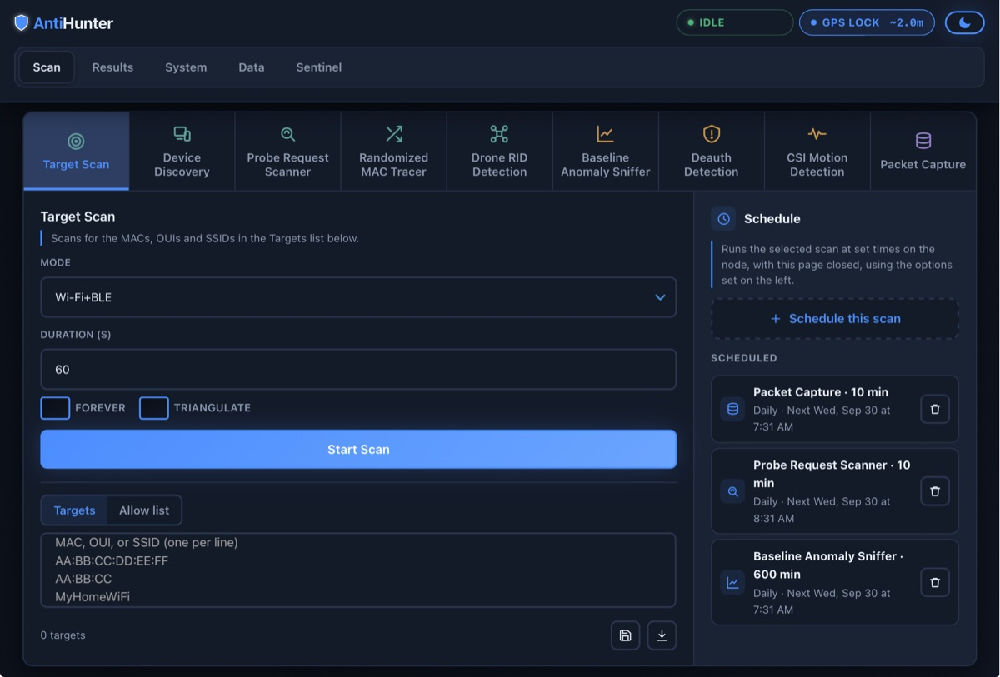
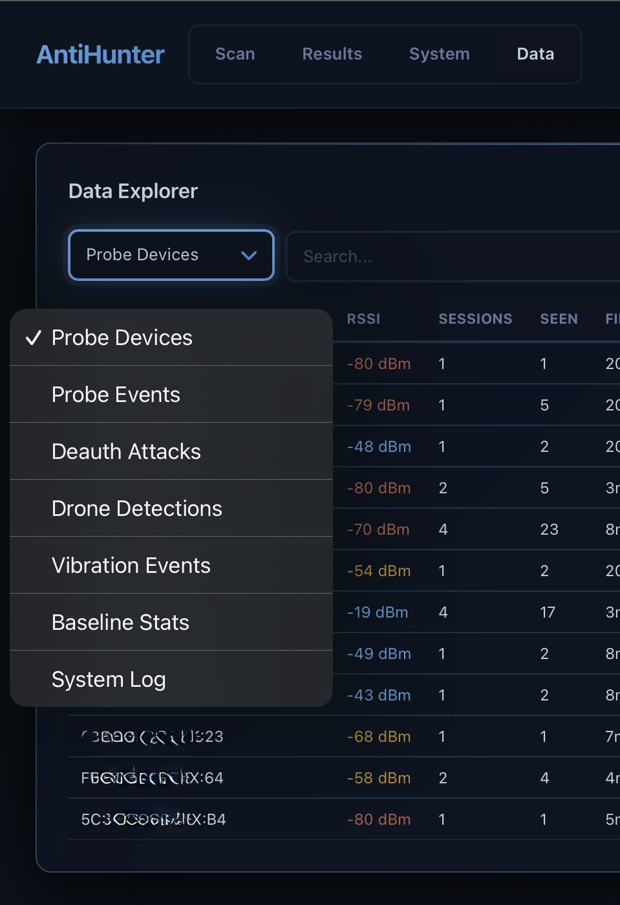
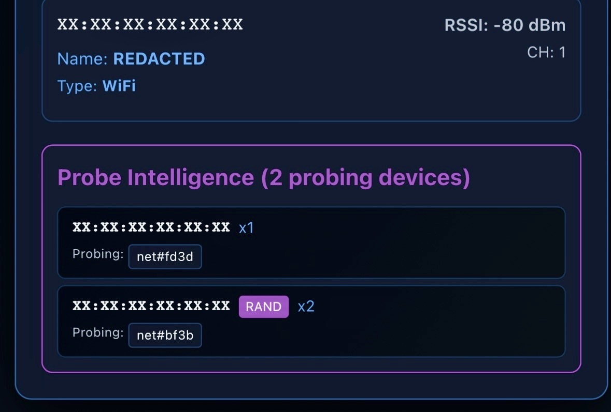
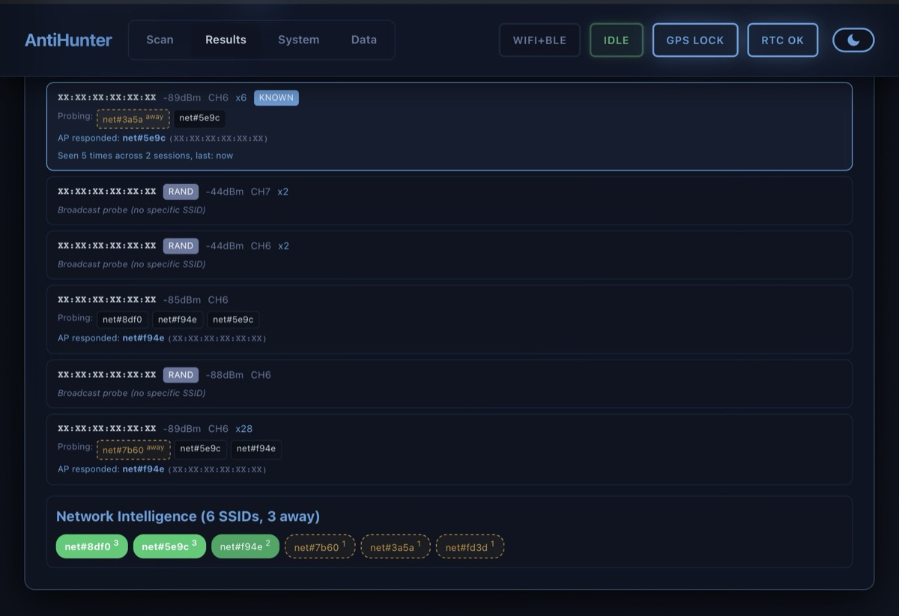
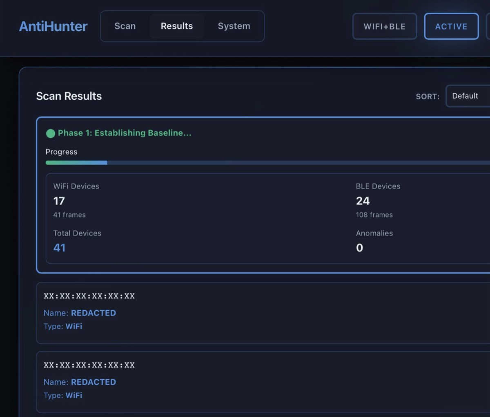
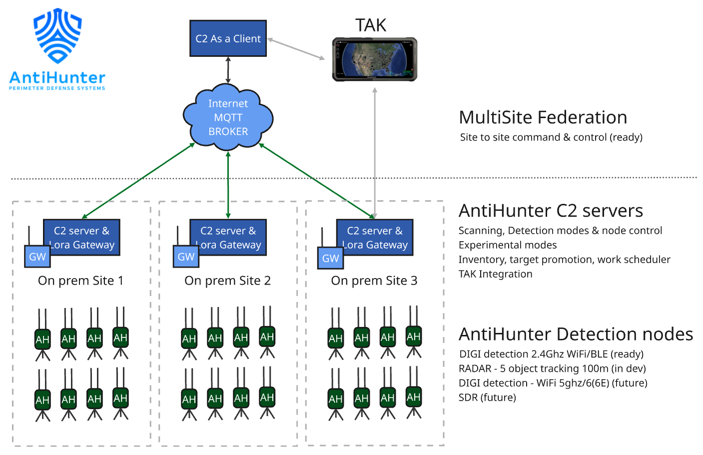

<div align="center">

[](https://discord.gg/AYFzUurfmh)</br>
[](https://github.com/lukeswitz/AntiHunter/actions/workflows/lint.yml)
[](https://github.com/lukeswitz/AntiHunter/actions/workflows/platformio.yml)
[](https://github.com/lukeswitz/AntiHunter/actions/workflows/github-code-scanning/codeql)
[](https://github.com/lukeswitz/AntiHunter/releases/latest)
[](https://github.com/lukeswitz/AntiHunter/releases)
[](https://github.com/lukeswitz/AntiHunter/tree/main/Antihunter/src)

</div>


<p align="center">
  

<div align="center">
  <a href="#features">Features</a> • <a href="#getting-started">Quick Start</a> • <a href="#hardware">DIY Build</a>  

[Website](https://rootdowndigital.com/antihunter)  • [Privacy Policy](https://rootdowndigital.com/privacy)

  <h3 align="center">DIGI Detection Node Firmware &mdash; ESP32-C5</h3>


 <a href="https://lectronz.com/stores/antihunter" alt="I sell on Lectronz"></a>

</div>

---

# Table of Contents

1. [Overview](#overview)
2. [Features](#features)
3. [Detection Modes](#detection-modes)
4. [Secure Data Destruction](#secure-data-destruction)
5. [RF Configuration](#rf-configuration)
6. [System Architecture](#system-architecture)
7. [Hardware](#hardware)
8. [Getting Started](#getting-started) - [deployment steps by tier](#1-deployment-steps-by-tier)
9. [Mesh Commands](#mesh-commands)
10. [API Reference](#api-reference)
11. [ESP32-C5](docs/ESP32-C5.md)
12. [Acknowledgments](#acknowledgments)
13. [Legal](#legal-disclaimer)

---

***Featured in Seeed Studio [Best 20 XIAO Projects in 2025](https://www.seeedstudio.com/blog/2026/01/29/best-xiao-projects/)***

## Overview

> [!WARNING]
> **This branch is the ESP32-C5 build, in testing.** Breadboard the C5 and test it before you solder anything - a C5 soldered into a PCB can only be put back on stable firmware by desoldering it and fitting an ESP32-S3 in its place. It is on the web flasher's **Experimental** channel; for stable firmware use [main](https://github.com/lukeswitz/AntiHunter/tree/main) (ESP32-S3). What differs from the S3 node is collected on the [ESP32-C5 page](docs/ESP32-C5.md).

- Open-source wireless sensor node for perimeter defense and spectrum awareness.
- ESP32-C5 with dual-band 2.4 + 5 GHz Wi-Fi and BLE scanning, GPS, SD logging, vibration sensing and LoRa mesh networking.
- Drop-in replacement for the ESP32-S3 on the same PCB - same pads, same peripherals, adds 5 GHz.
- Deploy one node or a distributed network - each scans independently and coordinates over mesh.

> Built or bought a node/kit? The **[Operator's Guide](docs/AntiHunter-Operators-Guide.pdf)** takes you from unboxing to deployment: antennas, flashing, mesh setup, every detector, the vibration sensor, Command Center install and a printable quick-reference card.

<p align="center">

</p>

## Features

| Detector | What it finds | Where |
|---|---|---|
| **Target Scan** | MAC, OUI or SSID watchlist hits, with mesh alerts | Scan tab |
| **Device Discovery** | Every Wi-Fi and BLE device in range, with RSSI, channel, vendor, name | Recon |
| **Probe Request Scanner** | The networks devices are searching for, including ghost SSIDs with no AP present | Recon |
| **Randomized MAC Tracer** | Rotating MACs linked back to one persistent identity | Recon |
| **Drone RID** | Drones broadcasting Remote ID over Wi-Fi and BLE, with operator position | Recon |
| **Baseline Anomaly** | Devices that are new, gone, returned, or that moved | Detection |
| **Deauth Detection** | Deauth and disassoc attacks, fingerprinted to the tool behind them | Detection |
| **CSI Motion** (experimental beta, S3) | Movement in the room, from how bodies disturb nearby Wi-Fi | Detection |
| **Sentinel** | Attacker-tool activity: floods, evil twins, karma, handshake capture, PMKID harvesting | Sentinel tab |
| **Packet Capture** | Raw Wi-Fi or BLE traffic to SD as a standard pcap | Capture |
| **Triangulation** | Multi-node RSSI location estimate for one target | Scan tab |

Supporting features: **Allowlist** (used by Target Scan and Baseline) · **Mesh networking** over Meshtastic LoRa · **Secure data destruction** on tamper or mesh command · **Vibration auto-scan** (movement starts a scan) · **Battery saver** · **Privacy mode** (one-click MAC/GPS/SSID redaction for screenshots) · **Data Explorer** (search and export every SD dataset) · theme and accent color choices in the System tab.

<p align="center">

</p>

### Use Cases

- Perimeter security and intrusion detection
- Penetration testing and wireless security auditing
- Counter-UAV operations and airspace monitoring
- Surveillance detection and OPSEC audits
- Device fingerprinting across MAC randomization
- Probe analysis and rogue device detection
- Event security and monitoring

---

## Detection Modes

One radio, one mode at a time. Starting a mode while another runs is rejected; `/stop` or `@ALL STOP` ends whatever is running. Every mode logs to SD and can broadcast over mesh.

**Target Scan** has its own form at the top of the Scan tab. Everything else is picked from the **Method** dropdown under *Recon & Detection*, grouped exactly as below. Sentinel runs from its own tab.

Sentinel is the exception to the one-at-a-time rule: starting any scan mode makes it hand the radio over, and it restarts on its own once the scan ends. Its enable setting is not lost in the meantime, so nothing needs restarting by hand.

### Target Scan

<p align="center">

</p>

Keep a watchlist of MAC addresses (full or OUI prefix), SSIDs, or identity IDs (`T-XXXX`) and alert when one appears.

- Wi-Fi-only, BLE-only, or both
- Global allowlist filters out known devices before anything alerts
- Logs RSSI, channel, GPS and device name to SD
- Alerts over mesh, web UI and Command Center as they happen

> **Web UI** &nbsp;Scan tab, with the watchlist under Targets
>
> **Mesh** &nbsp;`SCAN_START:mode:secs:channels[:FOREVER]`
>
> **Settings**
> - RSSI floor `@ALL CONFIG_RSSI:-80`
> - Channels `@ALL CONFIG_CHANNELS:1..11`
> - Band `@ALL CONFIG_BAND:2`

The **Target List** and **Allow List** are separate boxes on the same card. Both take one entry per line and both export to a text file.

---

### Triangulation (experimental)

Tick **Triangulate** on the Target Scan form and give a target MAC. Several nodes scan for that MAC at once, each recording RSSI and GPS; the mesh aggregates them into a weighted trilateration with Kalman filtering.

> [!TIP]
> Target RSSI above -80 dBm produces better results for BLE devices.

- Outputs GPS coordinates, confidence, estimated uncertainty in meters, and average HDOP
- Sends a Google Maps link over mesh
- Per-target distance tuning multipliers, 0.1x to 5.0x, for when the model reads short or long
- Exempt from the global RSSI threshold

<details>
<summary>RF environment calibration</summary>

Path loss model: `distance = 10^((RSSI0 - RSSI) / (10 * n))`

| Environment | Wi-Fi n | BLE n | Wi-Fi RSSI0 | BLE RSSI0 | Use Case |
|-------------|--------|-------|------------|-----------|----------|
| Open Sky | 2.0 | 2.0 | -23 dBm | -60 dBm | Clear LOS, minimal obstruction |
| Suburban | 2.7 | 2.5 | -24 dBm | -62 dBm | Light foliage, scattered buildings |
| Indoor | 3.2 | 2.9 | -25 dBm | -65 dBm | Typical indoor, some walls |
| Indoor Dense | 4.0 | 3.5 | -27 dBm | -69 dBm | Office spaces, many partitions |
| Industrial | 4.8 | 4.0 | -30 dBm | -73 dBm | Heavy obstruction, machinery |

`POST /triangulate/calibrate` with a known `mac` and `distance` writes a measured path-loss exponent for that environment.

</details>

---

---

### Recon: Device Discovery

Lists every Wi-Fi and BLE device in range with signal strength, channel and vendor.

AP discovery runs a periodic all-channel scan, paced by **Wi-Fi Scan Interval**, so every channel gets covered even while the Full build's SoftAP holds the shared radio on channel 6. Between those scans the radio hops channels in promiscuous mode and captures frames passively.

- **Capture Probes** checkbox piggybacks probe request collection onto the device scan, feeding the same probe database (MAC, vendor, RSSI, SSIDs, randomization status)
- Everything seen merges into `/devicedb.jsonl` on SD and survives reboots, capped at 2000 entries with least-recently-seen eviction (Full build only)

> **Web UI** &nbsp;Scan tab -> Device Discovery
>
> **Mesh** &nbsp;`DEVICE_SCAN_START:mode:secs[:FOREVER[:+PROBE]]`
>
> **Settings**
> - RSSI floor `@ALL CONFIG_RSSI:-80`
> - Channels `@ALL CONFIG_CHANNELS:1..11`
> - Cross-scan dedup `@ALL CONFIG_DEDUP_TTL:300`

---

### Recon: Probe Request Scanner

<p align="center">
  
</p>

Captures the networks devices are searching for, and correlates all three 802.11 address fields into one record per device.

- **Three-field correlation**: probe requests (addr2 = source), probe responses (addr1 = client, addr2 = AP, addr3 = BSSID), and destination-address matching all feed the same per-device record
- **Destination address (addr1) matching** catches probe requests addressed *to* a target MAC, so silent or sleeping devices that never transmit their own identity still register
- **Ghost SSID detection** cross-references requests against responses and flags SSIDs with no responding AP nearby. Ghosts print with a `~` prefix (`~"HomeNetwork"` vs `"CoffeeShop"`) and are networks the device joined somewhere else - home, work, travel
- SSID watchlist entries sit alongside MACs and OUIs in the target list
- OUI vendor identification, MAC randomization detection (locally-administered bit)
- Mesh alerting for watchlist hits, 60s dedup cooldown
- RSSI min/max/current, up to 4 probed SSIDs per device

> **Web UI** &nbsp;Scan tab -> Probe Request Scanner
>
> **Mesh** &nbsp;`PROBE_START:mode:secs[:FOREVER][:+ALL]` / `PROBE_STOP`
>
> **Settings**
> - `+ALL` logs every probe, not just watchlist hits
> - RSSI floor `@ALL CONFIG_RSSI:-80`
> - Channels `@ALL CONFIG_CHANNELS:1..11`

---

### Recon: Randomized MAC Tracer (experimental)

Links rotating MAC addresses back to one device using behavioral signatures: IE fingerprinting, channel sequencing, timing, RSSI patterns and sequence-number correlation. Assigns identity IDs (`T-XXXX`) that persist to SD and can be added to the target list.

- Up to 256 simultaneous identities, 128 linked MACs each. At the cap the oldest identity is evicted; stale tracks are pruned every 60s
- Dual signature support, full and minimal IE patterns
- Confidence-based linking with adaptive thresholds
- Detects global MAC leaks and Wi-Fi-to-BLE correlation

> **Web UI** &nbsp;Scan tab -> Randomized MAC Tracer
>
> **Mesh** &nbsp;`RANDOMIZATION_START:mode:secs[:FOREVER]`
>
> **Settings**
> - Mode `0` Wi-Fi, `1` BLE, `2` both
> - RSSI floor `@ALL CONFIG_RSSI:-80`

> [!NOTE]
> Use the Privacy button before sharing screenshots - it redacts MACs, GPS and SSIDs.

---

### Recon: Drone RID Detection

Decodes drone Remote ID per FAA/EASA standards over **Wi-Fi and Bluetooth**: ODID/ASTM F3411 over Wi-Fi (NAN action frames, beacon frames) and BLE (BT4 legacy and BT5 long-range advertising, service UUID 0xFFFA), plus French drone ID (OUI 0x6a5c35).

Decodes every ODID message type - Basic ID, Location, System, Operator ID, Auth, Self-ID - preferring Serial Number over CAA Registration ID. Extracts UAV ID, pilot location and flight telemetry. Mesh alerts and SD logging.


> **Web UI** &nbsp;Scan tab -> Drone RID Detection
>
> **Mesh** &nbsp;`DRONE_START:secs[:FOREVER]`
>
> **Settings**
> - RSSI floor `@ALL CONFIG_RSSI:-80`

---

### Detection: Baseline Anomaly

<p align="center">

</p>

Learns which devices belong here, then alerts on anything new, missing, returning, or whose signal moved significantly. Persistent across reboots.

- RAM cache 200-500 devices, SD overflow 1K-100K devices. Without an SD card the default cap is 1500
- Tiers between RAM and SD automatically
- Tunables under `/baseline/config`: `rssiThreshold`, `baselineDuration`, `ramCacheSize`, `sdMaxDevices`, `absenceThreshold`, `reappearanceWindow`, `rssiChangeDelta`

> **Web UI** &nbsp;Scan tab -> Baseline Anomaly Sniffer, minimum 60s
>
> **Mesh** &nbsp;`BASELINE_START:duration[:FOREVER]` (minimum 60s), `BASELINE_STATUS`
>
> **Settings**
> - Duration is the learning phase, 60s minimum
> - Progress `@ALL BASELINE_STATUS`
> - RSSI floor `@ALL CONFIG_RSSI:-80`

> [!TIP]
> A longer initial scan produces a more reliable baseline.

---

### Detection: Deauth Detection

Wi-Fi deauth and disassoc frame sniffer. Fingerprints the tool behind the frames and cross-references the Randomized MAC Tracer for source identification.


> **Web UI** &nbsp;Scan tab -> Deauth Detection
>
> **Mesh** &nbsp;`DEAUTH_START:secs[:FOREVER]`
>
> **Settings**
> - RSSI floor `@ALL CONFIG_RSSI:-80`
> - Channels `@ALL CONFIG_CHANNELS:1..11`

---

### Detection: CSI Motion (beta on S3, in testing on C5)

Tells you when someone is moving nearby, even through walls. Indoors only. It notices movement, not someone sitting still.

<p align="center">
  
</p>

**How it works.** Wi-Fi signals bounce around a room. When a person moves, the bounces change. The node listens to the Wi-Fi routers and phones around it and alerts when several of their signals change at once.

**Start it:** Scan tab → CSI Motion Detection → Start Scan. Over mesh: `@ALL CSI_MOTION_START:0:FOREVER`

**Pick a sensitivity:**
- **Low** (default): fewest false alarms. Two devices must see the movement.
- **Medium**: more sensitive. Two devices, or one device seeing a very strong change (4× the trigger).
- **High**: most sensitive. Same as Medium with a lower trigger and a shorter wait. More false alarms.

**Settings** (Scan tab → CSI Motion Detection; most are under Advanced):

| Setting | What it means | Default |
|---|---|---|
| Movement needed before alerting | How long someone must move before you get an alert | 8 s |
| Stillness before all-clear | How long it must be quiet before the alert clears | 5 s |
| Devices that must agree | How many devices must see the movement at the same time | 2 |
| Trigger level | Lower catches smaller movement | set by sensitivity |
| Listen only, never transmit | The node never sends probes. Turn off only if it sees too little Wi-Fi | On |
| Include randomized-MAC devices | Also listen to phones and watches, not just routers | On |
| Mesh alert gap | Wait at least this many seconds between alerts sent over mesh | 0 (off) |

**Getting false alarms with nobody there?** Turn on "Per-packet score to serial", watch the `sig` numbers while the room is empty, and set Trigger level just above the highest one.

> [!WARNING]
> **This mode can transmit if you enable it.** Off by default. If you turn off "Listen only, never transmit", the node sends Wi-Fi probe requests when there is too little traffic to measure. Anyone nearby can see them. Check local rules before turning it on.

Mesh commands for all of this: [CSI Motion commands](#csi-motion).

---

### Detector groups

| Group | Detectors | How they are caught |
|---|---|---|
| **DoS** | Deauth flood, deauth forge, broadcast deauth, AP-targeted deauth, beacon flood, auth flood, assoc-sleep, SAE DoS | Fixed/rotated deauth seqCtrl + reason codes, impersonation bursts, beacon-spam rate + static templates, open-system auth flood, assoc-req PM-bit floods, SAE commit floods (algo 3 / txn 1) |
| **Rogue AP** | Evil-twin, OWE abuse, Karma / MANA | Clone of our own AP (SSID/BSSID collision); OWE-transition downgrade; bait-probe answered by an AP that never beacons that SSID |
| **Recon** | PMKID harvest, probe flood, handshake capture | Orphaned-M1 / KDE PMKID solicitation; fixed-seq + behavioral probe spam (≥15 MACs/SSID/5s); forced and passive EAPOL M1-M4 capture |
| **Physical** | FragAttacks, TSF / multi-channel twin, Wi-Fi interference | A-MSDU PN reuse / mixed-key frags; same BSSID on ≥2 channels within 5s; per-channel PDR-vs-RSSI collapse (CRC-fail flood) |
| **Mesh disruption** | Self-spoof, channel flood, command audit | Own node-id seen inbound; inbound rate DoS; every privileged mesh command logged with the radio id that issued it |

**Field-verified on hardware**, confirmed firing against the live tools above: deauth (flood/forge/AP-targeted), beacon flood, auth flood, assoc-sleep, SAE DoS, karma, evil-twin, probe flood, handshake capture.

**Experimental**: OWE abuse, PMKID harvest, FragAttacks, TSF multi-channel twin, Wi-Fi interference, mesh disruption.

**Behavioral fallbacks**, which survive template changes: SSID-rotate forge, behavioral probe-flood, EAPOL-capture bait, broadcast-deauth-while-beaconing.

### False-positive suppression

The crypto and handshake detectors (PMKID, KRACK, handshake capture, SAE-DoS) and every beacon-based detector (evil-twin, OWE, SSID-confusion, TSF, beacon-flood) skip locally-administered and randomized BSSIDs. Phone hotspots and MAC-randomizing devices produce normal handshakes, SAE retries and M3 retransmits that would otherwise read as attacks.

Volume-based DoS detectors (deauth, auth, assoc floods, probe-flood) do **not** skip them, because real floods commonly spoof randomized sources.

### Control and boot

Start and stop from the Sentinel tab, or `SENTINEL_ON` / `SENTINEL_OFF` over mesh. Off at boot by default. `SENTINEL_OFF` also clears the start-on-boot setting, so re-enable both if you want it back at power-on.

- `SENTINEL_MODE:defend` pins the channel, `SENTINEL_MODE:scan` hops. Headless has no SoftAP to pin to, so use `scan` there.
- `SENTINEL_BOOT:1` makes it auto-start at power-on and survive reboot. Also settable from the Web Flasher / Configurator, or `POST /api/sentinel/boot`.
- `GROUP:<name>:<on|off>` toggles a whole group; `DETECT_CFG:<json>` sets individual detectors and thresholds. Both write to NVS.
- Deauth, beacon and auth detection have no toggle - they are always on while Sentinel runs.

### Attack response

When a detector confirms an attack with a source MAC, Sentinel can start a follow-up action against that MAC: triangulation, packet capture, device discovery, probe sweep, or drone RID, each with its own duration. Only one can hold the radio, so several queue and run in that order one at a time. Detection pauses while each runs.

Configured through `attack_resp_mask` plus `ar_secs_trilat`, `ar_secs_pcap`, `ar_secs_device`, `ar_secs_probe` and `ar_secs_drone` on `/api/detect/config`, or the Sentinel tab. Triangulation on its own also toggles with `ATTACKER_TRILAT:1`. Active hunts are listed at `GET /api/attacker_hunts`.

### Mesh command audit

Every privileged command received on the mesh is logged with the radio id that issued it. It appears in the Sentinel UI (*Mesh Commands* panel, below AP Clients, Full build), at `GET /api/mesh_cmd.jsonl`, and on SD at `/mesh_cmd.jsonl`.

This is a provenance record, not an alert, so it never false-positives. Injection on a shared LoRa channel is indistinguishable from legitimate operation, so the source is recorded rather than guessed at.

### Outputs

`[DETECT]` lines on serial, one `.jsonl` per detector on SD, and a mesh broadcast to peer nodes for quorum confirmation.

---

## Secure Data Destruction

Vibration-triggered and mesh-commanded destruction of everything on the node.

> [!WARNING]
> Data destruction is permanent and irreversible. There is no recovery path.

- **Auto-erase on tampering** - vibration-triggered, disabled by default
- **Setup delay** - grace period after enabling, so you can walk away from a deployed node
- **Manual secure wipe** - from the web interface, requires the erase PSK
- **Remote force erase** - mesh-commanded, answered with an HMAC of a challenge keyed by the erase PSK, 5-minute expiry
- **Obfuscation** - plants a dummy IoT weather config after the wipe

### Setting an erase PSK

Each node generates a random erase PSK on first boot and prints it on the USB console at every boot (`[ERASE] PSK: ...`). Every erase command needs a credential: send `@<NODE> ERASE_REQUEST`, take the `ERASE_TOKEN:` challenge from the reply, and answer with the hex HMAC-SHA256 of that token keyed with the PSK, e.g. `printf %s "<token>" | openssl dgst -sha256 -hmac "<psk>"`. Change the PSK with `@<NODE> CONFIG_ERASE_PSK:<new>:<hmac>` (1-64 chars, no `:`) or from **System → Secure Data Destruction** with the current PSK.

<details>
<summary>Auto-erase configuration</summary>

| Parameter | Range | Description |
|-----------|-------|-------------|
| Setup delay | 30s - 10min | Grace period before auto-erase arms |
| Erase delay | 10 - 300s | Countdown before destruction, cancellable |
| Vibrations required | 2 - 5 | Movement count to trigger |
| Detection window | 10 - 60s | Window the vibration count must fall inside |
| Cooldown period | 5 - 60min | Minimum time between tamper attempts |

Mesh: `AUTOERASE_ENABLE:<setup>:<erase>:<vibrations>:<window>:<cooldown>` in seconds, then `:<hmac>`. Web: **System → Auto-Erase** with the PSK in the Authorization field, or `GET`/`POST /config/autoerase` with `confirm=<psk>`.

**Deploying it:**
1. Enable auto-erase with a setup delay long enough to leave the area
2. Set thresholds for the site - a windy pole needs a higher vibration count than a shelf
3. Deploy and walk away during the setup period
4. Watch mesh for `TAMPER_DETECTED` alerts
5. Remote wipe: `@NODE ERASE_REQUEST` returns a challenge, then `@NODE ERASE_FORCE:<hmac>`. `@NODE ERASE_CANCEL:<hmac>` aborts a countdown

</details>

---

> [!IMPORTANT]
> **The C5 is a different radio, not a faster S3.** It is a drop-in and runs the same detectors, but its
> RF behavior differs in ways that are documented by Espressif and confirmed here on hardware:
>
> - **Dual band.** A capture hops 2.4 and 5 GHz channels in one run. `esp_wifi_set_band_mode` selects the
>   band; the regulatory 5 GHz channel set is on the [ESP32-C5 page](docs/ESP32-C5.md#bands-and-channels).
> - **Channel changes are refused while a station is associated to the AP.** This is the documented
>   contract for `esp_wifi_set_channel`, not a fault. Scans and captures visit channels through
>   `esp_wifi_scan_start`, which returns the radio to the AP channel between hops, so the link survives
>   and the AP channel takes a larger share of the airtime while a browser is connected.
> - **CSI reads differently than the S3** on the same channel, and the two boards' numbers are not
>   comparable. A trigger
>   tuned on an S3 will not behave the same here. Measure each board's own idle distribution on the
>   channel it surveyed onto and set its trigger from that.

## RF Configuration

### Band

One radio, one band at a time. RF Settings → *Band* selects 2.4 GHz, 5 GHz, or both; the setting filters the configured channel list into the hop list and persists to NVS.

Mesh: `CONFIG_BAND:<0|1|2>`. API: `POST /rf-config` with `bandMode`. Channel lists and 5 GHz behavior are on the [ESP32-C5 page](docs/ESP32-C5.md#bands-and-channels).

### Scan presets

| Preset | Wi-Fi Chan Time | Wi-Fi Scan Int | BLE Scan Int | BLE Scan Dur | RSSI Threshold | Use Case |
|--------|----------------|---------------|--------------|--------------|----------------|----------|
| Relaxed | 300ms | 5000ms | 6000ms | 3000ms | -80 dBm | Low power |
| Balanced | 160ms | 3000ms | 4000ms | 2000ms | -95 dBm | General use (default) |
| Aggressive | 110ms | 1500ms | 2000ms | 1000ms | -100 dBm | Fast, max coverage |
| Custom | User-defined | User-defined | User-defined | User-defined | User-defined | Fine-tuned |

Set from the web interface at `http://192.168.4.1` or `POST /rf-config`. Persists to NVS and mirrors to SD.

<details>
<summary>Parameter tuning</summary>

- **Wi-Fi Channel Time** - dwell per channel, 50-300ms. Used for both the passive hop and the per-channel time in the all-channel scan. It has to clear the ~100ms beacon interval to catch every AP on a channel; shorter covers more channels but risks missing beacons.
- **Wi-Fi Scan Interval** - cadence of the all-channel AP discovery scan, 1000-10000ms. Between scans, target frames are captured passively while hopping channels.
- **BLE Scan Interval** - time between BLE cycles, 1000-10000ms.
- **BLE Scan Duration** - active scanning per cycle, 1000-5000ms. Longer improves BLE discovery but holds the shared radio on BLE, pausing Wi-Fi channel-hopping.

Wi-Fi and BLE share one radio and the scan loop is single-threaded: a BLE scan holds the radio for its full duration, and Wi-Fi promiscuous capture is off-air for that whole time. BLE Scan Duration is therefore the fraction of each cycle Wi-Fi is dark. The presets set BLE Scan Duration to half the BLE Scan Interval, an even 50/50 split.

- **RSSI Threshold** - global signal filter, -100 to -10 dBm. Triangulation is exempt.
- **Wi-Fi Channels** - comma-separated (`1,6,11`) or a range (`1..14`). Default `1..11`.

> [!TIP]
> Lower intervals detect faster and draw more power. Higher intervals save power and may miss brief transmissions.

</details>

---

## System Architecture

<p align="center">
  
</p>

Nodes scan independently and coordinate over Meshtastic LoRa. Detection → data collection (RSSI, GPS, timestamp) → mesh broadcast → command center aggregation.

- **Connection**: TEXTMSG mode, 115200 baud, over UART. Radio-side pins `10 RX / 9 TX` (T114), `19 RX / 20 TX` (Heltec V3)
- **Addressing**: `@ALL COMMAND` broadcasts, `@AH01 COMMAND` targets one node. Node IDs are 2-5 alphanumeric characters, `A-Z0-9`, no spaces
- **Rate limiting**: 3s default send interval, settable 1500-30000ms via `/mesh-interval`
- **Sender names**: emoji and non-ASCII short names are stripped and still dispatch. A radio short-named the same as a node's own ID is dropped as a self-echo, so keep them distinct

**[AntiHunter Command Center](https://github.com/TheRealSirHaXalot/AntiHunter-Command-Control-PRO)** aggregates every node with live mapping and visualization.

A second C5 firmware, [RadarNode](https://github.com/lukeswitz/AntiHunter/blob/beta/docs/RADARNODE.md), shares this PCB and mesh: 24GHz radar as the primary sensor, Wi-Fi/BLE swept on a radar trigger. It tags its `STATUS` reply with `TYPE:RADAR`, which the RadarNode UI and Command Center use to type peers. Experimental, branch not yet published.

### Radio Setup

Soldered Core PCB and Assembled tiers ship this already applied - serial on, TEXTMSG 115200 on the board's pins, screen 1s, LED off, BLE on with the default pin. Region and channel are still yours to set. Bare PCB and Parts Kit builds do all of it.

The app and the web client can set all of this by hand. The script below does it in one go: flash the radio with stable Meshtastic, connect it on its own, then run `scripts/meshtastic_config.py`. One config group per call, each value read back afterwards.

```
options:
  --port PORT           serial port (auto-detected if omitted)
  --board {heltec-v3,t114}
                        board type, sets the serial-module pins (default heltec-v3)
  --screen on|off|SECS  'off' blanks after 1s, 'on' stays lit, or give seconds
  --led {on,off}        status LED heartbeat
  --ble {on,off}        Bluetooth on or off
  --pin NNNNNN|none|random
                        BLE pairing: 6-digit fixed pin, 'none', or 'random'
  --serial {on,off}     AntiHunter serial module (TEXTMSG, 115200, board pins)
  --region REGION       LoRa region, e.g. US. UNSET means receive only
```

```bash
python3 scripts/meshtastic_config.py                     # print current settings
python3 scripts/meshtastic_config.py --serial on         # node link, pins per --board
python3 scripts/meshtastic_config.py --region US         # UNSET = RX only, no TX
python3 scripts/meshtastic_config.py --pin 481920 --screen off --led off
python3 scripts/meshtastic_config.py --board t114 --serial on --ble off
```

Run it with no flags on a terminal for an interactive menu. The same settings apply from the Meshtastic app or web client: Serial enabled, TEXTMSG, 115200, pins per board.

> [!IMPORTANT]
> Before deployment: set your region, change the BLE pairing pin, make your own encrypted channel primary, and turn the public channel off. A node on the default public channel accepts commands from anyone in range.

<details>
<summary>Mesh TX architecture and airtime</summary>

Scan tasks (sniffer, baseline, drone, randdet, blueteam) are pure producers. They enqueue device-broadcast messages and exit immediately when the scan ends. A background consumer task (`meshTxTask`) drains at the LoRa airtime cap through the token-bucket rate limiter (`SerialRateLimiter`, ~167 B/s sustained, ~80ms inter-frame cadence).

Three priority queues hold 256 entries total - CTRL 16, EVENT 32, BULK 208 - drained in that order, so a `STOP` never waits behind a device dump. Device rows pack into frames up to 230 B, under Meshtastic's 237 B text-payload cap, so a scan's devices ride out in the fewest LoRa packets.

- Starting a new scan never waits on the prior scan's mesh TX
- `/stop` and the mesh `STOP` command flush the queues immediately, cancelling pending TX
- `MESH_TX_CANCEL` drops queued traffic without stopping the scan
- The header badge `Mesh TX K/N` shows live drain progress and hides when the queues empty. `GET /mesh/drain/status` returns the same figures

</details>

<details>
<summary>Cross-scan dedup</summary>

Repeated scans of the same RF environment re-broadcast the same MACs. `DEVICE:` broadcasts are deduplicated by MAC with a configurable TTL.

| Setting | Effect |
|---------|--------|
| `meshDedupTtl = 0` | Disabled. Every scan broadcasts every observed device |
| `meshDedupTtl = 300` (default) | A MAC broadcast in the last 5 minutes is skipped on later scans inside that window |
| `meshDedupTtl = 3600` (max) | Hourly per-MAC airtime cap |

**Applies only to** sniffer and baseline `DEVICE:` broadcasts. Never to triangulation (`T_F:`/`T_C:`/`T_D:` need multiple RSSI readings), anomaly alerts (`ANOMALY:`, `DEVICE_DISAPPEARED:`), drone alerts (`DRONE:`, `DRONE_LOST:`), attack alerts (`DEAUTH_FLOOD:`, `ATTACK:`), summaries (`SCAN_DONE:`, `BLUE_DONE:`), or identities (`IDENTITY:`).

With dedup on, `SCAN_DONE` reports `TX=N DUP=M`: N MACs broadcast this window, M skipped. Total unique devices seen is roughly `N+M`.

Set it with: Web UI **Network Settings → Mesh Dedup TTL** · `POST /mesh-dedup-ttl?ttl=N` seconds · `@ALL CONFIG_DEDUP_TTL:N`. Clear the cache with `POST /mesh-dedup-clear` or `@ALL MESH_DEDUP_CLEAR` to force everything to re-broadcast.

</details>

---

## Hardware

> [!IMPORTANT]
> Requires a regulated 5V supply. Unregulated battery sources cause voltage instability. A 2A fast-blow inline fuse on the battery line is optional added protection.

### Core components

- **Seeed XIAO ESP32-C5** - pinout and band configuration on the [ESP32-C5 page](docs/ESP32-C5.md)
- **Meshtastic board**: Heltec v3.2 (recommended) or T114. Alternatives in [discussions](https://github.com/lukeswitz/AntiHunter/discussions)
- **GPS, SDHC, vibration and RTC modules**

Assembly: the [Operator's Guide](https://github.com/lukeswitz/AntiHunter/blob/main/docs/AntiHunter-Operators-Guide.pdf) and the illustrated [assembly manual](https://github.com/lukeswitz/AntiHunter/blob/main/hw/Prototype_STL_Files/Antihunter-DIGINODE-AssemblyManual.pdf).

<details>
<summary>Bill of materials</summary>

[Links and photos for every part](https://github.com/lukeswitz/AntiHunter/blob/beta/hw/Prototype_STL_Files/BOM-Links.md)

CORE COMPONENTS
- 1x DIGI PCB (82mm, 2-layer)
- 1x Seeed Studio XIAO ESP32-C5
- 1x Heltec Wi-Fi LoRa 32 V3.2 (T114 also compatible, V3.2 preferred)
- 1x ATGM336H GPS Module
- 1x Micro SD SDHC TF Card Adapter Reader Module
- 1x SD Card (FAT32, 8GB shipped with every built tier; 32GB+ not recommended)
- 1x SW-420 Vibration Sensor
- 1x DS3231 Real Time Clock Module

CONNECTORS & FASTENERS
- 5x JST 2.54 2-Pin Terminals
- 10x M3 Mounting Inserts
- 4x M2 Mounting Inserts (power board)
- 2x M3x15mm Brass Standoffs
- 1x 1/4" Tripod Insert
- 2x JST Power Male Cable (switch, power board)
- 8x M3x4-6mm Flat Top Screws (enclosure lids, max 6mm heads)
- 6x M3x4-6mm Screws (PCB and front/rear covers)
- 4x M2x4-6mm Screws (power board; or M3x4-6mm straight into the plastic without inserts)
- 2-4x M2.5 13-15mm Screws (fan)

ANTENNA & CABLING
- 3x U.FL to SMA Pigtail Cable (SMA bulkhead, 10-20cm)
- 1x 6dBi Antenna 2.4GHz (Wi-Fi/BLE)
- 1x 6dBi Antenna LoRa (region-dependent: 868MHz EU / 915MHz US / 923MHz Asia)
- 1x Active GPS Antenna (L1, SMA)

POWER & THERMAL
- 1x 30mm 5V Fan - JST (2.0mm JST also fits)
- 1x 3-Pin Mini On/Off Switch
- 1x KSD9700 Normally Open Thermal Wire Sensor (30-40C)
- 1x Type-C Female Chassis Jack, waterproof (2-pin, 22 AWG leads, 14mm panel nut, dust cap)
- 1x Type-C 15W 3A 5V Fast Charge UPS Power Supply
  (2S 18650 Charger Module DC-DC Step Up Booster Converter, 88x41x22mm)
- 2x 18650 cells, protected flat-top (not supplied with any tier)

ENCLOSURE
- 1x Weatherproof Enclosure (3D printable) - [STL files](https://github.com/lukeswitz/AntiHunter/tree/main/hw/Prototype_STL_Files)
- 1x TPU Seal Kit (housing, USB-C, GPS antenna)

FAN NOTES
- The sticker side is not always the exhaust side. Run the fan for a second and feel which way it blows before you screw it down. Assembled units ship with the fan set to exhaust.
- Shorting the two THERMO pins bypasses the thermal switch and runs the fan whenever the node is powered.

</details>

<details>
<summary>Pinout</summary>

> Pin assignments may evolve. Verify against your board revision.

| Function | Pad | GPIO | Description |
|----------|-----|------|-------------|
| Vibration Sensor | D1 | 0 | SW-420 tamper detection (interrupt) |
| RTC SDA | D2 | 25 | DS3231 I2C data |
| RTC SCL | D5 | 24 | DS3231 I2C clock |
| GPS RX | D7 | 12 | NMEA data receive |
| GPS TX | D6 | 11 | GPS transmit |
| SD CS | D0 | 1 | SD card chip select |
| SD SCK | D8 | 8 | SPI clock |
| SD MISO | D9 | 9 | SPI MISO |
| SD MOSI | D10 | 10 | SPI MOSI |
| Mesh RX | D3 | 7 | Meshtastic UART receive |
| Mesh TX | D4 | 23 | Meshtastic UART transmit |

Same pads as the S3 node. The [ESP32-C5 page](docs/ESP32-C5.md#pinout) has the side-by-side GPIO mapping.

</details>

---

## Getting Started

### 1. Deployment Steps by Tier

No firmware ships on the node. You flash AntiHunter yourself, for integrity and regulatory reasons.

**Soldered Core PCB** and **Assembled** tiers ship the Heltec radio on the latest stable Meshtastic, already configured for the node: serial module on, TEXTMSG at 115200 on the board's pins, screen blanks after 1s, status LED off, Bluetooth on with the default pairing pin. LoRa region is UNSET, so the radio receives but does not transmit until you set it, and it sits on the public default channel. **Bare PCB** and **Parts Kit** builds flash and configure the radio themselves.

| Tier | What ships | What you supply |
|---|---|---|
| **Bare PCB** ([note](docs/note-tier4-bare-pcb.pdf)) | One unpopulated 82mm board | Everything: source the [BOM](https://github.com/lukeswitz/AntiHunter/blob/beta/hw/Prototype_STL_Files/BOM-Links.md), solder per the [assembly manual](https://github.com/lukeswitz/AntiHunter/blob/main/hw/Prototype_STL_Files/Antihunter-DIGINODE-AssemblyManual.pdf), flash and configure Meshtastic on the radio, fit a FAT32 SD card |
| **Soldered Core PCB** ([note](docs/note-tier3-populated-pcb.pdf)) | Fully populated PCB: XIAO ESP32-S3, Heltec LoRa radio, GPS, RTC, vibration sensor, SD reader, 8GB card fitted, radio flashed and serial-configured. Factory U.FL whip antennas only | Optional: enclosure, regulated 5V power, external antennas |
| **Parts Kit** ([note](docs/note-tier2-parts-kit.pdf)) | Every BOM part as loose components - PCB, modules, 8GB card, enclosure and TPU seals, 6dBi 2.4GHz and 6dBi LoRa antennas, U.FL→SMA pigtails and bulkheads, fan, thermal switch, power switch, waterproof USB-C panel jack, UPS board, fasteners. Nothing soldered, nothing flashed. No GPS antenna | Soldering and assembly per the manual, Meshtastic on the radio, 2x 18650 cells, active GPS antenna |
| **Assembled** ([note](docs/note-tier1-assembled.pdf)) | Built, sealed and bench-tested. 8GB card fitted, GPS helix antenna, radio flashed and serial-configured | 2x 18650 cells |

> Built tiers ship with an ESP32-S3. Fitting a C5 means desoldering the S3.

### 2. Attach all three antennas before powering on

On the Soldered Core PCB tier: ceramic is GPS, the labeled 2.4GHz one is the ESP32, the third is LoRa on the Heltec. All other tiers use SMA antennas. Powering a radio with no antenna attached can damage it.

### 3. Flash the firmware

Pick Full or Headless first:

| | Full | Headless |
|---|---|---|
| Control | Web UI and API over its own AP, plus serial and mesh | Serial and mesh only |
| Scan engine, detectors, mesh commands | Identical | Identical |
| Results | `/results` in the browser, plus `/last_results.txt` on SD | `/last_results.txt` on SD |
| Device database | `/devicedb.jsonl` on SD | Not written |
| RF footprint | AP beacons continuously | Never beacons unless a scan mode transmits |

[Open the web flasher](https://lukeswitz.github.io/AntiHunter/) in Chrome or Edge on desktop, choose the **Experimental - XIAO ESP32-C5** channel, pick Full or Headless, tick the acknowledgement, then Connect & Flash.

### 4. Finish the radio

Set your LoRa region, change the pairing pin, make your own encrypted channel primary and turn the public one off. Bare PCB and Parts Kit builds flash Meshtastic and enable the serial module here too.

The serial module needs four settings, however you get there: **Serial** enabled, mode **TEXTMSG**, baud **115200**, and the RX/TX pins for your board - `19 RX / 20 TX` on Heltec V3, `10 RX / 9 TX` on T114. Three ways to apply them: the [Meshtastic phone app](https://meshtastic.org/docs/software/) over Bluetooth, the [Meshtastic web client](https://meshtastic.org/docs/software/) over USB from Chrome or Edge, or `scripts/meshtastic_config.py` from a terminal - see [Radio Setup](#radio-setup).

### 5. First login

**Full build:** join the `Antihunter` AP (default password `antihunt3r123`) and open `http://192.168.4.1`. First thing to change is the AP password, in **System → RF Settings**. Then set your node ID, add targets, and start a scan from the **Scan** tab.

**Headless build:** serial monitor or mesh only. Set the node ID with `@<NODE> CONFIG_NODEID:AH01` and the band with `@<NODE> CONFIG_BAND:<0|1|2>`.

Settings persist to NVS and mirror to SD. A corrupted preference set self-heals from the SD copy on boot.

### Radio footprint

The node is passive by default. Two things transmit on Wi-Fi, both opt-in:

- **Karma bait** (Sentinel, `GROUP:rogue:on`) - one probe request every 8s carrying a throwaway SSID. Off by default.
- **CSI Motion** - only with `BROADCAST=ON` (default off): a broadcast probe request at most once per second, and only when fewer than 15 CSI packets arrived in the last second. It only runs while you have CSI Motion selected.

On the Full build the SoftAP beacons continuously on channel 6 regardless. The Headless build never beacons.

### Handy links

- PCB [welcome letter](https://github.com/lukeswitz/AntiHunter/blob/beta/hw/Prototype_STL_Files/ahwelcome.txt)
- [Assembly manual](https://github.com/lukeswitz/AntiHunter/blob/main/hw/Prototype_STL_Files/Antihunter-DIGINODE-AssemblyManual.pdf) (PDF)
- [BOM parts, links and photos](https://github.com/lukeswitz/AntiHunter/blob/beta/hw/Prototype_STL_Files/BOM-Links.md)
- [Operator's Guide](docs/AntiHunter-Operators-Guide.pdf)

---

### Build from Source

**Prerequisites:** PlatformIO, Git, a USB cable. Optional: VS Code with the PlatformIO extension.

```bash
git clone -b feat/c5 https://github.com/lukeswitz/AntiHunter.git
cd AntiHunter
```

```bash
pio device list                                       # list connected devices
```

Now pick which firmware you want. Full gives you the web UI; headless is serial and mesh only. Both go on the same board, so run one of these, not both.

```bash
pio run -e AntiHunter-c5-full -t upload               # full firmware: web UI, SoftAP dashboard
```

```bash
pio run -e AntiHunter-c5-headless -t upload           # headless firmware: serial + mesh only
```

```bash
pio device monitor -e AntiHunter-c5-full              # watch the node's serial output
```

Erasing wipes the whole flash chip, saved settings and all, and leaves the board with nothing on it. Only reach for it when you want to start clean, and upload again afterwards.

```bash
pio run -e AntiHunter-c5-full -t erase                # erase the entire flash chip
```

Both environments build from the same sources and differ only in features. `AntiHunter-c5-full` adds the SoftAP dashboard (ESPAsyncWebServer + AsyncTCP); `AntiHunter-c5-headless` is serial and mesh only, with no web dependencies. Board `seeed_xiao_esp32c5`, partitions `Dist/partitions_c5.csv`.

---

## Mesh Commands

Timestamps show local time from the GPS fix. Without a GPS lock they show UTC. Node IDs are 2-5 alphanumeric characters, `A-Z0-9`.

> [!TIP]
> `@ALL` broadcasts to every node. Replace it with a node ID to target one.

### Core

| Command | Does | Parameters | Example |
|---------|------|------------|---------|
| `STATUS` | Report mode, scan state, hits, temp, uptime, GPS | None | `@ALL STATUS` |
| `STOP` | Stop everything running and flush queued mesh TX | None | `@ALL STOP` |
| `MESH_TX_CANCEL` | Drop queued mesh traffic, keep scanning | None | `@ALL MESH_TX_CANCEL` |

### Configuration

| Command | Does | Parameters | Example |
|---------|------|------------|---------|
| `CONFIG_TARGETS` | Set the watchlist | Pipe-delimited MACs, OUIs, SSIDs | `@ALL CONFIG_TARGETS:AA:BB:CC:DD:EE:FF\|11:22:33\|MyNetwork` |
| `CONFIG_NODEID` | Rename the node | 2-5 alphanumeric | `@AH01 CONFIG_NODEID:AH02` |
| `CONFIG_RSSI` | Set the RSSI floor | -128 to -10 | `@ALL CONFIG_RSSI:-80` |
| `CONFIG_CHANNELS` | Set the channels to sweep | Comma-separated or a range | `@ALL CONFIG_CHANNELS:1..11` |
| `CONFIG_BAND` | Pick the band, C5 only | `0` 2.4, `1` 5, `2` both | `@ALL CONFIG_BAND:2` |
| `CONFIG_DEDUP_TTL` | Set cross-scan MAC dedup | Seconds 0-3600, `0` disables | `@ALL CONFIG_DEDUP_TTL:300` |
| `CONFIG_SESSION_DEDUP` | Toggle per-session dedup | `0`/`1` | `@ALL CONFIG_SESSION_DEDUP:1` |
| `MESH_DEDUP_CLEAR` | Clear the dedup cache | None | `@ALL MESH_DEDUP_CLEAR` |
| `DEVICE_DB_CLEAR` | Clear the discovered-device DB, headless only | None | `@AH01 DEVICE_DB_CLEAR` |

### Scanning

| Command | Does | Parameters | Example |
|---------|------|------------|---------|
| `SCAN_START` | Hunt the watchlist | `mode:secs:channels[:FOREVER]` | `@ALL SCAN_START:2:300:1..11` |
| `DEVICE_SCAN_START` | List everything in range | `mode:secs[:FOREVER[:+PROBE]]` | `@ALL DEVICE_SCAN_START:2:300:+PROBE` |
| `BASELINE_START` | Learn the area, then flag changes | `duration[:FOREVER]`, min 60s | `@ALL BASELINE_START:300` |
| `BASELINE_STATUS` | Report baseline progress | None | `@ALL BASELINE_STATUS` |
| `PROBE_START` / `PROBE_STOP` | Collect probe requests | `mode:secs[:FOREVER][:+ALL]` | `@ALL PROBE_START:2:300:+ALL` |
| `RANDOMIZATION_START` | Link randomized MACs to devices | `mode:secs[:FOREVER]` | `@ALL RANDOMIZATION_START:2:300` |
| `DRONE_START` | Watch for drone Remote ID | `secs[:FOREVER]` | `@ALL DRONE_START:300` |
| `DEAUTH_START` | Watch for deauth attacks | `secs[:FOREVER]` | `@ALL DEAUTH_START:300` |
| `PCAP_START` / `PCAP_STOP` | Record traffic to SD as pcap | `radio:secs:band[:CH<list>]` | `@ALL PCAP_START:0:300:2:CH36,40,149` |
| `PCAP_LIMITS` | Set or read the file size cap | `[MB]`, 8-300 | `@ALL PCAP_LIMITS:150` |
| `SD_REPAIR` | Rebuild an unmountable SD card; erases it | `ON\|OFF\|NOW` | `@ALL SD_REPAIR:ON` |

> [!WARNING]
> Stop a capture before cutting power or resetting the node. FAT has no power-fail
> protection, so an interruption mid-write can leave the SD card unreadable until it is
> reformatted, and the node then runs with no storage at all. `SD_REPAIR:ON` lets a node
> rebuild its own card, which recovers most cases but not all, and erases the card.

`mode` is `0` Wi-Fi, `1` BLE, `2` both. `+PROBE` on `DEVICE_SCAN_START` captures probe requests alongside device discovery, feeding the probe database.

### CSI Motion

| Command | Does | Parameters | Example |
|---------|------|------------|---------|
| `CSI_MOTION_START` | Detect movement in the room | `secs[:FOREVER][:CH<n>][:TELEM][:RAW][:GAP<s>][:LISTEN_ONLY\|ALLOW_TRANSMIT][:MGMTONLY\|MGMTDATA][:SOLICIT<ms>]` | `@ALL CSI_MOTION_START:600:GAP60` |
| `CSI_CFG` | Tune detection; tokens combine | `SENSITIVITY=`, `MIN_MOTION=`, `CLEAR_AFTER=`, `SPOTS=`, `BROADCAST=`, `ALLOW_RANDOM=`, `REQUIRE_CE=`, `CH=` | `@ALL CSI_CFG:SENSITIVITY=LOW:BROADCAST=OFF` |
| `CSI_EXCLUDE` | Ignore one MAC until reboot | MAC or `NONE` | `@AH01 CSI_EXCLUDE:NONE` |
| `CSI_STATUS` / `CSI_JSON` | Dump motion state to serial | None | `@AH01 CSI_STATUS` |
| `CSI_RECAL` | Clear a saved threshold; use the preset | None | `@ALL CSI_RECAL` |

`CSI_CFG` tokens: `SENSITIVITY=LOW|MEDIUM|HIGH|<number>` · `MIN_MOTION=<s>` · `CLEAR_AFTER=<s>` · `SPOTS=<n>` (default 2) · `BROADCAST=ON|OFF` (default OFF) · `ALLOW_RANDOM=ON|OFF` (default ON) · `REQUIRE_CE=ON|OFF` (default OFF) · `CH=<n>` (`0` picks).

On the first CSI start after boot each node sends `<NODE>: CSI_PEER:<AP MAC>`. Nodes that hear it ignore that MAC for CSI until reboot and answer with their own `CSI_PEER` the first time they hear a MAC. If the channel survey picks a channel whose best access point is a peer node, the survey runs again.

`CSI_CFG` ranges: trigger 0.005-20.0, hold 500-120000ms, consecutive 1-50, channel 0-14 (`0` auto). Out-of-range values return `CSI_CFG_ACK:INVALID`. `TELEM` and `RAW` dump per-packet scores and raw CSI to serial.

The trigger compares against `sig`, the noise-subtracted signal variance `var(G) - E[dG^2]/2` averaged over subcarriers. A link reads MOTION while `sig` is at or above the trigger and `sigz` is at least 1, and clears once it falls below for `hold` ms. The value is per-install: measure the idle distribution on the channel the node settled on, then set the trigger above it. A node that re-surveys onto another channel needs the value re-measured.

Named fields work in place of the positional form: `CSI_CFG:SENSITIVITY=<LOW|MEDIUM|HIGH|value>:MIN_MOTION=<s>:CLEAR_AFTER=<s>:SPOTS=<n>`.

A node with links in range but none armed for 3 minutes re-surveys and moves channel on its own.

### Sentinel Commands

| Command | Does | Parameters | Example |
|---------|------|------------|---------|
| `SENTINEL_ON` / `SENTINEL_OFF` | Start or stop Sentinel | None | `@ALL SENTINEL_ON` |
| `SENTINEL_STATUS` | Report Sentinel state | None | `@AH01 SENTINEL_STATUS` |
| `SENTINEL_MODE` | Pin a channel or hop | `defend` or `scan` | `@ALL SENTINEL_MODE:scan` |
| `SENTINEL_BOOT` | Auto-start at power-on | `1`/`0` | `@ALL SENTINEL_BOOT:1` |
| `GROUP` | Toggle a detector group | `<name>:<on\|off>` | `@ALL GROUP:dos:on` |
| `DETECT_CFG` | Set detector tunables | `<json>`, ≤180 chars | `@AH01 DETECT_CFG:{"pmkid":true}` |
| `DETECT_CFG_GET` | Dump the config to serial | None | `@AH01 DETECT_CFG_GET` |
| `INCIDENTS` | Dump the incident log | `[:<1-200>]` | `@AH01 INCIDENTS:50` |
| `INCIDENTS_CLEAR` | Clear the incident log | None | `@ALL INCIDENTS_CLEAR` |
| `ATTACKER_TRILAT` | Triangulate a confirmed attacker | `1`/`0`/`on`/`off` | `@ALL ATTACKER_TRILAT:1` |
| `ATTACKER_TRILAT_STATUS` | Report that setting | None | `@AH01 ATTACKER_TRILAT_STATUS` |

`GROUP` names and their members:

| Group | Members |
|---|---|
| `dos` | `eviltwin`, `sae`, `assoc_sleep` |
| `rogue` (or `rogue_ap`) | `eviltwin`, `owe`, `karma` |
| `recon` | `pmkid`, `probe_flood`, `hshk` |
| `physical` (or `phys`) | `frag`, `tsf`, `jam` |
| `mesh` | `mesh_guard` |
| `all` | every member above |

`DETECT_CFG` sets everything else: `ssid_confusion`, `pwna`, `csa_quiet`, `rid_spoof`, `bloom_gossip`, `ble_malformed`, the 15 `mesh_*` emit toggles, the attack-response keys, and the numeric thresholds. `DETECT_CFG_GET` prints every key to serial. Both `GROUP` and `DETECT_CFG` write to NVS.

<details>
<summary>Triangulation commands</summary>

| Command | Does | Parameters | Example |
|---------|------|------------|---------|
| `TRIANGULATE_START` | Locate a MAC across nodes | `target:duration[:rfEnv[:wifiPwr:blePwr]]` | `@AH01 TRIANGULATE_START:AA:BB:CC:DD:EE:FF:60:2:1.0:1.0` |
| `TRIANGULATE_STOP` | Stop it | None | `@ALL TRIANGULATE_STOP` |
| `TRIANGULATE_RESULTS` | Report the fix | None | `@AH01 TRIANGULATE_RESULTS` |

`rfEnv` is `0` Open Sky, `1` Suburban, `2` Indoor, `3` Indoor Dense, `4` Industrial.

</details>

<details>
<summary>Security commands</summary>

| Command | Does | Parameters | Example |
|---------|------|------------|---------|
| `CONFIG_ERASE_PSK` | Change the key that authorizes a wipe | `<new>:<hmac>`, key 1-64 chars | `@AH01 CONFIG_ERASE_PSK:myS3cretKey:<hmac>` |
| `ERASE_REQUEST` | Returns a challenge for the erase commands | None | `@AH01 ERASE_REQUEST` |
| `ERASE_FORCE` | Wipe with the answered challenge | `<hmac>` | `@AH02 ERASE_FORCE:<hmac>` |
| `ERASE_CANCEL` | Abort a pending wipe | `<hmac>` | `@AH01 ERASE_CANCEL:<hmac>` |
| `AUTOERASE_ENABLE` | Wipe if the node is moved | `setup:erase:vibs:window:cooldown:<hmac>` | `@AH01 AUTOERASE_ENABLE:60:30:3:30:300:<hmac>` |
| `AUTOERASE_DISABLE` | Turn that off | `<hmac>` | `@AH01 AUTOERASE_DISABLE:<hmac>` |
| `AUTOERASE_STATUS` | Report auto-erase state | None | `@AH01 AUTOERASE_STATUS` |
| `FACTORY_RESET` | Reset one node, needs the key | `<FULL\|CONFIG\|DATA>:<key>` | `@AH01 FACTORY_RESET:FULL:myS3cretKey` |
| `VIBRATION_ON` / `VIBRATION_OFF` | Enable the movement sensor | None | `@AH01 VIBRATION_ON` |
| `VIBRATION_STATUS` | Report sensor state | None | `@AH01 VIBRATION_STATUS` |
| `VIBSCAN_SET` | Start a scan when moved | `en:mode:dur[:cooldown]` | `@AH01 VIBSCAN_SET:1:2:60:60` |
| `VIBSCAN_STATUS` | Report that setting | None | `@AH01 VIBSCAN_STATUS` |

</details>

<details>
<summary>Battery saver commands</summary>

| Command | Does | Parameters | Example |
|---------|------|------------|---------|
| `BATTERY_SAVER_START` | Drop to low power | `interval_minutes` 1-30 | `@AH01 BATTERY_SAVER_START:10` |
| `BATTERY_SAVER_STOP` | Return to normal | None | `@AH01 BATTERY_SAVER_STOP` |
| `BATTERY_SAVER_STATUS` | Report power state | None | `@AH01 BATTERY_SAVER_STATUS` |

Stops Wi-Fi and BLE scanning, drops the CPU to 80MHz, enables light sleep, and polls GPS once a minute. Mesh UART stays active.

```
NODE_ID: HEARTBEAT: Temp:XXC GPS:lat,lon Battery:SAVER
```

</details>

<details>
<summary>Heartbeat commands</summary>

Periodic status broadcast over mesh. Disabled by default.

| Command | Does | Parameters | Example |
|---------|------|------------|---------|
| `HB_ON` / `HB_OFF` | Toggle the heartbeat | None | `@AH01 HB_ON` |
| `HB_INTERVAL` | Set how often it sends | `minutes` 1-60 | `@AH01 HB_INTERVAL:10` |

Format: `NODE_ID: Time:YYYY-MM-DD_HH:MM:SS Temp:XX.XC [GPS:lat,lon]`

</details>

<details>
<summary>Alert message formats</summary>

| Alert | Format |
|---|---|
| Target detected | `NODE_ID: Target: TYPE MAC RSSI:dBm [Name:name] [GPS=lat,lon]` |
| Baseline anomaly | `NODE_ID: ANOMALY-NEW/RETURN/RSSI: TYPE MAC RSSI:dBm [details]` |
| Deauth attack | `NODE_ID: ATTACK: DEAUTH\|DISASSOC [BROADCAST\|TARGETED] SRC:MAC DST:MAC RSSI:dBm CH:N R:reason [GPS:lat,lon]` |
| Probe watchlist hit | `NODE_ID: PROBE_HIT: MAC RSSI:dBm SSID:"network" [GHOST] [GPS=lat,lon]` |
| Drone detected | `NODE_ID: DRONE: MAC ID:uavId R-dBm [GPS:lat,lon] [ALT:m] [SPD:m/s] [OP:lat,lon]` - sent once per appearance, Wi-Fi and BLE alike. Telemetry fields are dropped if the line would exceed the mesh MTU. A drone that stays in range is never re-announced; one that returns after going stale is re-announced at most once per 120s |
| Drone lost | `NODE_ID: DRONE_LOST: MAC [ID:uavId] AGE:secs` - sent once, 120s after the last Remote ID beacon. Not repeated while the aircraft stays away, and the Web UI keeps the detection, marked stale |
| Triangulation data | `NODE_ID: T_D: MAC Hits=N RSSI:dBm Type:WiFi/BLE GPS=lat,lon HDOP=X.XX` - one per participating node per reporting cycle, coordinator included. Slots are assigned by node-ID order, so every node derives the same rotation |
| Triangulation final | `NODE_ID: T_F: MAC=addr GPS=lat,lon CONF=85.5 UNC=12.3` |
| Triangulation complete | `NODE_ID: T_C: MAC=addr Nodes=N [Google Maps link]` |
| Triangulation cycle start | `@ALL TRI_CYCLE_START:<ms>:<node,node,...>` - the coordinating node broadcasts it so every node in the run reports in its own slot. Sent by the firmware, not something you issue |
| CSI motion | `NODE_ID: CSI_MOTION: CH=N N=links S=peak` - one line when the area goes from quiet to moving, not one per transmitter. `N` is how many links moved, `S` the strongest score. One per state change, held 15s |
| CSI motion clear | `NODE_ID: CSI_CLEAR: CH=N D=Ns` - one line when every link has settled. `D` is how long the area was moving |
| Tamper detected | `NODE_ID: TAMPER_DETECTED: Auto-erase in Xs [GPS:lat,lon]` |
| Packet capture started | `NODE_ID: PCAP_START: WIFI\|BLE D=secs` - `D=0` runs until stopped |
| Packet capture done | `NODE_ID: PCAP_DONE: F=frames B=bytes D=dropped [R=reason]` - `D` counts frames the SD writer could not keep up with. `R` appears only when the capture ended on its own: `SIZECAP` at the 64 MB file limit, `WRITEFAIL` when the card stopped accepting writes |
| Status response | `NODE_ID: STATUS: Mode:TYPE Scan:STATE Hits:N Temp:XXC Up:HH:MM:SS GPS=lat,lon` |

</details>

<details>
<summary>Sentinel wire format reference</summary>

For anyone writing a parser (Command Center, C2, log tooling). Values are taken from `detect.cpp`; anything not listed is not emitted. Accept all of them.

| Mesh prefix | Payload | Enumerated values |
|---|---|---|
| `DEAUTH_FORGE:<src>:<tool>:<rssi>` | tool tag | **static:** `MARAUDER` (reason=2 + seq=0xFFF0 + dur=0x013A - the template shared by ESP32Marauder, Bruce and Evil-M5Project), `MICHAEL_TKIP` (reason=14). **behavioral:** `MDK4`, `ESP_DEAUTHER`, `AIREPLAY`, `BETTERCAP` |
| `DEAUTH_FLOOD:<src>:<count>:<rssi>` | frame count | - |
| `DEAUTH_AP_TARGETED:<client>:<reason>:<count>` | client + reason code | reason is context only |
| `BEACON_FORGE:<bssid>:<reason>:<rssi>` | forgery reason | `FORGE_TSF_STATIC`, `FORGE_BI_1000`, `FORGE_SRC_MCAST`, `FORGE_CSA_FF`, `FORGE_QUIET_ELEM`, `FORGE_SSID_ROTATE`, `FORGE_EVIL_PORTAL`, `FORGE_EVIL_PORTAL_ESP`, `FORGE_KARMA_BRUCE` |
| `BEACON_FLOOD:<rssi>` | - | serial line also carries `tool=<reason>` or `tool=-` |
| `EVILTWIN:<bssid>:<reason>:<rssi>:<ssid>` | twin reason | `SELF_CLONE`, `SELF_CLONE_OPEN`, `SSID_COLLISION`, `TWIN_MULTICH`, `TSF_RESTART` |
| `PROBE_FLOOD:<kind>:<what>:<rssi>` | flood kind | `RANDOMIZED`, `SINGLE_MAC`, `MARAUDER` (probe-request template seq=0x0001, fires on one frame) |
| `PROBE_FLOOD_BEHAVE:<ssid>:src=<n>:<rssi>` / `PROBE_FLOOD_AP:...` | - | - |
| `FRAG:<src>:<reason>` | CVE shape | `PN_GAP` (CVE-2020-26146), `MIXED_PLAIN` (CVE-2020-26147) |
| `HSHK:<bssid>:<sta>:<msg>:<replay>:<rssi>` | usable pair | `M1M2` (challenge), `M1M4`, `M2M3`, `M3M4` (authorized) |
| `PMKID_HARVEST:<src>:<bssid>:<rssi>` | tool | serial adds `tool=HCXDUMPTOOL` when the M1 replay counter is in `[0xF000,0xFFFE]` |
| `PMKID_FORGE:<src>:<bssid>:<rssi>` / `PMKID_FORGE:<src>:FAKE_M1:<rssi>` | forge kind | `FORGE_PMKID` (Marauder `BAD_MSG`, fixed PMKID `11 22 … ff 11`), `FAKE_M1` (zero ANonce; serial tag `ROGUE_M1`) |
| `EAPOL_BAIT:<src>:<sta>:<count>:<rssi>:<confidence>` | confidence | `high` (deauth carried a `DEAUTH_FORGE` tool fingerprint **and** EAPOL followed ≤2s), `medium` (fingerprinted deauth >2s, or unfingerprinted deauth with EAPOL ≤1s). An unfingerprinted deauth followed by EAPOL after >1s is a normal reassociation and does not alert |
| `CSA_SPOOF:<bssid>:<switch_count>` | count | fires at `switch_count ≥ 50`; Marauder hardcodes 255 |
| `QUIET_ABUSE:<bssid>:<duration_tu>` | duration | fires at `≥ 1000` TU; Marauder uses 0xFFFF |
| `KARMA_CAND:<bssid>:<distinct_ssids>` / `KARMA_CONFIRMED:<bssid>:<rssi>` | - | candidate at ≥2 distinct SSIDs on one BSSID per 60s |
| `AUTH_FLOOD:<bssid>:<distinct_src>:<frames>` | - | open-system (algo 0) only; SAE is `SAE_DOS` |
| `SAE_DOS:<bssid>:<unmatched_commits>` | - | - |
| `ATTACKER_HUNT:<mac>:<type>` | attack type | the detector name that armed the hunt |
| `ASSOC_SLEEP`, `SSID_CONFUSION`, `OWE_ABUSE`, `JAMMING`, `PWNAGOTCHI`, `RECON` | - | single-reason detectors |

**`R:` deauth/disassoc reason codes** (IEEE 802.11-2020 Table 9-49). Reported as context only - since `c0d710d` the reason code does not decide whether a frame is an attack, because 1, 2, 6 and 7 are all normal causes.

| Code | Meaning | Typical source |
|---|---|---|
| 1 | Unspecified reason | esp8266_deauther template; generic tools |
| 2 | Previous authentication no longer valid | **Marauder / Bruce / Evil-M5 template** (with `seq=0xFFF0`, `dur=0x013A`) |
| 3 | Deauthenticated, STA leaving | normal client roam/disconnect |
| 4 | Disassociated due to inactivity | normal AP housekeeping |
| 5 | Disassociated, AP out of resources | normal AP under load |
| 6 | Class 2 frame from non-authenticated STA | bettercap; also normal |
| 7 | Class 3 frame from non-associated STA | aireplay-ng (with `dur=0x013A`), GhostESP; also normal AP behavior |
| 8 | STA leaving BSS | normal |
| 14 | Michael MIC failure (TKIP) | `MICHAEL_TKIP` forge tag |

Any other value passes through verbatim as `Reason code N`.

</details>

---

## Using the Web UI

Full build only, at `http://192.168.4.1` after joining the node's AP. Five tabs across the top:

| Tab | What is there |
|---|---|
| **Scan** | Target list, allow list, the Target Scan form, the Recon/Detection/Capture method picker, packet capture list |
| **Results** | Results of whatever ran last, with sorting and a Clear button |
| **System** | Diagnostics, Fleet roster, RF settings, AP credentials, node ID, mesh settings, vibration, secure wipe, battery saver, accent colors |
| **Data** | Searchable, sortable, exportable view of every SD dataset |
| **Sentinel** | Sentinel control, detector toggles, live incidents, analysis |

### The header

The bar at the top stays visible on every tab:

- **Status ticker** - scan state (`Idle` or the running mode), GPS fix, and two that appear only when relevant: `Mesh TX K/N` shows the mesh queue draining and **cancels queued traffic when clicked**; `SENTINEL` toggles Sentinel from anywhere
- **STOP** - a red button that appears whenever something is running, and ends it
- **Theme toggle** - dark and light

### Running your first scan

1. **Scan tab → Scanning & Targets → Target List.** One entry per line: a full MAC (`AA:BB:CC:DD:EE:FF`), an OUI prefix (`AA:BB:CC`), an SSID, or an identity ID (`T-XXXX`). **Save**.
2. **Allow List**, just below it, takes the same formats. Anything listed there is ignored by every scan mode, so put your own devices in it first - otherwise you alert on yourself.
3. Pick **Mode** (Wi-Fi, BLE, or Wi-Fi+BLE) and a **Duration**. Tick **Forever** to run until stopped.
4. **Start Scan.** The header ticker switches off `Idle` and the STOP button appears.
5. **Results tab** fills in as hits arrive. Sort by RSSI, confidence, sessions, last seen, name, type or channel, and reverse the order with the arrows button.

To run anything other than a target hunt, use **Recon & Detection** on the same tab: pick a **Method** from the dropdown, and the controls for that mode appear beneath it.

Only one mode runs at a time. Starting a second is rejected while the first is going - STOP first.

### Setting the node up

Everything below is on the **System** tab.

| Card | What to set |
|---|---|
| **System Diagnostics** | Uptime, Wi-Fi/BLE frame counts, target hits, unique devices, CPU temp. Hardware and Network sub-tabs for SD, GPS, RTC and mesh state |
| **Fleet** | Every node and mesh radio heard. **Ping Nodes** broadcasts `@ALL STATUS` to refresh it |
| **RF Settings** | Global RSSI filter, RF environment, scan preset or custom timings, channel list, and Band on C5 hardware. **Save RF Settings** |
| **Wi-Fi Access Point** | SSID, password, auth mode, hidden. Saving reboots the node - change the default password here first |
| **Node Configuration** | Node ID (2-5 chars, `A-Z0-9`), mesh on/off, heartbeat, mesh send interval, dedup TTL |
| **Sensor Alerts** | Vibration sensor alerts, and Vibration Auto-Scan (which scan mode to start when the node is moved) |
| **Secure Data Destruction** | Auto-erase thresholds, **WIPE NOW**, and the abort button for a running tamper countdown |
| **Factory Wipe** | **WIPE EVERYTHING** - config and data |
| **Battery Saver** | Enable with an interval, or disable |
| **Accent Colors** | Recolors destructive controls and the Sentinel banners. Browser-local |

> RF Settings and the band selector return "Radio busy" while a scan is running. Stop the scan before changing them.

### Fleet Viewer

<p align="center">
 
</p>

### Running Sentinel

**Sentinel tab → Sentinel Control:**

1. **Start**. The status turns to running and `SENTINEL` appears in the header ticker.
2. **Radio**: *Defend this AP* pins the channel your AP is on; *Scan all channels* hops. Use Scan unless you are specifically protecting this node's own AP.
3. **Start Sentinel on boot** survives a reboot. Stopping Sentinel with the button clears it again.
4. **On confirmed attack** arms follow-up actions against an attacker's MAC - triangulate, packet capture, device discovery, probe sweep, drone RID - each with its own duration, 10-3600s. They run top to bottom, one at a time as the radio frees up, once per attacker per cooldown.

Three sub-tabs: **Live** (incidents as they fire, under an ACTIVE ALERTS banner), **Detectors** (per-detector toggles, thresholds and counts, plus Clear Session and Clear All State), **Analysis** (the incident log filtered by type and searched).

### Reviewing data

**Data tab** → pick a dataset, then search across any column, click a header to sort, and page through with Prev/Next. **Export** downloads the raw file; **Clear** wipes it from RAM and SD after a confirmation.

Datasets: All Discovered Devices · Probe Devices · Probe Events · Deauth Attacks · Drone Detections · Vibration Events · Baseline Stats · System Log · Sentinel Incidents.

### Before you screenshot

The **Privacy** button, on the Results, Fleet, Data and Sentinel toolbars, redacts MACs, GPS coordinates and SSIDs everywhere at once. It only affects the browser - exported logs and SD data still carry all three. Theme and accent colors are stored in your browser, not on the node, so each browser and each node keeps its own.

`GET /detect` is a separate lightweight page of live detector counters, usable over a slow link.

---

## API Reference

> [!NOTE]
> Timestamps show local time from the GPS fix, with daylight saving applied. Without a GPS lock they show UTC. Fields named `epoch` are UTC seconds. Config endpoints that touch the radio (`/config`, `/rf-config`) return `409` while a scan is running.

### Core

| Endpoint | Method | Description |
|----------|--------|-------------|
| `/` | GET | Web interface |
| `/diag` | GET | System diagnostics |
| `/stop` | GET | Fast-abort every scan and task: aborts in-flight Wi-Fi/BLE scans, stops triangulation, cancels mesh drain. `/diag` reports `Stopping: yes` until the task actually exits |
| `/config` | GET | System configuration (JSON) |
| `/config` | POST | Set channels, targets and optionally `bandMode`. `channels` and `targets` are both required or it returns `400` |
| `/clear-results` | POST | Clear all scan results |
| `/results` | GET | Latest scan or triangulation results |
| `/sniffer-cache` | GET | Cached device detections |

### Scanning

| Endpoint | Method | Description |
|----------|--------|-------------|
| `/scan` | POST | Start target scan (`mode`, `secs`, `forever`, `ch`, `triangulate`, `targetMac`). With `triangulate=1` it returns `400` and a reason if triangulation cannot start - bad or empty `targetMac`, debounce, or a busy task |
| `/sniffer` | POST | Start a Recon/Detection/Capture mode (`detection`, `secs`, `forever`, `randomizationMode`, `probeScanMode`, `captureProbes`, `droneScanMode`, `csiChannel`, `csiHold`, `csiConsec`, `csiAuto`, `csiTelem`, `csiRaw`) |
| `/drone` | POST | Start drone RID detection (`secs`, `forever`) |
| `/deauth-results` | GET | Deauth attack results |
| `/randomization-results` | GET | Randomization correlation results |
| `/drone-results` · `/drone-log` · `/drone/status` | GET | Drone results, event log, live status |
| `/csi-results` · `/csi-json` | GET | CSI motion state, text and JSON |

`detection` values: `device-scan`, `probe-scan`, `randomization-detection`, `drone-detection`, `baseline`, `deauth`, `csi-motion`, `pcap`.

### Packet capture

| Endpoint | Method | Description |
|----------|--------|-------------|
| `/pcap/status` | GET | Capture state (JSON): active, radio, band, channel, frames, bytes, dropped, elapsed, current file, `dualBand`, SD budget/floor/free in MB |
| `/pcap/list` | GET | Captures in `/pcap` (JSON): name, size, and whether that file is still being written |
| `/pcap/download` | GET | Streams a capture. `f=<name>` selects one, omit it for the most recent |
| `/pcap/delete` | POST | Deletes one capture (`f`). Refused while that file is recording |
| `/pcap/delete-all` | POST | Deletes every capture in `/pcap` |
| `/pcap/limits` | POST | Auto-capture pruning (`budgetMB`, `floorMB`), persisted |

### Fleet

The **Fleet** panel lists senders heard on the mesh.

**Nodes** - ids matching the node-id rule (2-5 chars, `A-Z0-9`), with mode, scan state, hits, uptime, temp and GPS from their `STATUS` and heartbeat lines. `type` is `RADAR` on `TYPE:RADAR`, otherwise `DIGI`. Online means heard within 2 minutes.

**Other Mesh Radios** - every other sender id, including your own paired radio. Tagged `Control` once an `@` line is seen from it, `Unknown` otherwise. Also shown in the Sentinel tab.

Both rosters hold 48 entries in RAM and drop an entry after 15 minutes unheard.

| Endpoint | Method | Description |
|----------|--------|-------------|
| `/api/mesh` | GET | Fleet roster (JSON: `node`, `peers`, `radios`) |
| `/api/mesh/ping` | POST | Broadcast `@ALL STATUS` |
| `/api/mesh/clear` | POST | Clear both rosters |
| `/mesh/drain/status` | GET | Mesh TX queue depth and drain progress |
| `/mesh-tx/cancel` | POST | Drop queued mesh traffic |

### Databases

Every device seen by Device Discovery or a target scan merges into `/devicedb.jsonl` on SD and survives reboots. Capped at 2000 entries, least-recently-seen evicted when full. Full build only.

| Endpoint | Method | Description |
|----------|--------|-------------|
| `/api/devicedb` | GET | All discovered devices (JSON: mac, ble, vendor, name, rssi, ch, sessions, seen, first, last, rand) |
| `/api/devicedb/clear` | POST | Clear device database |
| `/api/probedb` | GET | Probe database (JSON: mac, vendor, name, SSIDs, RSSI, randomization status) |
| `/api/probedb/clear` | POST | Clear probe database |
| `/api/probes.jsonl` | GET | Probe event log from SD (JSONL) |
| `/api/identity-map` | GET | Randomized-MAC identity map |
| `/api/oui/reload` | POST | Reload the OUI vendor table from SD |

`vendor` is the IEEE OUI-registered organization, resolved from the first 24 bits of the MAC. `name` is the device's advertised BLE name. Randomized (locally administered) MACs carry no OUI assignment and resolve to no vendor.

### Data Explorer

The **Data** tab searches, sorts and pages every SD-logged dataset. Pick a dataset, search across any column, click a header to sort. Every dataset exports the raw file and clears with a confirmation.

Datasets: All Discovered Devices, Probe Devices, Probe Events, Deauth Attacks, Drone Detections, Vibration Events, Baseline Stats, Sentinel Incidents, System Log.

| Endpoint | Method | Description |
|----------|--------|-------------|
| `/api/deauth.jsonl` · `/api/deauth/clear` | GET · POST | Deauth/disassoc attack log |
| `/api/drones.jsonl` · `/api/drones/clear` | GET · POST | Drone RID detection log |
| `/api/vibrations.jsonl` · `/api/vibrations/clear` | GET · POST | Vibration and tamper event log |
| `/api/antihunter.log` · `/api/antihunter.log/clear` | GET · POST | System event log (text) |

The headless firmware writes the same files to SD without the web UI, except the device database, which is Full-build only.

<details>
<summary>Sentinel and detection endpoints</summary>

| Endpoint | Method | Description |
|----------|--------|-------------|
| `/api/detect/config` | GET | Current detector config (JSON: every detector enable, mesh-broadcast flag, threshold) |
| `/api/detect/config` | POST | Set detector config. JSON body of `{key: bool\|int}`, the same keys GET returns (`pmkid`, `eviltwin`, `sae`, `karma`, `probe_flood`, `assoc_sleep`, `mesh_*` flags, `attack_resp_mask`, `ar_secs_*`, thresholds). The Web Flasher/Configurator sends these under a nested `detectors` object at flash time |
| `/api/detect/health` | GET | Detector runtime health (heap, queue depth, drops, per-detector counts) |
| `/api/detect/session` | GET | Counters for the current Sentinel session |
| `/api/detect/verbose` · `/on` · `/off` | GET · POST | Verbose detector logging to serial |
| `/api/detect/clear_session` · `/clear_all` | POST | Clear session state, or every detector state plus the SD logs |
| `/api/sentinel/status` | GET | Sentinel running state |
| `/api/sentinel/start` · `/api/sentinel/stop` | POST | Start/stop the Sentinel engine |
| `/api/sentinel/boot` | GET/POST | Persistent start-on-boot setting (NVS pref `sentBoot`, `sentinelBoot` in the configurator JSON) |
| `/api/incidents.json` | GET | Recent incident ring (JSON) |
| `/api/incidents.jsonl` | GET | Full incident log from SD (JSONL) |
| `/api/incidents` | DELETE | Clear all incidents (RAM + SD) |
| `/api/attacker_hunts` · `/clear` · `/cooldown` | GET · POST | Active attack-response hunts, clear them, set the re-arm cooldown |
| `/api/handshakes` · `/stats` · `/clear` | GET · POST | Captured EAPOL handshake pairs |
| `/api/karma` · `/stats` · `/enable` · `/clear` | GET · POST | Karma candidates and confirmations, and the bait transmitter toggle |
| `/api/apclients.json` | GET | Clients associated to this node's AP |
| `/api/mesh_cmd.jsonl` | GET | Mesh command provenance audit from SD (JSONL: `ts`, `epoch`, `src` radio id, `cmd`) |
| `/api/mesh_cmd` | DELETE | Clear the mesh command audit log |

Most detectors also expose their own SD log at `/api/<detector>.jsonl`, several with a matching `/clear` POST: `assoc_sleep`, `ble_attack`, `ble_malformed`, `deauth_ap`, `deauth_flood`, `eapol_bait`, `eviltwin`, `fragattack`, `jamming`, `meshguard`, `owe_abuse`, `pmkid`, `pmkid_forge`, `probe_ap`, `probe_flood`, `sae_dos`, `ssid_confusion`. Three return live JSON rather than a file: `/api/tsf_skew`, `/api/pwnagotchi`, `/api/recon`.

Each incident record carries `ts` (device uptime ms), `epoch` (RTC Unix seconds, `0` if the RTC is unset - the Analysis tab uses it for real timestamps), `node`, `src`, `type` and `raw`.

</details>

<details>
<summary>Configuration endpoints</summary>

| Endpoint | Method | Description |
|----------|--------|-------------|
| `/node-id` | GET/POST | Get/set node ID (2-5 alphanumeric, `A-Z0-9`) |
| `/save` | POST | Save target configuration |
| `/export` | GET | Export target MAC list |
| `/allowlist-save` | POST | Save allowlist |
| `/allowlist-export` | GET | Export allowlist |
| `/mesh` | POST | Enable/disable mesh |
| `/mesh-test` | GET | Test mesh connectivity |
| `/mesh-interval` | GET/POST | Mesh send interval (1500-30000ms) |
| `/mesh-hb` | POST | Enable/disable heartbeat (`enabled=true\|false`) |
| `/mesh-hb-interval` | POST | Heartbeat interval (`interval=1-60` minutes) |
| `/mesh-dedup-ttl` | GET/POST | Cross-scan dedup TTL (`ttl` seconds, `0` disables) |
| `/mesh-dedup-clear` | POST | Clear the dedup cache |
| `/mesh-session-dedup` | POST | Toggle per-session dedup |
| `/api/time` | POST | Set RTC time from a Unix timestamp |

</details>

<details>
<summary>RF and AP endpoints</summary>

| Endpoint | Method | Parameters | Description |
|----------|--------|------------|-------------|
| `/rf-config` | GET | - | RF config (JSON) |
| `/rf-config` | POST | `preset` (0-2) | Apply preset: 0 Relaxed, 1 Balanced, 2 Aggressive |
| `/rf-config` | POST | `wifiChannelTime`, `wifiScanInterval`, `bleScanInterval`, `bleScanDuration`, `wifiChannels`, `globalRssiThreshold` | Full custom config |
| `/rf-config` | POST | `globalRssiThreshold` (-100 to -10) | RSSI threshold only |
| `/rf-config` | POST | `rfEnv` (0-4) | Path-loss environment: 0 Open Sky, 1 Suburban, 2 Indoor, 3 Indoor Dense, 4 Industrial |
| `/rf-config` | POST | `bandMode` (0-2) | Band: 0 2.4GHz, 1 5GHz, 2 both. Also returned by GET, and accepted on `/config` and in the serial `CONFIG:` JSON |
| `/wifi-config` | GET | - | Wi-Fi AP settings (JSON) |
| `/wifi-config` | POST | `ssid` (1-32), `pass` (8-63 or empty), `auth` (0 WPA2/WPA3, 1 WPA2), `hidden` (0/1) | Update AP credentials and mode, triggers a reboot |

> `hidden=1` stops the SSID beacon, but clients must then enter the SSID manually and will probe for it by name, so the network name travels with them. Auth is what actually controls access, not hiding.

</details>

<details>
<summary>Baseline, triangulation, randomization endpoints</summary>

**Baseline:**

| Endpoint | Method | Description |
|----------|--------|-------------|
| `/baseline/status` | GET | Baseline scan status (JSON) |
| `/baseline/stats` | GET | Baseline statistics (JSON) |
| `/baseline/config` | GET/POST | `rssiThreshold`, `baselineDuration`, `ramCacheSize`, `sdMaxDevices`, `absenceThreshold`, `reappearanceWindow`, `rssiChangeDelta` |
| `/baseline/reset` | POST | Reset baseline |

**Triangulation:**

| Endpoint | Method | Description |
|----------|--------|-------------|
| `/triangulate/start` | POST | Start (`mac`, `duration`, `rfEnv`, optional `wifiPwr`/`blePwr` 0.1-5.0); `400` and a reason if it cannot start |
| `/triangulate/stop` | POST | Stop triangulation |
| `/triangulate/status` | GET | Status (JSON) |
| `/triangulate/results` | GET | Results |
| `/triangulate/nodes` | GET | Connected triangulation nodes |
| `/triangulate/calibrate` | POST | Calibrate path loss (`mac`, `distance`) |

**Randomization:**

| Endpoint | Method | Description |
|----------|--------|-------------|
| `/randomization/identities` | GET | Tracked identities (JSON) |
| `/randomization/reset` | POST | Reset randomization detection |
| `/randomization/clear-old` | POST | Clear old identities (optional `age`) |

</details>

<details>
<summary>Security and hardware endpoints</summary>

| Endpoint | Method | Description |
|----------|--------|-------------|
| `/erase/status` | GET | Erasure status |
| `/erase/psk-status` | GET | Whether an erase PSK is set |
| `/erase/request` | POST | Request secure erase (`confirm=<psk>`, optional `reason`) |
| `/erase/cancel` | POST | Cancel the erase sequence (`confirm=<psk>`) |
| `/erase/psk` | POST | Change the erase PSK (`confirm=<psk>`, `key=<new>`) |
| `/factory-wipe` | POST | Factory reset |
| `/secure/status` | GET | Tamper detection status |
| `/secure/abort` | POST | Abort the tamper sequence |
| `/config/autoerase` | GET/POST | Auto-erase config |
| `/vibration` | POST | Toggle the vibration sensor |
| `/vibration-scan` | GET/POST | Vibration auto-scan (`enabled`, `mode` 0-8, `duration` 0-65535s, `cooldown` 5-86400s) |
| `/battery-saver` | GET | Battery saver (`action=start\|stop\|status`, `interval`) |
| `/gps` | GET | GPS status and location |
| `/sd-status` | GET | SD card status |

</details>

---

## Acknowledgments

Original concept and hardware design by @TheRealSirHaXalot. Get [involved](https://github.com/lukeswitz/AntiHunter/discussions) - PRs, issues and docs contributions welcome.

This project includes code from [opendroneid-core-c](https://github.com/opendroneid/opendroneid-core-c), licensed under the Apache License 2.0. Copyright (C) Intel Corporation and OpenDroneID contributors.

## Legal Disclaimer

<details>
<summary>Full disclaimer</summary>

```
AntiHunter (AH) is provided for lawful, authorized use only -- such as research,
training, and security operations on systems and radio spectrum you own or have
explicit written permission to assess. You are solely responsible for compliance
with all applicable laws and policies, including privacy/data-protection (e.g.,
GDPR), radio/telecom regulations (LoRa ISM band limits, duty cycle), and export
controls. Do not use AH to track, surveil, or target individuals, or to collect
personal data without a valid legal basis and consent where required.

Authors and contributors are not liable for misuse, damages, or legal
consequences arising from use of this project.

By using AH, you accept full responsibility for your actions and agree to
indemnify the authors and contributors against any claims related to your use.

These tools are designed for ethical blue team use, such as securing events,
auditing networks, or training exercises.

THE SOFTWARE IS PROVIDED "AS IS" AND "AS AVAILABLE," WITHOUT WARRANTY OF ANY
KIND, EXPRESS OR IMPLIED. TO THE MAXIMUM EXTENT PERMITTED BY LAW, IN NO EVENT
SHALL THE DEVELOPERS, MAINTAINERS, OR CONTRIBUTORS BE LIABLE FOR ANY CLAIM,
DAMAGES, OR OTHER LIABILITY, WHETHER IN AN ACTION OF CONTRACT, TORT, STRICT
LIABILITY, OR OTHERWISE, ARISING FROM OR IN CONNECTION WITH THE SOFTWARE,
INCLUDING ANY DIRECT, INDIRECT, INCIDENTAL, SPECIAL, CONSEQUENTIAL, EXEMPLARY,
OR PUNITIVE DAMAGES.

BY ACCESSING, DOWNLOADING, INSTALLING, COMPILING, EXECUTING, OR OTHERWISE USING
THE SOFTWARE, YOU ACCEPT THIS DISCLAIMER AND THESE LIMITATIONS OF LIABILITY.
```

</details>
