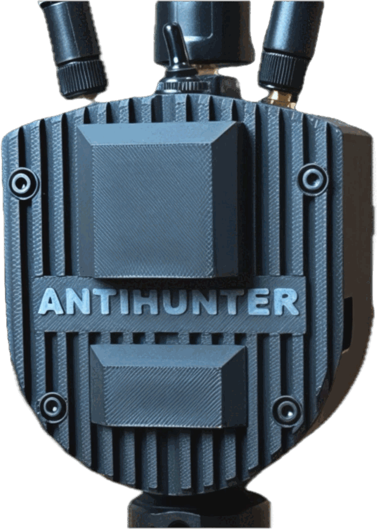
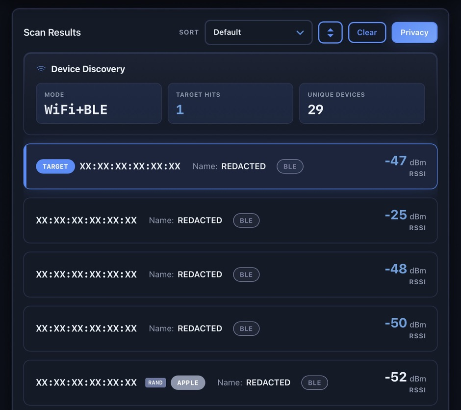
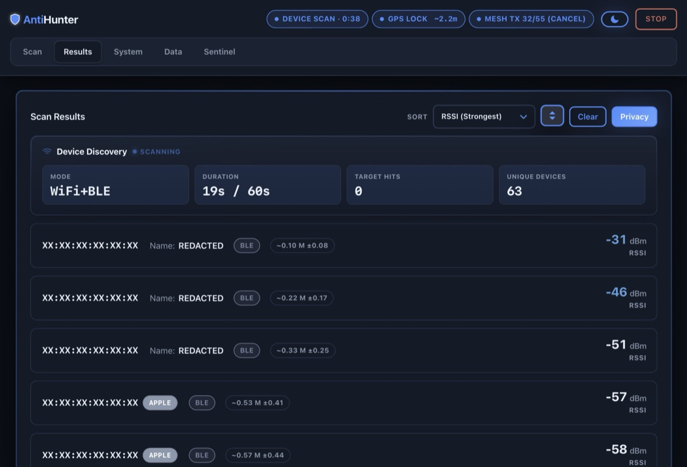
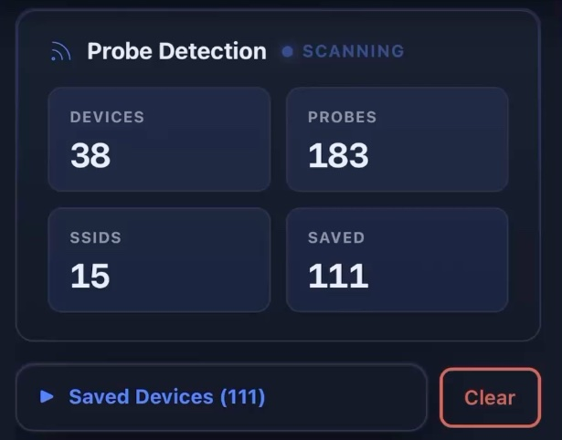
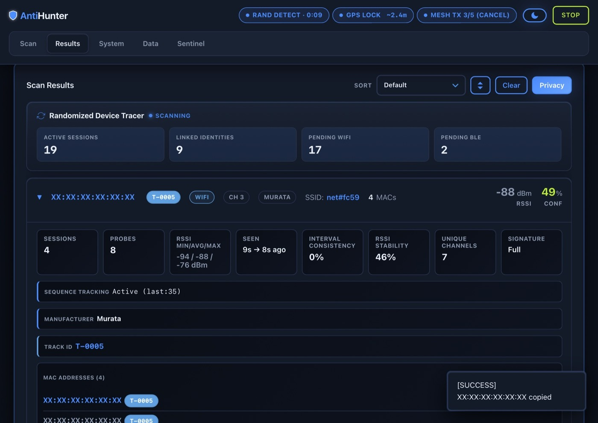
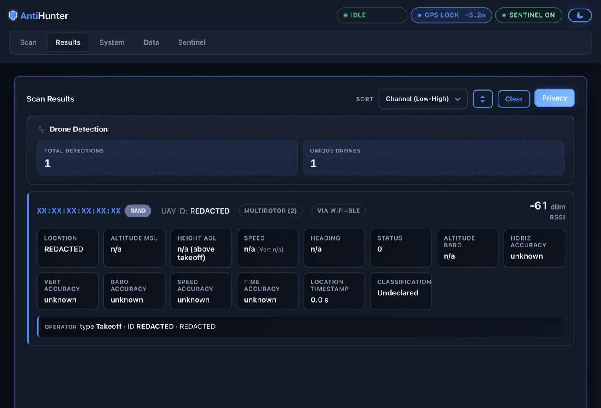
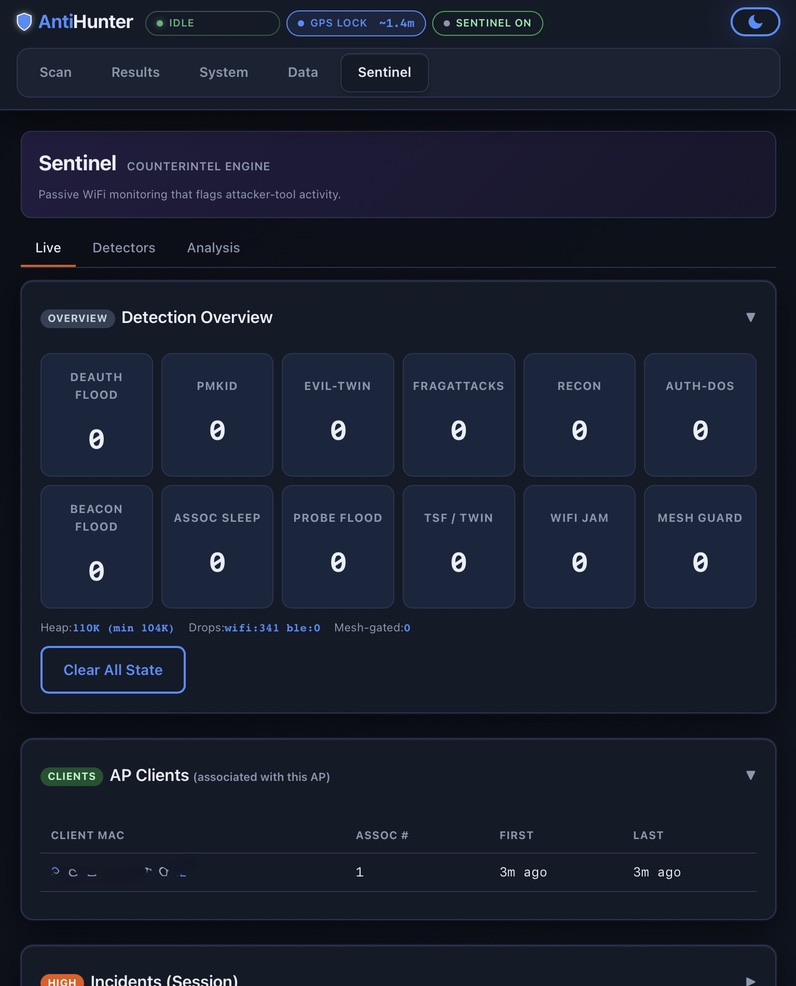
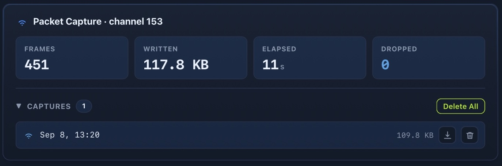
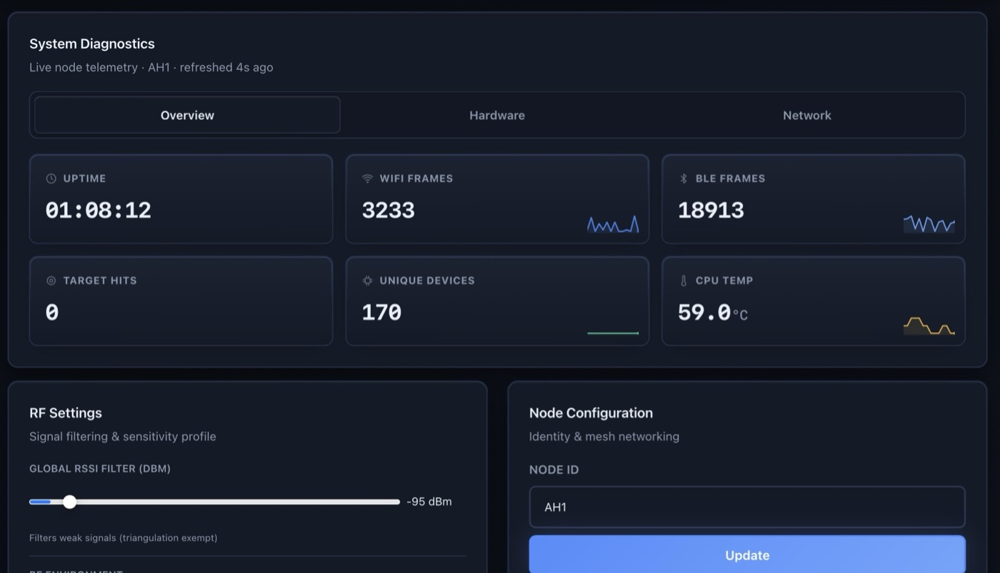

<p align="center">
  
</p>

<div align="center">

[](https://github.com/lukeswitz/AntiHunter/releases/latest)
[](https://github.com/lukeswitz/AntiHunter/releases)
[](https://github.com/lukeswitz/AntiHunter/releases)

[](https://discord.gg/AYFzUurfmh)</br>

[](https://github.com/lukeswitz/AntiHunter/actions/workflows/lint.yml)
[](https://github.com/lukeswitz/AntiHunter/actions/workflows/platformio.yml)
[](https://github.com/lukeswitz/AntiHunter/actions/workflows/github-code-scanning/codeql)
[](https://github.com/lukeswitz/AntiHunter/tree/main/Antihunter/src)

</div>


<div align="center">
  <h3 align="center">DIGI Detection Node Firmware</h3>
  <h4><a href="https://lectronz.com/stores/antihunter">Get one</a> • <a href="https://lukeswitz.github.io/AntiHunter/">Flash from your browser</a> • <a href="#quick-start">Quick start</a> • <a href="#hardware">DIY</a> • <a href="docs/README.md">Docs</a></h4>
  
  <strong>Companion C2: <a href="https://github.com/TheRealSirHaXalot/AntiHunter-Command-Control-PRO">Command Center</a></strong>

  <a href="https://lectronz.com/stores/antihunter" alt="I sell on Lectronz"></a>
  
  [Website](https://rootdowndigital.com/antihunter)  • [Privacy Policy](https://rootdowndigital.com/privacy)


</div>

---

## What is AntiHunter?

***A digital and physical tripwire for your perimeter and RF environment. No subscription, data is yours.***

The name comes from counter-surveillance: phones, trackers, and drones give themselves away by transmitting, and AntiHunter listens for them. It doesn't jam or send attack frames.

Use it at home, on a fence line, at an event, or off the grid on battery and LoRa. It needs no internet, and scan results and detections save to its SD card. One node works on its own. Add more and they share alerts over the mesh, control all at once from the AHCC, and can locate a device together.

<p align="center">
  
</p>

<p align="center"><i>Featured in Seeed Studio <a href="https://www.seeedstudio.com/blog/2026/01/29/best-xiao-projects/">Best 20 XIAO Projects in 2025</a>.</i></p>

> [!TIP]
> **New to AntiHunter?** [Start Here](docs/README.md) has setup order, decisions, troubleshooting, and every guide and manual.

---

## Table of Contents

1. [Quick start](#quick-start)
2. [What it detects](#what-it-detects)
3. [Using a node](#using-a-node)
4. [Mesh networking](#mesh-networking)
5. [Hardware](#hardware)
6. [Build & flash](#build--flash)
7. [Configuration](#configuration)
8. [System architecture](#system-architecture)
9. [Reference](#reference)
10. [Legal](#license)

---

## Quick start

> The **[Assembly Manual](hw/Prototype_STL_Files/Antihunter-DIGINODE-AssemblyManual.pdf)** covers the full build. The **[Operator's Guide](docs/AntiHunter-Operators-Guide.pdf)** walks through each step in more detail

**1. Attach all three antennas before powering on.**
- SMA or U.FL, see [how to attach depending on tier](#deployment-steps-by-tier)

**2. Flash AntiHunter.**
- Open the [Web Flasher](https://lukeswitz.github.io/AntiHunter/) in Chrome or Edge on a desktop.
- Pick **Full** or **Headless** ([which one?](#full-vs-headless)), pick **Stable** or **Beta**, plug in the ESP32-S3, and select **Connect & Flash**.

The flasher asks whether to erase the device first. Erase to clear saved settings. To flash from a terminal, see [Build & flash](#build--flash).

**3. Connect to the node.**
- Full: join the `Antihunter` Wi-Fi network (password `antihunt3r123`) and open http://192.168.4.1.
- Headless: open a serial monitor at 115200 baud.

**4. Set up the Meshtastic radio.**
- Set the LoRa region, and check the serial settings. See [Radio setup](#radio-setup).

**5. Lock it down.**
<a id="before-you-deploy"></a>
- Change the AP name and password under RF Settings. Every unit ships with the same published defaults, so anyone can join an unchanged node.
- Set the node ID in the web UI, or with `CONFIG_NODEID` over mesh.
- On the radio, set the region and a new BLE pairing pin: `python3 scripts/meshtastic_config.py --region US --pin 481920` (use your region and your own 6-digit pin). Then in the Meshtastic app, under Channels, make your own encrypted channel primary and turn the public channel off.
- Set your erase key. Wipe is off until you do. See [Secure data destruction](#secure-data-destruction).
- For covert work, run Headless, which has no access point, and turn off the radio's screen, LED, and Bluetooth with the radio plugged in on its own USB: `python3 scripts/meshtastic_config.py --screen off --led off --ble off`
- Privacy Mode hides MACs, SSIDs, and GPS in the web UI only. Exported logs and SD files still contain them, and GPS coordinates identify places. Check files before posting them.
- Passive reception differs from interception, and the rules differ by country. Scan only where you have authority. See the [legal disclaimer](#legal-disclaimer).

**6. Run a scan.**
Pick a feature from [What it detects](#what-it-detects). Each one shows how to start it.

---

## What it detects

| Feature | What it does | Start it over mesh |
|---|---|---|
| [**Target scan**](#target-scan) | Alerts when the node hears a MAC, vendor prefix, or SSID on the watchlist | `SCAN_START:2:300` |
| [**Baseline anomaly**](#detection-baseline-anomaly) | Learns which devices are normally present, then reports new, gone, returning, and changed ones | `BASELINE_START:300` |
| [**Device discovery**](#recon-device-discovery) | Lists nearby access points and BLE devices with RSSI, channel, and name | `DEVICE_SCAN_START:2:300` |
| [**Probe request scanner**](#recon-probe-request-scanner) | Lists the network names Wi-Fi devices ask for | `PROBE_START:2:300` |
| [**Randomized MAC tracer**](#recon-randomized-mac-tracer-experimental) *(experimental)* | Groups a device's changing MACs into one identity | `RANDOMIZATION_START:2:300` |
| [**Drone Remote ID**](#recon-drone-remote-id) | Drone ID, position, flight data, and operator location | `DRONE_START:300` |
| [**Deauth detection**](#detection-deauth) | Logs deauth and disassociation frames and flags floods | `DEAUTH_START:300` |
| [**Sentinel**](#detection-sentinel-beta) *(Beta)* | Detects Wi-Fi attacks in progress and names the tool when it recognizes one | `SENTINEL_ON` |
| [**CSI motion**](#detection-csi-motion-beta) *(Beta)* | Detects movement from changes in Wi-Fi signals between nearby devices and the node | `CSI_MOTION_START:0:FOREVER` |
| [**Packet capture**](#capture-packet-capture) | Writes Wi-Fi or BLE to SD as a pcap that Wireshark opens | `PCAP_START:0:300:0` |
| [**Triangulation**](#locate-triangulation-experimental) *(experimental)* | Three or more nodes with a GPS fix estimate a device's location from RSSI | `TRIANGULATE_START:<MAC>:60` |
| [**Tamper response**](#field-controls) | Starts a scan, or wipes the node, when someone moves it | `VIBSCAN_SET` |
| [**Scheduling**](#field-controls) | Runs any Scan tab scan at a set time, once or repeating, up to 8 entries | `SCHED_ADD` |

Put `@ALL ` in front of a command for every node, or `@AH01 ` for one node. **(Beta)** features exist only in the Beta firmware. **(experimental)** features exist in every firmware but may give inaccurate results.

> [!NOTE]
> **Shared mesh parameters**
> - Mode: `0` Wi-Fi, `1` BLE, `2` both. Duration is in seconds. Add `:FOREVER` to run until `@ALL STOP`
> - RSSI floor: default −95 dBm, set with `@ALL CONFIG_RSSI:-80`. Baseline uses its own RSSI setting. Triangulation and packet capture ignore the floor
> - Channels: scans that hop use the channel list (`@ALL CONFIG_CHANNELS:1..11`). Drone detection stays on channel 6. Target scan on Full scans all channels

---

### Target scan

Keep a watchlist of MAC addresses (full or vendor prefix) and SSIDs. On each scan pass, the node checks what it heard against the list and alerts on a match, in the web UI and over the mesh.

<p align="center">
  
</p>

**Start**
- Web UI: add entries under Targets, then Scan tab → Target Scan → **Start Scan**
- Mesh: `@ALL SCAN_START:2:300` scans Wi-Fi + BLE for 300 s
- Mesh: `@ALL CONFIG_TARGETS:AA:BB:CC:DD:EE:FF|T-00A3|MyNetwork` replaces the watchlist with those three entries

**Operational notes**
- Full matches access points (BSSID or SSID) from active Wi-Fi scans, and BLE devices. Headless also sniffs Wi-Fi frames while hopping channels
- It ignores devices on the [allowlist](#field-controls)
- Each hit is logged to SD with radio, MAC, RSSI, channel, name, and GPS
- Each target gets at most one mesh alert per 30 s, unless its RSSI changes by 5 dB or more or the node's GPS position moves

---

### Recon: Device discovery

Lists nearby Wi-Fi access points and BLE devices (up to 200 of each): MAC, SSID, signal strength, name, and channel.



**Start**
- Web UI: Scan tab → Device Discovery → **Start Scan**
- Mesh: `@ALL DEVICE_SCAN_START:2:300:+PROBE` scans Wi-Fi + BLE for 300 s and collects probe requests

**Operational notes**
- It finds access points with a periodic all-channel scan (set by Wi-Fi Scan Interval), and picks up more from beacons while hopping channels between scans
- Tick **Capture Probes** to collect probe requests at the same time. They go into the probe database with MAC, vendor, RSSI, SSIDs, and a randomized-MAC flag
- To skip MACs already sent over the mesh in the last N seconds, use `@ALL CONFIG_DEDUP_TTL:300` (see [Cross-scan dedup](#cross-scan-dedup))

---

### Recon: Probe request scanner

Wi-Fi devices send probe requests that name the networks they want to join. This scanner records the network names each device asks for.

<p align="center">
  
</p>

**Start**
- Web UI: Scan tab → Probe Request Scanner → **Start Scan**
- Mesh: `@ALL PROBE_START:2:300:+ALL` runs for 300 s. Stop it with `@ALL PROBE_STOP`

**Operational notes**
- **Ghost SSIDs:** if the node hears no probe response for a network name, it marks the name with a `~` prefix
- **Frames to watchlist devices:** it also flags management frames (other than probes and beacons) addressed to a watchlist MAC
- `+ALL` sends every probe to the mesh. Without it, only watchlist hits go to the mesh. The node keeps every probe locally either way
- Vendor names come from a built-in list of the 400 largest IEEE-registered vendors. Randomized MACs are flagged
- BLE mode adds BLE devices to the list. BLE has no probe requests

---

### Recon: Randomized MAC tracer (experimental)

Modern phones change their MAC address to avoid tracking. The tracer scores how alike two MACs are. It compares MAC prefix, information elements and their order, timing, signal pattern, and sequence numbers. Close matches become one identity with a confidence score and an ID (`T-XXXX`) saved to SD.

<p align="center">
  
</p>

**Start**
- Web UI: Scan tab → Randomized MAC Tracer → **Start Scan**
- Mesh: `@ALL RANDOMIZATION_START:2:300` traces Wi-Fi + BLE for 300 s

**Operational notes**
- It tracks up to 256 devices at once. Past that, it drops the one not seen for longest
- It flags devices that also send from their real (global) MAC
- Press the Privacy button to hide MACs, GPS, and SSIDs before taking screenshots

---

### Recon: Drone Remote ID

Detects drones broadcasting Remote ID under the FAA and EASA rules, and reports drone ID, operator location, and flight data to the mesh and to `/drones.jsonl` on SD.

<p align="center">
  
</p>

**Start**
- Web UI: Scan tab → Drone RID Detection → **Start Scan**
- Mesh: `@ALL DRONE_START:300` watches for 300 s. `@ALL DRONE_START:0:FOREVER` runs until `@ALL STOP`

**Operational notes**
- Wi-Fi: ODID/ASTM F3411 in NAN action frames and beacons. The node stays on channel 6 during a drone scan
- BLE: legacy advertising, service UUID `0xFFFA`. BLE 5 long-range advertising isn't received
- It also reads French drone ID
- When a drone sends both a serial number and a CAA registration ID, the node reports the serial number

---

### Detection: Baseline anomaly

Learns which access points and BLE devices are normally present, then reports devices that are new, gone, back again, or whose signal changed by more than the RSSI variation setting (default 20 dB).

<p align="center">

</p>

**Start**
- Web UI: Scan tab → Baseline Anomaly Sniffer → pick the learning time (5, 10, or 15 min) → **Start Scan**
- Mesh: `@ALL BASELINE_START:300` monitors for 300 s after the learning phase. The learning time comes from the web UI setting (default 5 min)
- Check progress: `@ALL BASELINE_STATUS`

**Operational notes**
- **Watch for changes from now** - splits the learning phase into before and after a moment you pick. Send it while the node is still learning: press **Watch for changes from now** (Full), or send `@ALL BASELINE_WATCH`. The node replies `BASELINE_ACK:WATCHING`, or `BASELINE_ACK:NOT_RUNNING` if no baseline scan is running

  | Result | Meaning |
  |--------|---------|
  | New | Heard only after you pressed it |
  | Gone | Heard only before |
  | Moving closer / away | Heard both times, signal changed by 20 dB or more |

  Full shows it in Results. Headless prints the list to serial when the scan ends and sends `BASELINE_WATCH: New=<n> Gone=<n> Moved=<n> Both=<n>` over mesh
- With an SD card, the baseline survives a reboot. Recent devices stay in memory, and the node moves the rest to SD
- Baseline uses its own RSSI threshold (default −60 dBm), not the global RSSI floor

---

### Detection: Deauth

Watches for deauthentication and disassociation frames, which knock devices off Wi-Fi.

**Start**
- Web UI: Scan tab → Deauth Detection → **Start Scan**
- Mesh: `@ALL DEAUTH_START:300` watches for 300 s

**Operational notes**
- It alerts on any broadcast deauth, and on 10 deauths to one client within 10 s, tagged `[BROADCAST]` or `[TARGETED]`
- It flags a `DEAUTH_FLOOD` at 20 deauths from one source within 10 s
- Each alert shows the source and destination written in the frame, RSSI, channel, and reason code. An attacker can fake the source address

---

### Detection: Sentinel (Beta)

> [!IMPORTANT]
> To use Sentinel, flash the **Beta** firmware.

Once you start it, Sentinel listens for Wi-Fi attack frames in the background and pauses while another scan runs. It matches frame patterns and behavior, such as deauth floods, beacon spam, evil twin APs, PMKID requests, and someone knocking a client off to force a WPA handshake.

**Tools it names:** Marauder, MDK4, ESP Deauther, aireplay-ng, bettercap, hcxdumptool, Bruce, Pwnagotchi

<p align="center">
  
</p>

**Start**
- Web UI: Sentinel tab → Start
- Mesh: `@ALL SENTINEL_ON` / `@ALL SENTINEL_OFF`
- Start at power-on: `@ALL SENTINEL_BOOT:1`, or set it in the Flasher or Configurator. Off by default

**Settings**
- Turn a detector group on or off: `@ALL GROUP:dos:on` (`dos`, `rogue`, `recon`, `physical`, `mesh`, `all`). Deauth, beacon flood, and auth flood detection are always on
- Hop channels or stay on one: `@ALL SENTINEL_MODE:scan` or `:defend`. Headless has no AP to stay on, so use `scan`
- Fine-tune: `@AH01 DETECT_CFG:{"pmkid":true}`
- The Web Flasher's **Sentinel & Detectors** section sets the same options at flash time. Anything left on *Default* keeps the firmware setting

**Operational notes**
- Sentinel writes each detection to serial and SD. With the mesh on and that detector's broadcast flag set, it also sends it to other nodes, rate-limited
- When Sentinel confirms an attack, it can start a follow-up: triangulate, packet capture, device discovery, probe sweep, or drone RID. They run one at a time, and detection pauses while they do
- Karma bait is the only detector that transmits. While on, it sends one bait probe request every 8 s, plus one when a suspect AP is first seen. Off by default. Turn it on with `GROUP:rogue:on`
- Per-detector logs on SD start fresh at each boot so counts begin at zero. The full history stays in `/incidents.jsonl`

<details>
<summary>Detectors, outputs, and test coverage</summary>

| Group | Detectors | How they're caught |
|---|---|---|
| **DoS** | Deauth flood, deauth forge, broadcast deauth, AP-targeted deauth, beacon flood, auth flood, assoc-sleep, SAE DoS | Fixed Marauder seqCtrl, reason 7 with duration 0x013A, sawtooth sequence numbers, alternating deauth/disassoc, and deauth rate. Impersonation bursts. 40+ distinct nearby BSSIDs beaconing within 10 s, plus known static beacon templates. Open-system auth flood. Assoc-req PM-bit floods. SAE commit floods (algo 3 / txn 1). Reasons 1/2/6/7 alone never alert. Reason 14, or reason 2 with fixed seqCtrl 0xFFF0, alerts on its own |
| **Rogue AP** | Evil-twin, OWE abuse, Karma / MANA | Another BSSID beaconing the node's own SSID. A new-vendor BSSID reusing a learned SSID. TSF restarts and known beacon-forgery templates. OWE-transition downgrade. Bait probe answered by an AP that never beacons that SSID |
| **Recon** | PMKID harvest, probe flood, forced handshake | Orphaned-M1 / KDE PMKID solicitation. Probes with fixed seq 0x0001, 40+ distinct MACs probing one SSID within 5 s, or probe-rate floods. A WPA 4-way handshake completed right after a deauth burst, meaning someone knocked a client off to capture it. Sentinel ignores handshakes without a deauth burst |
| **Physical** | FragAttacks, TSF / multi-channel twin, Wi-Fi interference | Fragment packet-number gaps and mixed encrypted/plaintext fragments (CVE-2020-26146/26147, off by default). Same BSSID on ≥2 channels within 5s. Per-channel PDR-vs-RSSI collapse (CRC-fail flood) |
| **Mesh disruption** | Self-spoof, channel flood, command audit | Own node-id seen inbound. Inbound rate DoS. Logs every inbound mesh command (lines starting with `@`) with the radio id that sent it, even when this detector is off. The log is an **audit trail**, not an alert: on a shared channel an injected command looks like a normal one, so the node records the source |

- **Phone hotspots:** the crypto and beacon detectors skip locally administered BSSIDs, which phone hotspots use. Flood detectors don't, because real floods spoof them
- **Output:** `[DETECT]` serial lines, `.jsonl` files on SD (some detectors share a file), `/incidents.jsonl`, and a mesh broadcast so other nodes can confirm
- **AP clients:** devices that join the node's own AP, with MAC, join count, and first/last seen. *AP Clients* panel, `GET /api/apclients.json`
- **Mesh command audit:** every incoming command and its sender, including commands meant for other nodes. *Mesh Commands* panel, `GET /api/mesh_cmd.jsonl`
- **Mesh labels:** the [mesh command reference](docs/mesh-commands.md) lists the labels Sentinel sends, for log parsers and C2, under *Sentinel label reference*
- **Tested against:** airgeddon, aireplay-ng, bettercap, wifite, mdk4, angryoxide, eaphammer, hostapd-mana, wifipumpkin3, hcxdumptool, purpose-built test scripts, and common consumer ESP32 attack firmware
- **Confirmed on hardware** against those tools: deauth (flood/forge/AP-targeted), beacon flood, auth flood, assoc-sleep, SAE DoS, karma, evil-twin, probe flood, forced handshake
- **Experimental:** OWE abuse, PMKID harvest, FragAttacks, TSF multi-channel twin, Wi-Fi interference, mesh disruption
- **Behavioral fallbacks** (still work when a tool changes its frame template): SSID-rotate forge, behavioral probe-flood, EAPOL-capture bait, broadcast deauth bursts

</details>

---

### Detection: CSI motion (Beta)

Tells you when something moves nearby, even through walls. The web UI marks it as indoor only. It triggers on changes in the Wi-Fi signal, not on presence.

<p align="center">
  
</p>

**How it works.** Wi-Fi signals bounce around a room. When a person moves, the bounces change. The node listens to the Wi-Fi routers around it, plus phones if you include randomized-MAC devices. It alerts when their signals change together, as set by the sensitivity below. It needs ongoing Wi-Fi traffic to measure.

**Start**
- Web UI: Scan tab → CSI Motion Detection → **Start Scan**
- Mesh: `@ALL CSI_MOTION_START:0:FOREVER`. The [mesh command reference](docs/mesh-commands.md) lists the CSI commands

**Pick a sensitivity**
- **Low** (default): fewest false alarms. Two devices must see the movement.
- **Medium**: more sensitive. Two devices, or one device seeing a change 4× the trigger.
- **High**: most sensitive. Same as Medium with a lower trigger and a shorter wait. Expect false alarms.

<details>
<summary>All CSI settings (Scan tab → CSI Motion Detection)</summary>

**Sensitivity** and the mesh alert limit sit at the top. The rest are under **Advanced**.

| Setting | What it means | Default |
|---|---|---|
| Min. seconds between mesh motion alerts | Wait at least this long between motion alerts sent over mesh. 0 sends every alert | 0 |
| Channel | Wi-Fi channel to listen on. 0 picks one automatically | 0 |
| Movement needed before alerting | Seconds of movement within the last minute before an alert | 8 s |
| Stillness before all-clear | Seconds a single device's signal must stay quiet before it stops counting as moving. The room all-clear comes later | 5 s |
| Devices that must agree | How many devices must see the movement at the same time | 2 |
| Trigger level | Lower catches smaller movement | set by sensitivity |
| Packets in a row before alerting | Consecutive readings above the trigger before a device counts as moving | 3 |
| Listen only, never transmit | The node never sends probes. Turn off only if it sees too little Wi-Fi | On |
| Include randomized-MAC devices | Also listen to phones and watches, not just routers | On |

</details>

**False alarms with nobody there?** Turn on **Per-packet score to serial**, watch the `sig` numbers while the room is empty, and set Trigger level just above the highest one.

> [!WARNING]
> **This mode can transmit if you let it.** Off by default. If you turn off **Listen only, never transmit**, the node sends Wi-Fi probe requests when it hears too little traffic to measure. Anyone nearby can see them. Check local rules before turning it on.

---

### Capture: Packet capture

Records raw traffic to SD as a standard pcap that Wireshark opens.

<p align="center">
  
</p>

**Start**
- Web UI: Scan tab → Packet Capture → **Start Capture**
- Mesh: `@ALL PCAP_START:0:300:0:CH1,6,11` captures Wi-Fi for 300 s on 2.4 GHz channels 1, 6, and 11
- Fields, in order: radio (`0` Wi-Fi, `1` BLE), duration in seconds (required, no `FOREVER`), band (`0` 2.4 GHz, `1` 5 GHz, `2` both; 5 GHz on C5 only), and an optional `:CH` list
- Stop: `@ALL PCAP_STOP` stops the capture and any other running scan. File size cap: `@ALL PCAP_LIMITS:150` (8-300 MB)

**Operational notes**
- Wi-Fi frames carry a radiotap header with channel and RSSI, plus the rate on legacy frames and the MCS index on 802.11n frames. Both bands on C5
- BLE saves the raw HCI events the Bluetooth controller reports, link type 187. HCI has no RF channel field, so the capture shows no channel
- It sweeps the RF Settings channels, or a channel list and dwell set under Advanced. There's an optional management-frames-only filter
- The Scan tab lists captures to download or delete. You can't delete the file in progress
- A Sentinel attack response can also start a capture. The node prunes automatic (`auto_`) captures to stay under a size budget and keep free space. It never prunes manual ones

> [!WARNING]
> Stop a capture before cutting power. The node flushes the file as it writes, but cutting power mid-write can leave it truncated.

---

### Locate: Triangulation (experimental)

Nodes listen for the same device at once. Each records RSSI and its own GPS position, and the mesh combines the results (weighted trilateration with Kalman filtering) into a location estimate. A position needs at least three nodes with a GPS fix. With two, the results only compare GPS distance with RSSI.

**Start**
- Mesh: `@AH01 TRIANGULATE_START:AA:BB:CC:DD:EE:FF:60`. AH01 coordinates a 60 s run for that MAC with the other nodes on the mesh
- Optional `:rfEnv` picks the environment from the table below (`0` Open Sky to `4` Industrial). Optional `:wifiPwr:blePwr` are distance multipliers (0.1 to 5.0)
- Result: `@AH01 TRIANGULATE_RESULTS`. Stop: `@ALL TRIANGULATE_STOP`

**Operational notes**
- It reports GPS coordinates, confidence, estimated error in meters, and average HDOP, and sends a Google Maps link over the mesh
- It ignores readings of −95 dBm or weaker

<details>
<summary>RF environment calibration</summary>

Path loss model: `distance = 10^((RSSI0 - RSSI) / (10 * n))`

| Environment | Wi-Fi n | BLE n | Wi-Fi RSSI0 | BLE RSSI0 | Use Case |
|-------------|--------|-------|------------|-----------|----------|
| Open Sky | 2.0 | 2.0 | -23 dBm | -60 dBm | Clear LOS, minimal obstruction |
| Suburban | 2.7 | 2.5 | -24 dBm | -62 dBm | Light foliage, scattered buildings |
| Indoor | 3.2 | 2.9 | -25 dBm | -65 dBm | Typical indoor, some walls |
| Indoor Dense | 4.0 | 3.5 | -27 dBm | -69 dBm | Office spaces, many partitions |
| Industrial | 4.8 | 4.0 | -30 dBm | -73 dBm | Heavy obstruction, machinery |

</details>

---

## Using a node

### Full vs Headless

Both builds share the detectors and scan engine. Full adds a Wi-Fi access point with the web UI and [API](docs/api-reference.md). Headless never starts the access point.

| | Full | Headless |
|---|---|---|
| Control | Web UI and API over its own AP, plus serial and mesh | Serial and mesh |
| Wi-Fi discovery | Active all-channel sweep plus promiscuous capture on Device Scan, Target Scan, Baseline, and Triangulation | Same sweep, without Full's handling for clients joined to its AP |
| Results | Results tab in the browser, saved to `/last_results.txt` on SD | `/last_results.txt` on SD |
| Device database | `/devicedb.jsonl` | `/devicedb.jsonl` on Beta, not in Stable |
| Scheduling | Scan tab and `SCHED_ADD` | Not available |
| Fleet roster | Fleet card on the System tab, and `/api/mesh` | Not tracked |
| RF footprint | AP beacons, unless hidden-network is on | No AP |

### Web UI

The web UI has four tabs: **Scan**, **Results**, **System**, and **Data** (plus **Sentinel** on Beta). On the Scan tab, pick the scan, the radio, and how long, then select **Start Scan**. Results show on the Results tab and save to SD. **Schedule this scan** runs the current scan at a set time.

<p align="center">

</p>

The **System** tab holds the node-wide settings. Its **Fleet** card lists the nodes and mesh radios this node has heard. The **Data** tab is the Data Explorer for findings, device logs, and scan data.

<details>
<summary>System tab cards and screenshots</summary>

<p align="center">
  
</p>

| Card | What it holds |
|---|---|
| **System Diagnostics** | Three subtabs, all fed from `GET /diag`. **Overview** - uptime, Wi-Fi and BLE frame counts, target hits, unique devices, CPU temperature. **Hardware** - last reset and previous uptime, results restored, free and minimum-free internal heap, scan stack headroom, SD card, GPS, RTC, and vibration sensor. **Network** - AP address, mesh state, Wi-Fi channels |
| **Fleet** | Live roster of nodes and radios with mode, uptime, temperature, hits, and GPS. Ping the fleet or clear the list |
| **RF Settings** | Global RSSI filter and RF environment (Open Sky to Industrial, used for distance estimates). Scan preset (Relaxed, Balanced, Aggressive, Custom). Wi-Fi channel dwell, scan interval, and channel list. BLE scan duration and interval. Also holds the **Wi-Fi Access Point** section: SSID, password, WPA2/WPA3 or WPA2 only, and hidden network |
| **Node Configuration** | Node ID, mesh on/off, status heartbeat, mesh send interval, mesh dedup TTL, and session dedup |
| **Sensor Alerts** | Vibration sensing and what it triggers |
| **Secure Data Destruction** | Erase key, setup and erase delays, vibration count and window, cooldown |
| **Factory Wipe** | Clears settings and stored data back to defaults |
| **Battery Saver Mode** | Stops scans and turns BLE off, drops the CPU to 80 MHz with light sleep, and polls GPS once a minute. Mesh commands, heartbeats, and vibration alerts keep working |
| **Accent Colors** | Recolors the destructive controls and Sentinel banners. Stored in the browser |


<p align="center">
 
</p>

</details>

### Field controls

- **Allowlist** - devices that Target Scan and Baseline ignore. Scan tab → **Allow list** tab next to Targets, one MAC per line.
- **Privacy Mode** - the Privacy button (Results, System, and Data tabs) hides MACs, GPS, and SSIDs in the web UI for screenshots. Exported files keep them.
- **Vibration trigger** - starts a scan when the node is moved. Full: System tab → Sensor Alerts. Both builds, over mesh, `VIBSCAN_SET:<on>:<scan>:<secs>:<cooldown>`:

  | Part | Value |
  |------|-------|
  | on | `1` on, `0` off |
  | scan | `1` device discovery, `2` probe, `3` randomized MAC tracer, `4` target, `5` drone, `6` deauth, `7` baseline, `8` packet capture |
  | secs | Scan length in seconds. `0` runs until `STOP` |
  | cooldown | Seconds to wait before the next trigger, 5-86400 |

  Examples:
  - `@AH01 VIBSCAN_SET:1:2:60:300` - probe scan for 60 s when moved, then at most once per 5 min
  - `@AH01 VIBSCAN_SET:0:0:0` - turns it off
- **Scheduled scans** - Full: Scan tab → **Schedule this scan**. Both builds, over mesh, `SCHED_ADD:<start>|<repeat>|<scan>|<options>`:

  | Part | Value |
  |------|-------|
  | start | Node local time, `YYYY-MM-DDTHH:MM` |
  | repeat | Seconds between runs. `0` = once, `86400` = daily. Minimum `600` |
  | scan | `/scan` (list scan), `/sniffer` (device discovery), `/drone` |
  | options | `secs=<duration>`, plus `mode=0` Wi-Fi, `1` BLE, `2` both for `/scan` |

  Examples:
  - `@AH01 SCHED_ADD:2026-10-07T21:00|86400|/scan|mode=2&secs=600` - Wi-Fi + BLE list scan, 10 min, daily at 21:00
  - `@AH01 SCHED_ADD:2026-10-07T06:00|0|/drone|secs=300` - drone scan once, 5 min
  - `@AH01 SCHED_LIST` - replies with the count, prints entries to serial
  - `@AH01 SCHED_DEL:1` - deletes entry 1

  Headless runs entries only once its clock is set, from GPS or `SETTIME:<unix seconds>` on USB serial.
- **Battery Saver** - stops Wi-Fi/BLE scanning, drops the CPU to 80 MHz, enables light sleep, and polls GPS once a minute. The mesh stays connected and sends a heartbeat. `@AH01 BATTERY_SAVER_START:10` starts it with a heartbeat every 10 min (1-30), `@AH01 BATTERY_SAVER_STOP` ends it.
- **Hidden SoftAP** - the access point stops broadcasting its name. It doesn't keep anyone out. System → RF Settings → Wi-Fi Access Point → **Hidden network**.
- **SD Repair** - lets the node rebuild an SD card it can't mount. Off by default, and rebuilding erases the card. System tab, or over mesh: `@AH01 SD_REPAIR:ON`, `:OFF`, or `:NOW` to rebuild immediately.

The [mesh command reference](docs/mesh-commands.md) lists every parameter.

### Secure data destruction

Wipe the node's data if someone moves it, or on command.

Wipe is off until you set your own erase key (8+ characters, no `:`).

**Set your key**
- Full: System → Secure Data Destruction. The current key is your AP password (change the default first). Or over mesh: `@AH01 CONFIG_ERASE_PSK:<new key>:<AP password>`
- Headless: the **Erase key** field in the web flasher

**Wipe**
- Web UI: enter your key, press **WIPE NOW**
- Mesh: `@AH01 ERASE_FORCE:<your key>`

**Change your key:** `@AH01 CONFIG_ERASE_PSK:<new key>:<current key>`

5 wrong keys lock erase commands for 10 minutes. The key travels over your mesh channel, so use your own encrypted channel.

- **Auto-erase on tamper:** off by default. After the setup delay, **Vibrations required** vibrations within the **Detection window** start the erase countdown. Cancel with `@AH01 ERASE_CANCEL:<your key>`
- **Decoy file:** after the wipe, the node erases its settings and SD files, then writes `/weather-air-feed.txt` with a weather-monitor error message

> [!WARNING]
> A wipe is permanent. You can't undo it.

<details>
<summary>Auto-erase settings</summary>

| Parameter | Range | Description |
|-----------|-------|-------------|
| Setup delay | 30s - 10min | Grace period before auto-erase activates |
| Erase delay | 10-300s | Countdown before destruction |
| Cooldown period | 1-60min in the web UI, 5-60min over mesh | Shortest time between tamper attempts |
| Vibrations required | 2-5 | Vibrations needed to start the countdown |
| Detection window | 5-60s in the web UI, 10-60s over mesh | Time window for counting vibrations |

1. Turn on auto-erase in the web UI with a setup delay
2. Place the node and leave during the setup delay
3. Watch the mesh for tamper alerts

</details>

---

## Mesh networking

The mesh is optional. A single node works fully on its own. With a mesh, you control nodes by sending text messages from any Meshtastic app on the node's channel:

- `@ALL COMMAND` goes to every node, `@AH01 COMMAND` to one. Node IDs are 2-5 letters or digits
- Replies and alerts come back on the same channel, public or encrypted
- Alerts go out at most one per send interval (default 3 s, set under Node Configuration). Device lists go out every 2.2 s. Triangulation messages skip the interval
- The node strips emoji and non-ASCII from sender names and still runs the command. It ignores a radio whose short name matches its own node ID as an echo, so keep them different

The [mesh command reference](docs/mesh-commands.md) lists the commands, parameters, and alert formats.

### Radio setup

The radio needs four settings: **Serial** module enabled, mode **TEXTMSG**, baud **115200**, and the RX/TX pins for your board - `19 RX / 20 TX` on Heltec V3, `10 RX / 9 TX` on T114. It also needs a LoRa region. With no region it receives but never transmits.

Soldered Core and Assembled radios come on the latest stable Meshtastic with the serial settings done, screen off after 1s, LED off, and Bluetooth on with the default pin. The region ships UNSET and the channel ships as the public default, so set those yourself. Bare PCB and Parts Kit builds flash stable Meshtastic and set everything.

Pick one way:

- **Phone:** pair the radio in the [Meshtastic app](https://meshtastic.org/docs/software/), set Module Settings → Serial, then LoRa → Region
- **Browser:** the [Meshtastic web client](https://meshtastic.org/docs/software/) over USB from Chrome or Edge
- **Script:** plug in the radio on its own USB and run:

```bash
pip3 install 'meshtastic[cli]' pyserial
python3 scripts/meshtastic_config.py
```

With no arguments the script prints the current settings and opens a menu. With flags, it applies all of them in one call, then reads the radio back and prints the settings before and after.

<details>
<summary>Script options and examples</summary>

```
options:
  --port PORT           serial port (auto-detected if omitted)
  --board {heltec-v3,t114}
                        board type, sets the serial-module pins (default heltec-v3)
  --screen on|off|SECS  'off' blanks after 1s, 'on' stays lit, or give seconds
  --led {on,off}        status LED heartbeat
  --ble {on,off}        Bluetooth on or off
  --pin NNNNNN|none|random
                        BLE pairing: 6-digit fixed pin, 'none', or 'random'
  --serial {on,off}     AntiHunter serial module (TEXTMSG, 115200, board pins)
  --region REGION       LoRa region, e.g. US. UNSET means receive only
```

```bash
python3 scripts/meshtastic_config.py                     # print current settings
python3 scripts/meshtastic_config.py --serial on         # node link, pins per --board
python3 scripts/meshtastic_config.py --region US         # UNSET = RX only, no TX
python3 scripts/meshtastic_config.py --pin 481920 --screen off --led off
python3 scripts/meshtastic_config.py --board t114 --serial on --ble off
```

</details>

### Control from a Meshtastic client

Commands and alerts are ordinary Meshtastic text messages, so anything that reaches the radio reaches the node:

- **Meshtastic app** - pair [any client](https://meshtastic.org/docs/software/) over Bluetooth, Wi-Fi, or USB and send `@node COMMAND` from anywhere in mesh range. You need no AP and no Command Center. [Quick chat](https://meshtastic.org/docs/software/android/user/messages-and-channels/) puts your usual commands on a button.
- **TAK / ATAK** - set the radio's role to `TAK`, install the [Meshtastic ATAK plugin](https://meshtastic.org/docs/software/integrations/integrations-atak-plugin/) for your ATAK version, and leave the Meshtastic app running. CoT then travels over the mesh, and node alerts still arrive as text. `TAK_TRACKER` sends the radio's own position without ATAK running.
- **MQTT** - a Meshtastic [MQTT gateway node](https://meshtastic.org/docs/software/integrations/mqtt/) forwards mesh traffic to a broker for logging, Home Assistant, or Node-RED.

### Reaching a node you cannot hear

You don't need line of sight to every node. Nodes between you and it relay for you - [3 hops by default, 7 max](https://meshtastic.org/docs/configuration/radio/lora/).

A standalone Meshtastic radio in the `ROUTER` or `REPEATER` [role](https://meshtastic.org/docs/configuration/radio/device/) extends range further. AntiHunter radios stay on the default `CLIENT` role.

### Cross-scan dedup

Repeated scans of the same place would resend the same devices over the mesh. To save airtime, the node skips `DEVICE:` messages for a MAC it already sent within a set time. The default is 5 minutes. Change it with `@ALL CONFIG_DEDUP_TTL:N` (seconds, `0` turns it off).

<details>
<summary>Dedup details</summary>

| Setting | Effect |
|---------|--------|
| `meshDedupTtl = 0` (off) | Every scan sends every device |
| `meshDedupTtl = 300` (5 min, default) | Skips a MAC sent in the last 5 min |
| `meshDedupTtl = 3600` (1 hr max) | Sends each MAC at most once an hour |

Dedup applies only to the `DEVICE:` rows of Device discovery. The node always sends triangulation (`T_F:/T_C:/T_D:`), anomaly alerts (`ANOMALY:`, `DEVICE_DISAPPEARED:`), drone alerts (`DRONE:`, `DRONE_LOST:`), attack alerts (`DEAUTH_FLOOD:`, `ATTACK:`), summaries (`SCAN_DONE:`, `DEAUTH_DONE:`, `BASELINE_DONE:`), and identities (`IDENTITY:`).

`SCAN_DONE` reports `U` (unique MACs seen), `TX` (MACs sent this scan), and `DUP` (MACs skipped by dedup in the final pass).

Set it in the web UI (System tab → Node Configuration → Mesh Dedup TTL, shown once mesh is on), with `POST /mesh-dedup-ttl` and form field `ttl=N`, or with `@ALL CONFIG_DEDUP_TTL:N`. `POST /mesh-dedup-clear` clears the cache so the node sends every MAC again.

</details>

<details>
<summary>How mesh sending works</summary>

Scans only queue messages and finish immediately. A background task (`meshTxTask`) sends them through a token-bucket rate limiter (`SerialRateLimiter`: 1000-byte burst, refilled at 400 B/s), and sends device rows one frame every 2.2 s. Three priority queues hold 256 messages - CTRL 16, EVENT 32, BULK 208 - sent in that order, so a `STOP` never waits behind a device list. The node packs device rows into frames up to 230 B, under Meshtastic's 237 B limit.

- A new scan never waits for the last scan's messages to finish sending
- `STOP` (web or mesh) clears the queue
- The header badge `Mesh TX K/N` shows sending progress and hides when the queue empties

</details>

---

## Hardware

Buy a node from the [store](https://lectronz.com/stores/antihunter), or build your own from the parts below.


> [!IMPORTANT]
> Use a regulated 5V power supply. Unregulated batteries cause voltage instability. A 2A fast-blow inline fuse on the battery line adds protection.

### Deployment steps by tier

No tier comes with AntiHunter firmware installed. That's for integrity and regulatory reasons. You flash it yourself (Quick start, step 2).

| Tier | What ships | What you supply |
|---|---|---|
| **Bare PCB** ([note](docs/note-tier4-bare-pcb.pdf)) | One unpopulated 82mm board | Everything: source the [BOM](https://github.com/lukeswitz/AntiHunter/blob/beta/hw/Prototype_STL_Files/BOM-Links.md), solder per the [assembly manual](https://github.com/lukeswitz/AntiHunter/blob/main/hw/Prototype_STL_Files/Antihunter-DIGINODE-AssemblyManual.pdf), flash and configure Meshtastic on the radio, fit a FAT32 SD card |
| **Soldered Core PCB** ([note](docs/note-tier3-populated-pcb.pdf)) | A fully populated PCB: XIAO ESP32-S3, Heltec LoRa radio, GPS, RTC, vibration sensor, SD reader, 8GB card fitted, radio flashed and serial-configured. Factory U.FL whip antennas only | Optional: enclosure, regulated 5V power, external antennas |
| **Parts Kit** ([note](docs/note-tier2-parts-kit.pdf)) | Every BOM part except the GPS antenna and 18650 cells, loose. PCB, modules, 8GB card, enclosure, and TPU seals. 6dBi 2.4GHz and 6dBi LoRa antennas, U.FL→SMA pigtails, and bulkheads. Fan, thermal switch, power switch, waterproof USB-C panel jack, UPS board, and fasteners. Nothing soldered, nothing flashed | Soldering and assembly per the manual, Meshtastic on the radio, two 18650 cells, active GPS antenna |
| **Assembled** ([note](docs/note-tier1-assembled.pdf)) | Built, sealed, and bench-tested. 8GB card fitted, GPS helix antenna, radio flashed and serial-configured | Two 18650 cells |

### Core components

- **Seeed XIAO ESP32-S3** (at least 8MB flash), or **XIAO ESP32-C5** for 2.4 + 5 GHz on the same board - [C5 page](docs/ESP32-C5.md) (testing)
- **Meshtastic board**: Heltec v3.2 (recommended) or T114. Alternatives in [discussions](https://github.com/lukeswitz/AntiHunter/discussions)
- **GPS, SD card, vibration, and RTC modules**

### Assembling the PCB

- [Operator's Guide](https://github.com/lukeswitz/AntiHunter/blob/main/docs/AntiHunter-Operators-Guide.pdf) - unboxing, antennas, flashing, mesh setup, deployment
- Illustrated [assembly manual](https://github.com/lukeswitz/AntiHunter/blob/main/hw/Prototype_STL_Files/Antihunter-DIGINODE-AssemblyManual.pdf)
- PCB [welcome letter](https://github.com/lukeswitz/AntiHunter/blob/beta/hw/Prototype_STL_Files/ahwelcome.txt)
- BOM parts [links & images](https://github.com/lukeswitz/AntiHunter/blob/beta/hw/Prototype_STL_Files/BOM-Links.md)

<details>
<summary>Bill of Materials</summary>

**Core components**
- 1 × DIGI PCB (82mm)
- 1 × Seeed Studio XIAO ESP32-S3
- 1 × Heltec Wi-Fi LoRa 32 V3.2 (T114 also works, V3.2 preferred)
- 1 × ATGM336H GPS Module
- 1 × Micro SD SDHC TF Card Adapter Reader Module
- 1 × SD Card (FAT32, 8GB shipped with every built tier, 32GB+ not recommended)
- 1 × SW-420 Vibration Sensor
- 1 × DS3231 Real Time Clock Module

**Connectors and fasteners**
- 5 × JST 2.54 2-Pin Terminals
- 10 × M3 Mounting Inserts
- 4 × M2 Mounting Inserts (power board)
- 2 × M3 × 15mm Brass Standoffs
- 1 × 1/4" Tripod Insert
- 2 × JST Power Male Cable (switch, power board)
- 8 × M3 × 4-6mm Flat Top Screws (for enclosure lids, max 6mm heads)
- 6 × M3 × 4-6mm Screws (for PCB and front/rear covers)
- 4 × M2 × 4-6mm Screws (for power board, or M3 × 4-6mm straight into the plastic without inserts)
- 2-4 × M2.5 13-15mm Screws (for fan)

**Antennas and cabling**
- 3 × U.FL to SMA Pigtail Cable (SMA bulkhead, 10cm)
- 1 × 6dBi Antenna 2.4GHz (Wi-Fi/BLE)
- 1 × 6dBi Antenna LoRa (by region: 868MHz EU, 915MHz US, 923MHz Asia)
- 1 × Active GPS Antenna (L1, SMA)

**Power and thermal**
- 1 × 30mm 5V Fan (7-10mm), JST 2.54
- 1 × 3-Pin Mini On/Off Switch
- 1 × KSD9700 Normally Open Thermal Wire Sensor (30-40C)
- 1 × Type-C Female Chassis Jack, waterproof (2-pin, 22 AWG leads, 14mm panel nut, dust cap)
- 1 × Type-C 15W 3A 5V Fast Charge UPS Power Supply
  (2S 18650 Charger Module DC-DC Step Up Booster Converter, 88 × 41 × 22mm)
- 2 × 18650 cells, protected flat-top (no tier includes them)

**Enclosure**
- 1 × Weatherproof Enclosure (3D printable)
  - STL files: [hw folder](https://github.com/lukeswitz/AntiHunter/tree/main/hw/Prototype_STL_Files)
- 1 × TPU Seal Kit (housing, USB-C, GPS antenna)

**Fan notes**
- The sticker side isn't always the exhaust side. Run the fan for a second and feel which way it blows before you screw it down. Assembled units ship with the fan set to exhaust.
- Shorting the two THERMO pins bypasses the thermal switch and runs the fan whenever the node has power.

</details>

<details>
<summary>Pinout reference</summary>

XIAO ESP32S3 [Pin Diagram](https://camo.githubusercontent.com/29816f5888cbba2564bd0e0add96cd723a730cb65c81e48aa891f0f9c20471cd/68747470733a2f2f66696c65732e736565656473747564696f2e636f6d2f77696b692f536565656453747564696f2d5849414f2d455350333253332f696d672f322e6a7067)

> Pin assignments may change. Check them against your board revision.

| Function | GPIO | Description |
|----------|------|-------------|
| Vibration Sensor | 2 | SW-420 tamper detection (interrupt) |
| RTC SDA | 3 | DS3231 I2C data |
| RTC SCL | 6 | DS3231 I2C clock |
| GPS RX | 44 | NMEA data receive |
| GPS TX | 43 | GPS transmit (unused) |
| SD CS | 1 | SD card chip select |
| SD SCK | 7 | SPI clock |
| SD MISO | 8 | SPI MISO |
| SD MOSI | 9 | SPI MOSI |
| Mesh RX | 4 | Meshtastic UART receive |
| Mesh TX | 5 | Meshtastic UART transmit |

</details>

---

## Build & flash

The [Web Flasher](https://lukeswitz.github.io/AntiHunter/) is the easiest way. Use these to flash from a terminal or build from source.

### CLI flash

```bash
curl -fsSL -o flashAntihunter.sh https://raw.githubusercontent.com/lukeswitz/AntiHunter/beta/Dist/flashAntihunter.sh
chmod +x flashAntihunter.sh
./flashAntihunter.sh
```

The script asks for a release channel: Stable (from `main`), Beta (from `beta`), or Experimental (ESP32-C5 and RadarNode test builds). Then it asks which firmware. `-c` sets device parameters during flashing, `-e` erases flash first, `-l` lists available firmware.

### Build from source

You need PlatformIO, Git, and a USB cable. VS Code with the PlatformIO extension helps but isn't required.

```bash
git clone https://github.com/lukeswitz/AntiHunter.git
cd AntiHunter
pio device list                                    # list connected devices
```

Flash one of the two builds:

```bash
pio run -e AntiHunter-full -t upload               # Full: web UI on its own AP
pio run -e AntiHunter-headless -t upload           # Headless: serial + mesh only
```

Watch the serial output:

```bash
pio device monitor -e AntiHunter-full
```

To start from a blank chip, erase it. This removes saved settings and the firmware, so upload again afterward.

```bash
pio run -e AntiHunter-full -t erase
```

**Build environments:**
- `AntiHunter-full` builds `Antihunter/full/src`: web UI on its own AP (ESPAsyncWebServer + AsyncTCP). `AntiHunter-headless` builds `Antihunter/headless/src`: serial and mesh only, no web libraries. The two are separate source trees.
- ESP32-C5 (2.4 + 5 GHz, testing): `AntiHunter-c5-full` / `-c5-headless` on the `feat/c5` branch - see the [ESP32-C5 page](docs/ESP32-C5.md).
- RadarNode (24GHz radar, experimental): flash it from the web flasher's **Experimental** channel - see the [RadarNode page](docs/RADARNODE.md).

---

## Configuration

### RF scan presets

Set under System → RF Settings. The presets only change scan timing and the RSSI threshold.

| Preset | Wi-Fi Chan Time | Wi-Fi Scan Int | BLE Scan Int | BLE Scan Dur | RSSI Threshold | UI label |
|--------|----------------|---------------|--------------|--------------|----------------|----------|
| Relaxed | 300ms | 5000ms | 6000ms | 3000ms | −80 dBm | Relaxed (Quiet) |
| Balanced | 160ms | 3000ms | 4000ms | 2000ms | −95 dBm | Balanced (Default) |
| Aggressive | 110ms | 1500ms | 2000ms | 1000ms | −100 dBm | Aggressive (Fast) |
| Custom | User-defined | User-defined | User-defined | User-defined | User-defined | Custom |

<details>
<summary>What each setting does</summary>

- **Wi-Fi Channel Time**: how long the node listens on each channel (110-300ms in the web UI). Shorter covers channels faster and spends less time on each.
- **Wi-Fi Scan Interval**: how often the all-channel AP scan runs (1000-10000ms). Between scans, the node catches devices while hopping channels.
- **BLE Scan Interval**: time between BLE scans (1000-10000ms).
- **BLE Scan Duration**: how long each BLE scan listens (1000-5000ms). The scan loop waits for the BLE scan to finish before moving on. The presets set BLE Scan Duration to half the BLE Scan Interval.
- **RSSI Threshold**: ignore anything weaker than this (−100 to −10 dBm). Triangulation ignores this filter.
- **Wi-Fi Channels**: a list (1,6,11) or a range (1..14). Default 1-11, the 2.4 GHz channels allowed in the United States.

</details>

---

## System architecture

One node works on its own. Add more and they share one Meshtastic mesh: every node hears every alert, any Meshtastic app can control them, and they can locate a device together. The [Command Center](https://github.com/TheRealSirHaXalot/AntiHunter-Command-Control-PRO) collects data from every node onto a live map.

<p align="center">
  
</p>

Three node types use the same PCB and mesh:

| | Board | Sensor | Firmware | Status |
|---|---|---|---|---|
| **DIGI** | ESP32-S3 | Wi-Fi + BLE, 2.4 GHz | `AntiHunter-full` / `-headless` | stable |
| **[DIGI C5](docs/ESP32-C5.md)** | ESP32-C5 | Wi-Fi + BLE, 2.4 **and** 5 GHz | `AntiHunter-c5-full` / `-c5-headless` | testing |
| **[RadarNode](docs/RADARNODE.md)** | ESP32-C5 | 24GHz radar, Wi-Fi/BLE on trigger | web flasher, Experimental | experimental |

The C5 drops into the S3's place on the same board and adds 5 GHz. A RadarNode spots a moving target on radar, then sweeps Wi-Fi and BLE to record the devices present at that moment. Its `STATUS` reply carries `TYPE:RADAR`, so the RadarNode UI and Command Center can tell node types apart. You flash both from the [web flasher](https://lukeswitz.github.io/AntiHunter/) under the **Experimental** channel, which asks you to confirm they're test builds.

---

## Reference

- [Start Here](docs/README.md) - setup order, decisions, troubleshooting, and every guide and manual
- [Operator's Guide](docs/AntiHunter-Operators-Guide.pdf) - unboxing to deployment, with a printable quick-reference card

### Mesh commands

[docs/mesh-commands.md](docs/mesh-commands.md) - mesh commands with parameters, examples, and alert formats.

### API reference

[docs/api-reference.md](docs/api-reference.md) - the Full firmware's HTTP endpoints.

## Contributing

Ask questions and share builds in [Discussions](https://github.com/lukeswitz/AntiHunter/discussions) or on [Discord](https://discord.gg/AYFzUurfmh). Report bugs in [Issues](https://github.com/lukeswitz/AntiHunter/issues). Pull requests for code and docs are welcome.

## Acknowledgments

Original concept and hardware design by @TheRealSirHaXalot.

This project includes code from [opendroneid-core-c](https://github.com/opendroneid/opendroneid-core-c), licensed under the Apache License 2.0. Copyright © Intel Corporation and OpenDroneID contributors

## License

Firmware: [GNU Affero General Public License v3.0](LICENSE). Hardware and documentation: as stated in their files.

## Legal disclaimer

<details>
<summary>Full Disclaimer</summary>

```
# Legal Disclaimer

AntiHunter ("AH", the "Project") comprises open-source firmware, source code, hardware designs, and associated documentation distributed for lawful, authorized defensive use only. You may operate the Project solely on infrastructure, networks, devices, radio spectrum, and datasets that you own or for which you hold explicit, written permission to assess. By downloading, compiling, flashing, assembling, energizing, or otherwise using the Project you agree to the following conditions:

- **Authorization & intent.** Use is limited to security research, blue-team training, regulatory-compliant monitoring, event security, network auditing, and other defensive activities. Offensive operations, targeted surveillance, stalking, harassment, or tracking of individuals without their informed consent are strictly prohibited. Detection, correlation, and triangulation capabilities are provided to characterize an environment you are authorized to assess, not to identify or follow persons.

- **Radio & telecommunications compliance.** You are responsible for abiding by every jurisdictional regulation governing radio frequency use, including FCC Part 15 and Part 97, CE/RED, Ofcom, and equivalent national rules; LoRa/ISM band allocations, power limits, and duty-cycle restrictions; and any licensing conditions applicable to your operating class. LoRa firmware is region-locked (868 MHz EU / 915 MHz US / 923 MHz Asia); operating a build outside its intended regulatory region may be unlawful. You must not use the Project to cause harmful interference or to interfere with authorized radio communications.

- **Interception & wiretap law.** Passive reception of radio emissions is regulated separately from network access in many jurisdictions. Depending on your location and the mode in use, capturing, storing, decoding, or disclosing frame contents, payloads, or identifiers may implicate the U.S. Wiretap Act (18 U.S.C. § 2511), the Electronic Communications Privacy Act, state two-party-consent statutes, the UK Investigatory Powers Act, or equivalent law. Determine the lawfulness of each capture mode in your jurisdiction before enabling it.

- **Privacy & data protection.** MAC addresses, device identifiers, probe request contents, BLE advertisements, and Remote ID broadcasts may constitute personal data under GDPR, UK GDPR, CCPA/CPRA, ePrivacy, and similar regimes. Collect telemetry only with a lawful basis. Obtain consent where required, minimize collection, apply retention and destruction schedules that match applicable law, and honor data-subject rights. The maintainers do not process, receive, or host your data.

- **Drone Remote ID.** Reception of broadcast Remote ID is permitted in most jurisdictions, but using Remote ID data to locate, approach, confront, or interfere with an aircraft or its operator may violate aviation, harassment, or anti-stalking law, including 18 U.S.C. § 32. Remote ID reception is not an authorization to act on what you receive.

- **Computer misuse laws.** Scanning, probing, or accessing third-party networks without permission may violate the Computer Fraud and Abuse Act, the UK Computer Misuse Act, EU Directive 2013/40, or similar statutes. Always obtain written authorization before interfacing with systems you do not control.

- **Export & sanctions.** You must ensure distribution and use complies with the U.S. EAR (including controls applicable to cryptographic and telemetry functionality), EU dual-use regulations, applicable sanctions regimes, and any contractual restrictions. The maintainers make no export classification representations and grant no export approvals.

- **Hardware, assembly & safety.** Kits, bare PCBs, and assembled units are supplied for use by persons competent in electronics assembly and operation. You are responsible for correct assembly, soldering, ESD control, antenna selection and attachment, and supply of regulated 5 V power. Operating the transceiver without a properly matched antenna may damage the hardware. Lithium cells are not supplied; sourcing, protection circuitry, charging, storage, transport, and disposal of any battery are your responsibility and carry fire and injury risk. The hardware is not certified for, and must not be used in, life-safety, medical, aviation, automotive, industrial-control, or other applications where failure could result in death, injury, or environmental damage. It is not a substitute for a certified security, alarm, or life-safety system, and detection results are advisory only, subject to false positives and false negatives.

- **Units, kits, and builds supplied by the maintainers.** These terms apply in full to units the maintainers assembled, kits and bare boards they shipped, firmware flashed with tools they published, and builds produced by following their documentation, BOM, wiring diagrams, or flashing instructions. Assembly, sale, or instruction by the maintainers creates no warranty, no certification, no fitness-for-purpose representation, and no assumption of responsibility for how a unit is later configured, deployed, or used. Once the unit is in your hands, operation and compliance are yours alone. Flashing the firmware - by the web flasher, the shell script, or any other means - is acceptance of these terms.

- **Experimental features.** Modes designated beta or experimental - including Sentinel, Triangulation, and MAC Randomization Correlation - are unvalidated, may produce inaccurate or misleading output, and must not be relied upon for operational, evidentiary, investigative, or safety decisions.

- **Operational safeguards.** Run the Project on hardened, access-controlled infrastructure. You are responsible for segregation of duties, credential management, network isolation of nodes and mesh links, and preventing unauthorized access to captured telemetry or command functions.

- **Forks and modifications.** The firmware is licensed under the GNU Affero General Public License v3.0; hardware and documentation are licensed as stated in their respective files. If you fork, redistribute, modify, manufacture, or resell the Project, you are solely responsible for supporting your derivative work, for its regulatory compliance and certification, and for any representations you make about it. The original authors and contributors are not liable for defects or legal issues introduced by third-party changes, packaging, integrations, or manufacture.

## No Warranty / Limitation of Liability

THE PROJECT - INCLUDING SOFTWARE, FIRMWARE, HARDWARE DESIGNS, AND DOCUMENTATION - IS PROVIDED "AS IS" AND "AS AVAILABLE," WITHOUT WARRANTY OF ANY KIND, EXPRESS OR IMPLIED, INCLUDING BUT NOT LIMITED TO WARRANTIES OF MERCHANTABILITY, FITNESS FOR A PARTICULAR PURPOSE, TITLE, NON-INFRINGEMENT, ACCURACY, DETECTION EFFICACY, OR UNINTERRUPTED OPERATION. THIS DISCLAIMER SUPPLEMENTS AND DOES NOT LIMIT THE WARRANTY DISCLAIMER AND LIABILITY LIMITATION SET OUT IN SECTIONS 15 THROUGH 17 OF THE GNU AFFERO GENERAL PUBLIC LICENSE V3.0.

TO THE MAXIMUM EXTENT PERMITTED BY LAW, THE AUTHORS, DEVELOPERS, MAINTAINERS, AND CONTRIBUTORS SHALL NOT BE LIABLE FOR ANY DIRECT, INDIRECT, INCIDENTAL, SPECIAL, EXEMPLARY, PUNITIVE, OR CONSEQUENTIAL DAMAGES (INCLUDING, WITHOUT LIMITATION, LOSS OF DATA, PROFITS, GOODWILL, EQUIPMENT, OR BUSINESS INTERRUPTION, OR DAMAGES ARISING FROM FAILURE TO DETECT, FALSE DETECTION, OR REGULATORY ENFORCEMENT ACTION) ARISING FROM OR RELATED TO YOUR USE OF THE PROJECT, EVEN IF ADVISED OF THE POSSIBILITY OF SUCH DAMAGES. WHERE LIABILITY CANNOT BE FULLY DISCLAIMED, TOTAL AGGREGATE LIABILITY SHALL NOT EXCEED THE GREATER OF (A) THE AMOUNT PAID, IF ANY, FOR THE COPY OR UNIT THAT GAVE RISE TO THE CLAIM OR (B) USD $0.

NOTHING IN THIS DISCLAIMER EXCLUDES OR LIMITS LIABILITY THAT CANNOT LAWFULLY BE EXCLUDED OR LIMITED, INCLUDING LIABILITY FOR DEATH OR PERSONAL INJURY CAUSED BY NEGLIGENCE, FOR FRAUD, OR ANY NON-EXCLUDABLE STATUTORY CONSUMER RIGHTS. SOME JURISDICTIONS DO NOT ALLOW THE EXCLUSION OF IMPLIED WARRANTIES OR THE LIMITATION OF INCIDENTAL OR CONSEQUENTIAL DAMAGES, SO SOME OF THE ABOVE MAY NOT APPLY TO YOU.

## Responsibility for Compliance

You alone are responsible for ensuring your build, deployment, and operation comply with all applicable laws, regulations, licenses, permits, equipment authorizations, organizational policies, and third-party rights. No advice or information, whether oral or written, obtained from the Project, its maintainers, or its community channels creates any warranty or obligation not expressly stated in this disclaimer. Continued use signifies your agreement to indemnify and hold harmless the authors, developers, maintainers, and contributors from claims arising out of or related to your activities with the Project.

If you do not agree to these terms, do not build, flash, assemble, deploy, or operate AntiHunter.
```

</details>
