## DIGI Node — BOM Links
> [!NOTE]
> No affiliate links. These links are for reference only and may change.
>
> Product images are sourced from their respective manufacturers or retailers and remain the property of their owners. They are used here solely for part identification — no ownership or endorsement is implied.

**Link key:** `MFR` manufacturer/OEM · `AMZN` Amazon (US) · `ALI` AliExpress (cheapest, live search) · `ALT` other verified reseller

## AntiHunter DIGI Node — Bill of Materials

Full parts list for a complete node. Which of these come in a bought tier: [Deployment Steps by Tier](https://github.com/lukeswitz/AntiHunter/blob/beta/README.md#deployment-steps-by-tier).

### Core Electronics
| Qty | Part |
|-----|------|
| 1× | DIGI PCB |
| 1× | Seeed XIAO ESP32-S3 (2.4 GHz) |
| 1× | Heltec WiFi LoRa 32 V3.2 |
| 1× | ATGM336H GPS Module |
| 1× | DS3231 RTC Module |
| 1× | SW-420 Vibration Sensor |
| 1× | MicroSD SPI Reader Module |
| 1× | MicroSD Card — 8 GB, FAT32 (32 GB+ not recommended) |

### Power & Enclosure
| Qty | Part |
|-----|------|
| 1× | Type-C 15W 3A 5V UPS (2S 18650) |
| 1× | 30mm 5V JST Fan (7-10mm)|
| 1× | 3-Pin Mini On/Off Switch (6mm) |
| 2× | JST Power Male Cables (switch, power board) |
| 1× | KSD9700 Thermal Switch — Normally Open, 30–40°C |
| 2× | 18650 Cells — protected, flat-top (not supplied with any tier) |
| 1× | Weatherproof Enclosure |
| 1× | TPU Seal Kit — housing, USB-C, GPS antenna |

### Antennas & Cables
| Qty | Part |
|-----|------|
| 3× | U.FL → SMA Pigtail |
| 1× | 6dBi 2.4GHz Antenna |
| 1× | 6dBi LoRa Antenna |
| 1× | GNSS Antenna — Active L1, SMA |

### Fasteners & Hardware
| Qty | Part |
|-----|------|
| 10× | M3 Heat-Set Inserts |
| 2× | M3×15mm Brass Standoffs |
| 8× + 6× | M3 Flat-Top Screws (enclosure) + M3 Screws (PCB / power board) |
| 2–4× | M2.5 13–15mm Screws (fan) |
| 5× | JST 2.54 2-Pin Terminals |
| 1× | 1/4" Tripod Insert |

---

## Core Electronics

| Qty | Part | Image | MFR | AMZN | ALI / ALT |
|:---:|------|:---:|------|------|-----------|
| 1× | **DIGI PCB**  | 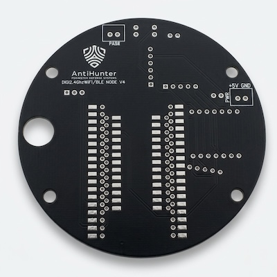 | [AntiHunter - Lectronz Store](https://lectronz.com/products/antihunter-diginode-24ghz-wifible-pcb-only) |   |
 1× | **Seeed XIAO ESP32-S3** (2.4 GHz) *Buy the plain S3 — "Sense" is a different board* | 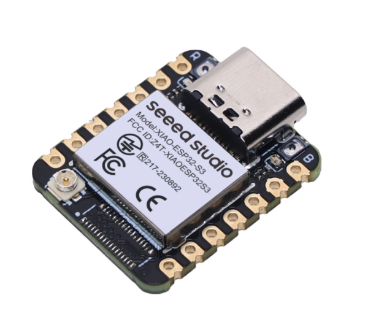 | [Seeed Studio](https://www.seeedstudio.com/XIAO-ESP32S3-p-5627.html) | [Search](https://www.amazon.com/s?k=Seeed+XIAO+ESP32-S3) | [Search](https://www.aliexpress.com/w/wholesale-XIAO-ESP32-S3.html) |
| 1× | **Heltec WiFi LoRa 32 V3.2** *T114 alt — V3.2 preferred · Band: 863–870 EU / 902–928 US* | 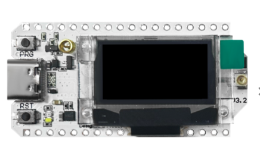 | [Heltec](https://heltec.org/project/wifi-lora-32-v3/) · [Datasheet](https://resource.heltec.cn/download/WiFi_LoRa_32_V3/HTIT-WB32LA_V3.2.pdf) | [Search](https://www.amazon.com/s?k=heltec+v3&i=electronics&crid=2DU09XJ5HC24F&sprefix=heltec+v3%2Celectronics%2C245&ref=nb_sb_noss_1) | [Search](https://www.aliexpress.com/w/wholesale-Heltec-WiFi-LoRa-32-V3.html) |
| 1× | **ATGM336H GPS Module** *AT6558, L1-band, NMEA0183* | 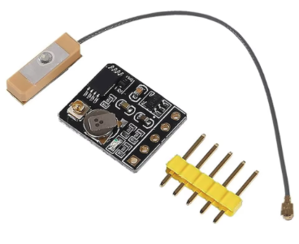 | Commodity (AT6558) | [View](https://www.amazon.com/DWEII-Dual-Mode-Satellite-Positioning-Replacement/dp/B0B68C1W94/ref=sr_1_2?crid=1BIHLTX2D3Q8G&dib=eyJ2IjoiMSJ9._va0qNlb7f2IDJS0x_jvVHX8xcGx6iiLMNmwU0RB_PGok1ekmwTHfY0OI4jTp6s4Imkg8G-eQ6Nl07JPFTtBfchyTWXrSkKQXnUFaH8LTVuTyj6LBpfhVDewZlh-kxQeU1SWopQbhLirJqXIvjwaFo7n_hK0azY7D4k0iiaM06SxYNcpojHe3nNClcBAHLn4W03WiJxNN8etlzRgH1zrg65pv5FkGG7zH9cx24sFjm3eh6gFnbGsmogpGlArcx14VMVpZhjfKPaRL0o6a0lkA-DFXjiKfo2pwRW7-DFueIk.w59Du-qq6cBOpVpC9FWPaRVvfhw2eJ-b_bZN-Hn3y9s&dib_tag=se&keywords=ATGM336H&qid=1780583983&s=electronics&sprefix=atgm336h%2Celectronics%2C276&th=1) | [Search](https://www.aliexpress.com/w/wholesale-ATGM336H.html) · [ElectroDragon](https://www.electrodragon.com/product/gnss-module-atgm336h/) |
| 1× | **DS3231 RTC Module** | 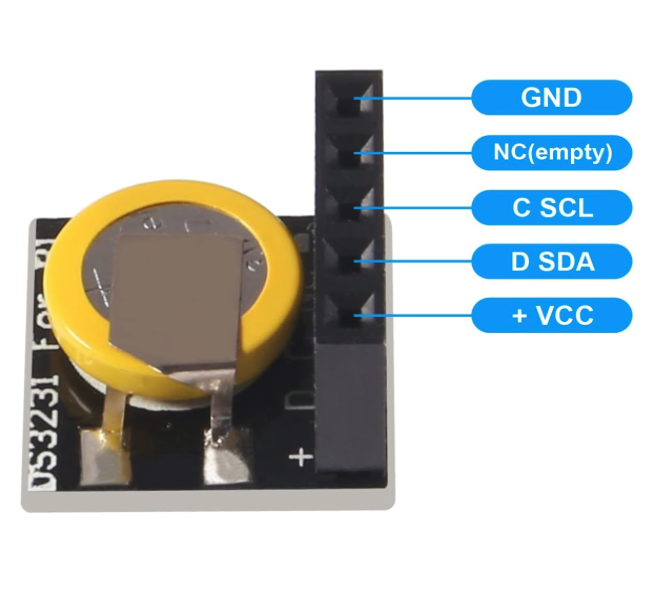 | Analog Devices DS3231 | [View](https://amazon.com/dp/B08X4H3NBR) | [View](https://www.aliexpress.us/item/2251832129568616.html) |
| 1× | **SW-420 Vibration Sensor** | 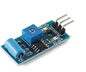 | Commodity | [Search](https://www.amazon.com/s?k=SW-420+vibration+sensor+module) | [Search](https://www.aliexpress.us/w/wholesale-SW%2525252d420.html?spm=a2g0o.productlist.search.0) |
| 1× | **MicroSD SPI Reader Module** | 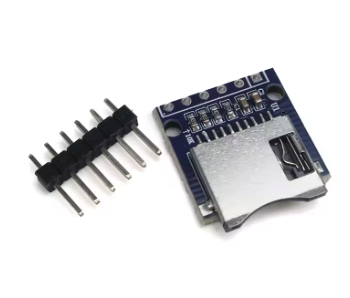 | Commodity | *SD Card Module* | [Search](https://www.aliexpress.com/w/wholesale-micro-sd-card-module-spi.html) |
| 1× | **MicroSD Card — 8 GB, FAT32** *SDHC, formats clean to FAT32 · 32 GB+ not recommended* | — | [Micro Center](https://www.microcenter.com/search/search_results.aspx?Ntt=8GB+microSDHC) | [Search](https://www.amazon.com/s?k=8GB+microSDHC+card+multipack) | [Search](https://www.aliexpress.com/w/wholesale-8GB-micro-sd-card.html) |

---

## Power & Enclosure

| Qty | Part | Image | MFR | AMZN | ALI |
|:---:|------|:---:|------|------|-----|
| 1× | **Type-C 15W 3A 5V UPS** (2S 18650) *Board ID HW-465A · 88×41×22 mm* | 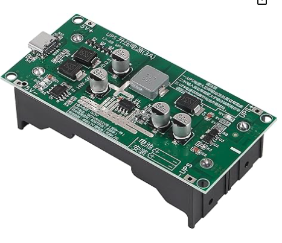 | Commodity (HW-465A) | [DWEII](https://www.amazon.com/dp/B0DCVRXTW8) · [JUZITAO 2-Pack](https://www.amazon.com/dp/B0DNMVSD65) | [Search](https://www.aliexpress.com/w/wholesale-HW-465A-UPS-18650.html) |
| 1× | **KSD9700 Normally Open Thermal Switch** 30–40°C close temp| 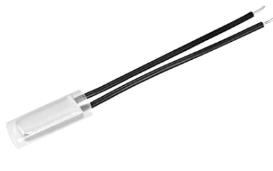 | — | [Search](https://www.amazon.com/s?k=KSD9700+40C+normally+open+thermal+switch) | [Search](https://www.aliexpress.com/w/wholesale-KSD9700-40C-NO.html) |
| 1× | **30mm 5V JST Fan** | 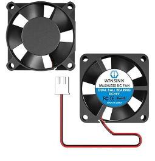 | — | [10mm](https://amazon.com/dp/B08R9HFXTN) · [7mm](https://amazon.com/dp/B0CWD6BY6G) | [Search](https://www.aliexpress.com/w/wholesale-30mm-5V-fan.html) |
| 1× | **3-Pin Mini On/Off Switch** (6mm) | 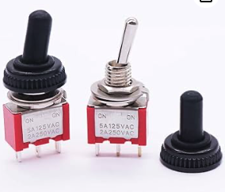 | — | [View](https://www.amazon.com/dp/B07LBNWD52?th=1) | [Search](https://www.aliexpress.com/w/wholesale-mini-switch--waterproof-cap.html) |
| 2× | **JST Power Male Cables** *Switch, power board·  Includes female 2.54 JST socket* | 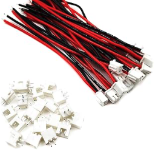 | — | [View](https://amazon.com/dp/B0D6KSMK1Q) | [View](https://www.aliexpress.us/item/3256809537971085.html) |
| 2× | **18650 Cells** *Protected, flat-top, ~3000 mAh · not supplied with any tier* | — | — | [Search](https://www.amazon.com/s?k=protected+18650+flat+top) | [Search](https://www.aliexpress.com/w/wholesale-protected-18650.html) |
| 1× | **Weatherproof Enclosure** *3D-printed* | — | — | [STLs (Repo)](https://github.com/lukeswitz/AntiHunter/tree/main/hw/Prototype_STL_Files) | — |
| 1× | **TPU Seal Kit** *Housing, USB-C, GPS antenna — grease before fitting* | — | — | [STLs (Repo)](https://github.com/lukeswitz/AntiHunter/tree/main/hw/Prototype_STL_Files) | — |

---

## Antennas

| Qty | Part | Image | AMZN | ALI |
|:---:|------|:---:|------|-----|
| 3× | **U.FL → SMA Pigtail** *10cm, SMA bulkhead — female/jack, see Note 2* | 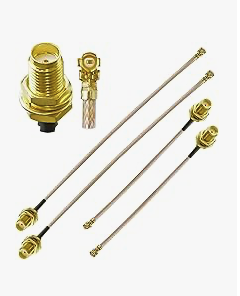 | [Search](https://www.amazon.com/s?k=U.FL+to+SMA+female+bulkhead+pigtail+10cm) | [Search](https://www.aliexpress.com/w/wholesale-ufl-to-sma-female-bulkhead.html) |
| 1× | **6dBi 2.4GHz Antenna** *WiFi/BLE, SMA* | — | [Search](https://www.amazon.com/s?k=6dBi+2.4GHz+SMA+antenna) | [Search](https://www.aliexpress.com/w/wholesale-6dBi-2.4GHz-SMA-antenna.html) |
| 1× | **6dBi LoRa Antenna** *868 EU / 915 US / 923 Asia, SMA* | — | [Search](https://www.amazon.com/s?k=915MHz+LoRa+antenna+SMA) | [Search](https://www.aliexpress.com/w/wholesale-915MHz-LoRa-antenna.html) |
| 1× | **GNSS Antenna — Active L1, SMA** *1575.42 MHz, 28 dB, 3–5V* | 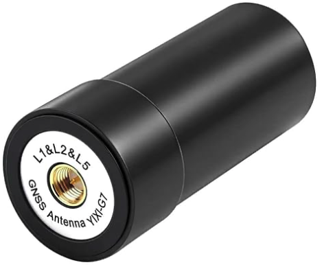 | [View](https://amazon.com/dp/B0FPKPBW7G) | [Search](https://www.aliexpress.us/w/wholesale-gps-helix-l1-antenna.html) |

---

## Fasteners & Hardware

| Qty | Part | Image | AMZN | ALI |
|:---:|------|:---:|------|-----|
| 10× | **M3 Heat-Set Inserts** | 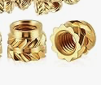 | [Search](https://www.amazon.com/s?k=M3+heat+set+inserts) | [Search](https://www.aliexpress.com/w/wholesale-M3-heat-set-insert.html) |
| 2× | **M3×15mm Brass Standoffs** *Male-to-female* | 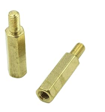 | [View](https://amazon.com/dp/B07WR5ZD8G) | [Search](https://www.aliexpress.com/w/wholesale-M3-brass-standoff.html) |
| 8× + 6× | **M3 Flat-Top Screws** (enclosure, max 6mm heads) **+ M3 Screws** (PCB / power board) | — | [Search](https://www.amazon.com/s?k=M3+screw+kit) | [Search](https://www.aliexpress.com/w/wholesale-M3-screw-assortment-kit.html) |
| 2–4× | **M2.5 13–15mm Screws** (fan) | — | [Search](https://www.amazon.com/s?k=M2.5+15mm+screw) | [Search](https://www.aliexpress.com/w/wholesale-M2.5-15mm-screw.html) |
| 5× | **JST 2.54 2-Pin Terminals** |  | [View](https://amazon.com/dp/B0D6KSMK1Q) | [Search](https://www.aliexpress.com/w/wholesale-JST-XH-2.54-2pin.html) |
| 1× | **1/4" Tripod Insert** *1/4-20 threaded* | — | [Search](https://www.amazon.com/s?k=1%2F4-20+threaded+insert+brass) | [Search](https://www.aliexpress.com/w/wholesale-1-4-20-threaded-insert.html) |

---

## Builder Notes — read before ordering

1. **2× 18650 cells are never supplied.** The HW-465A UPS holds two; they do not come with the UPS board or with any tier. Use protected flat-top cells, ~3000 mAh.
2. **SMA gender chain.** GPS/LoRa/WiFi antennas are SMA male; modules are U.FL. Your U.FL→SMA pigtails must be SMA female (jack) bulkheads or the antennas won't thread. Most common ordering mistake on this build.
3. **SD card = FAT32.** Built tiers ship with an 8 GB card. 32 GB and larger are not recommended; 64 GB+ ships exFAT and needs reformatting (untested).
4. **LoRa band must match your region and Heltec board variant** (EU868 / US915 / AS923). Mismatched antenna/board band degrades range.
5. **Fusing the battery line is optional.** A 2A fast-blow inline fuse between the cells and the UPS board adds protection against a cell fault. Not required and not supplied.

> [!IMPORTANT]
>  **RTC and SW modules require a minor pin mod** to seat them in the PCB:

- RTC MODULE
     Usually ships with female headers. Trim and reuse the existing pins,
     or desolder and swap in male pin headers.

- VIBRATION SENSOR
     Sourced units have inverted 90° headers. Heat all three joints and
     bend straight (trim excess), or desolder and replace with standard
     header pins.
