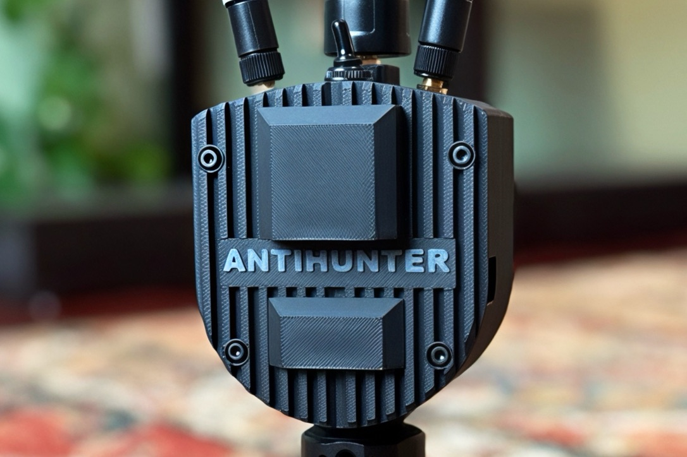
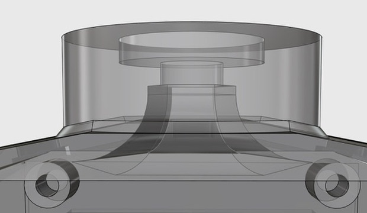
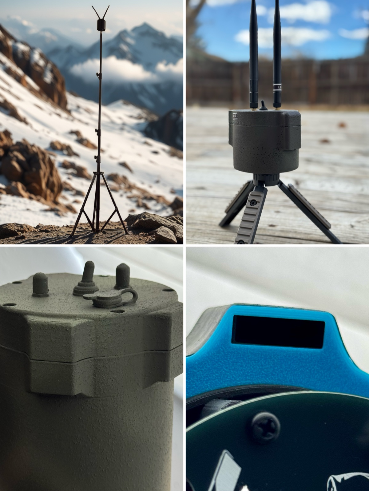
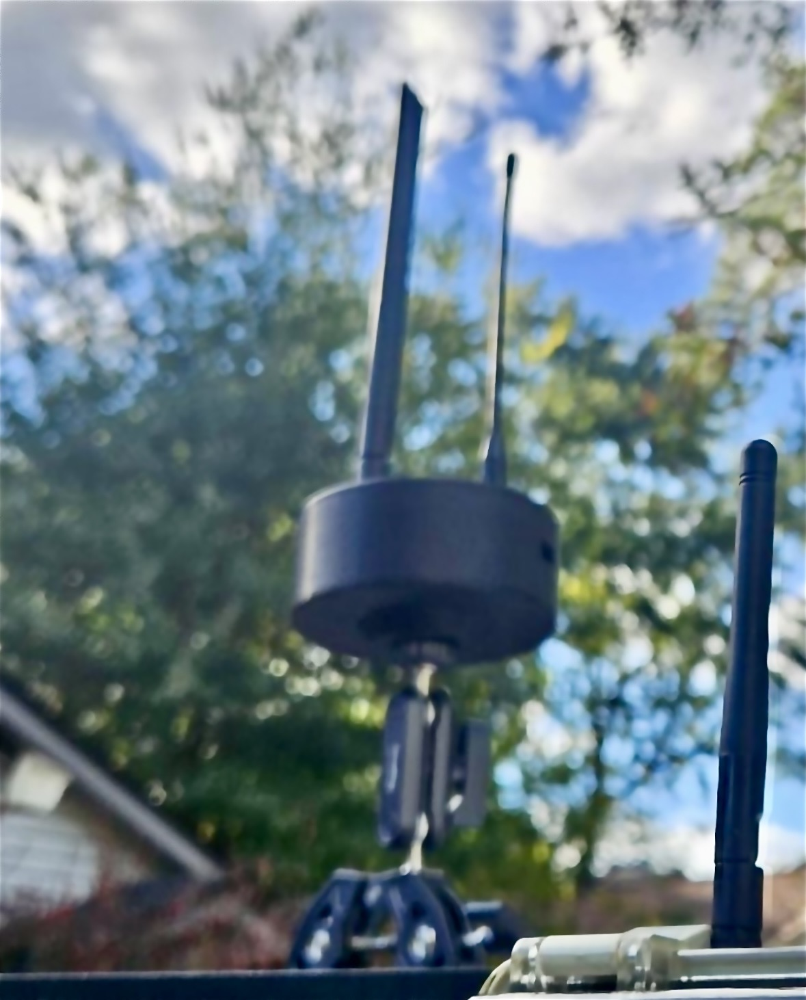
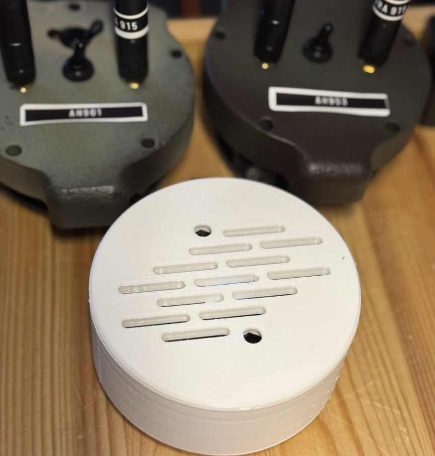

# Enclosure Prototypes 

## 1.  Field Deployment Cases
Credit @TheRealSirHaxAlot

### AH Case v2
External GPS, UPS board/DIY 2S 18650 





- Accommodates UPS board with fast/side charger options
- Use without rear power case for dev/compact form
- TPU seals for housing and GPS antenna
- USBC, GPS SMA and housing TPU seals
- Front lid with open/closed fan options
- Base accepts 1/4"-20 UNC heat-set inserts
- M3 heat-set inserts for assembly
- 2x 15mm standoffs 


### Can Design
10x and 2x18650 Power



- Bunker vented roll-proof lid with fan mount
- Variations for full battery (10x 18650) and 2S (2x 18650)
- Spacer mod for legacy design
- Base accepts 1/4"-20 UNC heat-set inserts
- TPU gasket seal


## 2. Puck Case

Credit @nitekry

 

- Slim design with USBC port access
- Vented lid and snap fit design
- Base accepts 1/4"-20 UNC heat-set inserts
- SMA bulkheds recessed in lid


## Disclaimer
```
These 3D printable enclosure files are provided "AS IS" without warranty of any kind. AntiHunter maintainers and contributors assume no liability for any damages, injuries, losses, or legal consequences arising from the use of these files. Users are solely responsible for regulatory compliance, material selection, print quality, hardware compatibility, and all outcomes of use.
```
