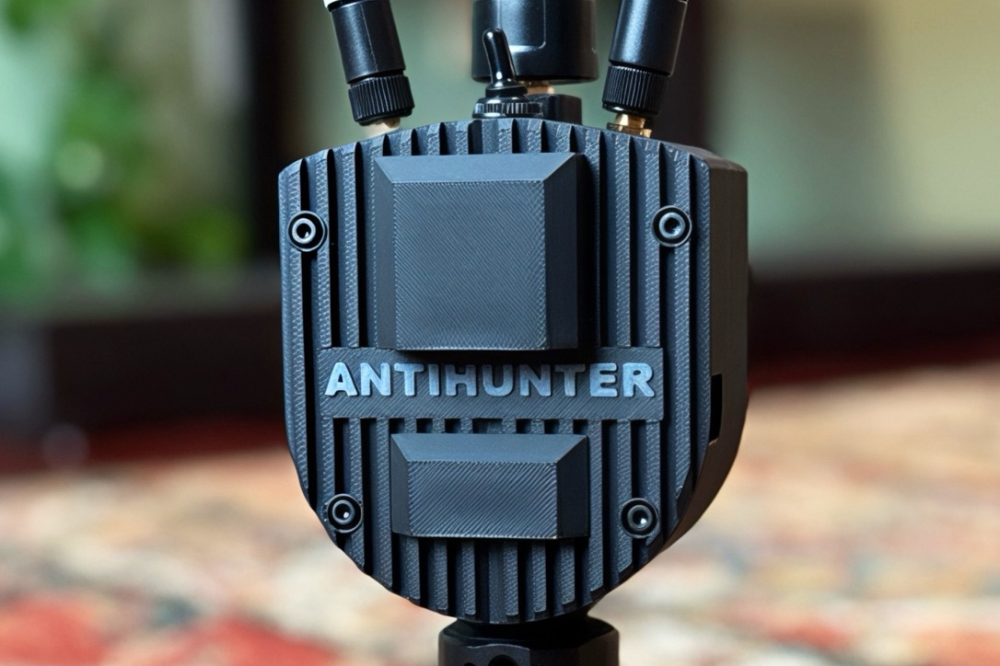
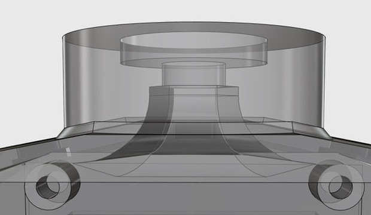
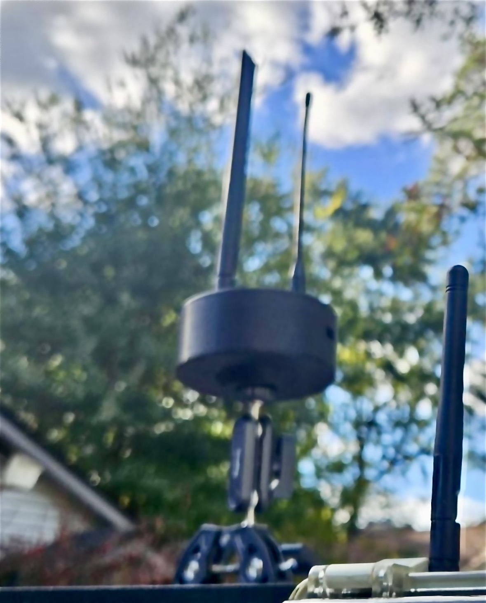
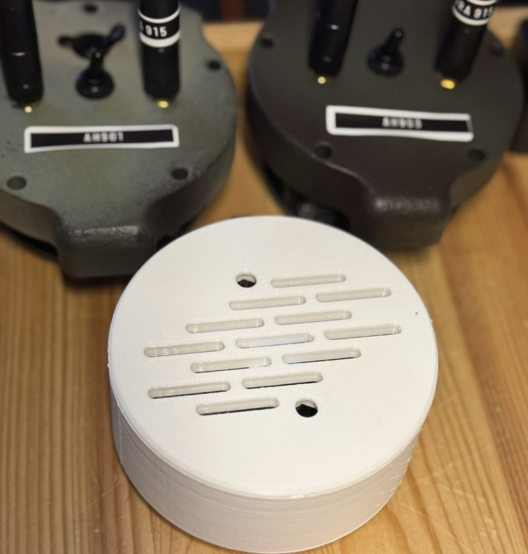

# Enclosure Prototypes

3D-printable enclosures for AntiHunter nodes. Parts list: [BOM-Links.md](BOM-Links.md). Assembly: [Antihunter-DIGINODE-AssemblyManual.pdf](Antihunter-DIGINODE-AssemblyManual.pdf).

| Enclosure | Folder | Power | Credit |
|---|---|---|---|
| [AH Case v2](#ah-case-v2) | `AH-DIGINODE-v2/` | UPS board or DIY 2S 18650 | @TheRealSirHaxAlot |
| [Puck Case](#puck-case) | `AHPuckCase/` | USB-C | @nitekry |

## AH Case v2

Field deployment case with external GPS.

 

### Features

- Holds a UPS board, with fast-charge or side-charge battery housing
- Runs without the rear power housing for a compact dev build
- TPU seals for the housing, GPS antenna, USB-C port and GPS SMA
- Front cover with open or hidden fan
- Base takes 1/4"-20 UNC heat-set inserts
- Assembly uses M3 heat-set inserts and 2x 15 mm standoffs

### Files

| Part | File |
|---|---|
| Back cover | `BackCover.stl` |
| Front cover, open fan | `FrontCover-Open-Fan.stl` |
| Front cover, hidden fan | `FrontCover-Hidden-Fan.stl` |
| Battery enclosure bracket | `universalbracket-for-battery-enclousure.stl` |
| Fast-charge main housing | `FastCharge enlosure/Main-Housing-USBFast-Version.stl` |
| Fast-charge battery housing | `FastCharge enlosure/Battery-Housing-USBFast-with-side-hole.stl`, `…-no-side-hole.stl` |
| Side-charge main housing | `SideCharge enclosure/Main-Housing-SideCharge-Version.stl` |
| Side-charge battery housing | `SideCharge enclosure/Battery-Housing-SideCharge.stl` |

### Extensions

| Folder | Parts |
|---|---|
| `Extentions/MOUNTS` | Universal bracket, with or without battery |
| `Extentions/RadarMOD` | Radar housing (fat, slim) and radar front |
| `Extentions/SEALS` | TPU seals: battery housing, front housing, ESP USB plug, GPS, radar |
| `Extentions/SOLAR` | 115x85 mm solar panel frame and leg |

## Puck Case

Slim case with a snap-fit, vented lid.

 

- USB-C port access
- SMA bulkheads recessed in the lid
- Base takes 1/4"-20 UNC heat-set inserts
- Files: `puck_body.stl`, `puck_top.stl`, `puck_bottom.stl`

## Disclaimer

```
These 3D printable enclosure files are provided "AS IS" without warranty of any kind. AntiHunter maintainers and contributors assume no liability for any damages, injuries, losses, or legal consequences arising from the use of these files. Users are solely responsible for regulatory compliance, material selection, print quality, hardware compatibility, and all outcomes of use.
```
